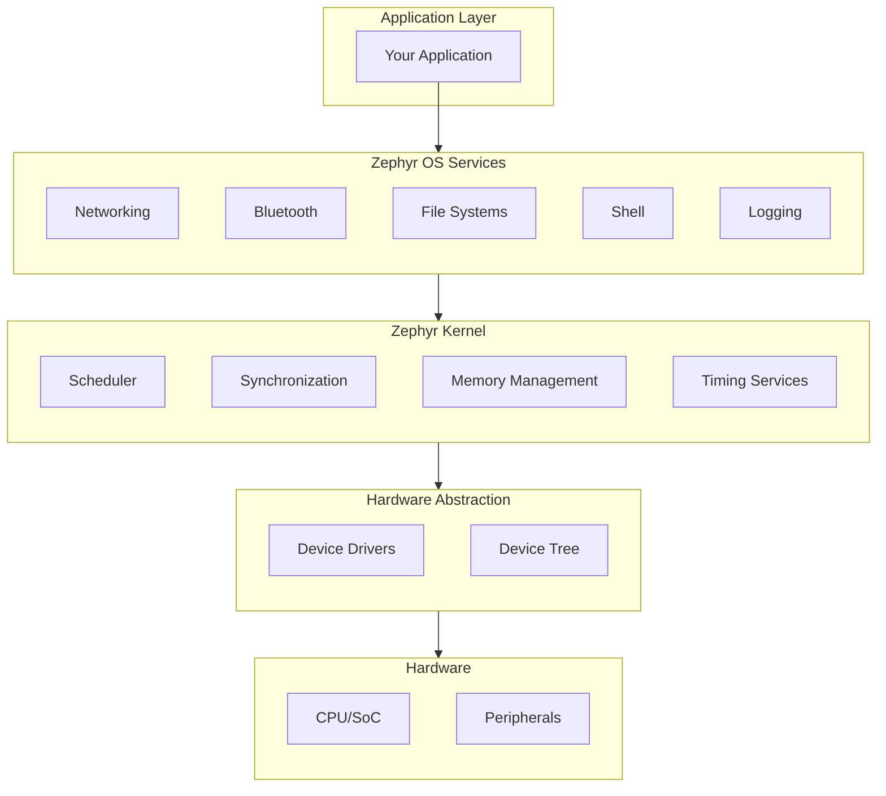

# Introduction to Zephyr RTOS

## What is Zephyr?

Zephyr is a scalable, open-source real-time operating system (RTOS) designed for resource-constrained devices. It supports multiple architectures including ARM Cortex-M, RISC-V, x86, ARC, and others.

## Key Features

### Scalability
Zephyr can run on devices with as little as 8KB of RAM up to complex multi-core systems. The modular architecture lets you include only what you need.

### Multiple Architecture Support
- **ARM**: Cortex-M0/M0+/M3/M4/M7/M23/M33/M55, Cortex-A, Cortex-R
- **RISC-V**: 32-bit and 64-bit
- **x86**: IA-32 and x86-64
- **ARC**: EM, HS
- **Others**: Xtensa, SPARC, MIPS

### Rich Connectivity
- **Networking**: TCP/UDP, IPv4/IPv6, MQTT, CoAP, HTTP, WebSocket
- **Bluetooth**: BLE 5.x, Bluetooth Mesh, Classic Bluetooth
- **Other**: USB, CAN, LoRa, IEEE 802.15.4

### Security
- Memory protection (MPU/MMU)
- Secure boot support
- TLS/DTLS with mbedTLS
- PSA (Platform Security Architecture) support

## History and Governance

Zephyr started as an internal project at Wind River and was open-sourced in 2016. It's now a Linux Foundation project with contributions from major companies:

- Intel
- Nordic Semiconductor
- NXP
- STMicroelectronics
- Texas Instruments
- Google
- Meta
- And many others

## When to Use Zephyr

Zephyr is ideal for:

| Use Case | Why Zephyr |
|----------|------------|
| IoT devices | Rich connectivity stacks, low power support |
| Wearables | Small footprint, Bluetooth support |
| Industrial sensors | Real-time guarantees, safety features |
| Smart home | Thread/Matter support, low power |
| Medical devices | Deterministic behavior, security |
| Automotive | Safety features, CAN support |

## Zephyr vs Other RTOS

| Feature | Zephyr | FreeRTOS | RIOT | Bare Metal |
|---------|--------|----------|------|------------|
| License | Apache 2.0 | MIT | LGPL | N/A |
| Connectivity | Extensive | Basic | Good | Manual |
| Driver ecosystem | Large | Varies | Medium | Manual |
| Build system | CMake/west | Varies | Make | Manual |
| Learning curve | Medium | Low | Medium | Varies |

## Ecosystem Overview

### West - The Meta-Tool
West manages Zephyr workspaces, handles multiple repositories, and provides build/flash/debug commands.

### Device Tree
Hardware is described in device tree files (`.dts`), allowing the same code to run on different boards with minimal changes.

### Kconfig
Configuration uses the Linux kernel's Kconfig system, providing a consistent way to enable/disable features.

### Twister
The built-in test framework runs tests across multiple boards and QEMU targets.

## Community Resources

- **Documentation**: [docs.zephyrproject.org](https://docs.zephyrproject.org/)
- **GitHub**: [github.com/zephyrproject-rtos/zephyr](https://github.com/zephyrproject-rtos/zephyr)
- **Discord**: [Zephyr Discord Server](https://discord.com/invite/zephyrproject)
- **Mailing Lists**: [lists.zephyrproject.org](https://lists.zephyrproject.org/)

## Next Steps

Now that you understand what Zephyr is, let's [install the SDK]().
