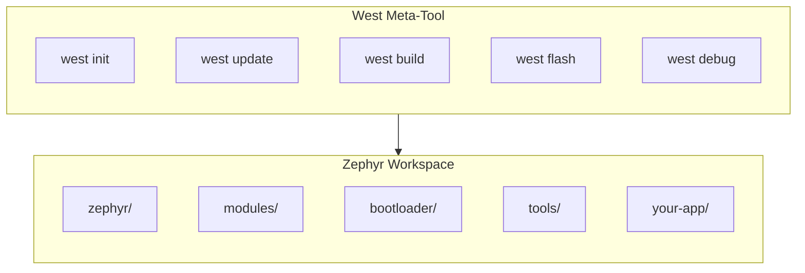
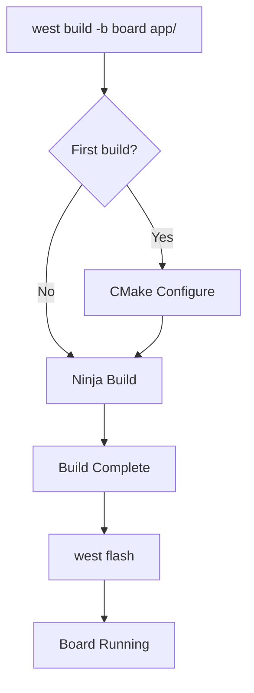

# Setting Up West

West is Zephyr's meta-tool that manages workspaces, builds, flashes, and debugs your applications.

## What is West?



West provides:
- **Workspace management**: Initialize and update multi-repo workspaces
- **Build integration**: Invoke CMake with correct settings
- **Flash/debug**: Program and debug boards
- **Extension commands**: Board-specific tooling

## Creating a Zephyr Workspace

### Initialize Workspace

```bash
# Create workspace directory
mkdir ~/zephyrproject
cd ~/zephyrproject

# Initialize with Zephyr
west init

# Fetch all modules
west update
```

This creates a workspace structure:

```
zephyrproject/
├── .west/           # West configuration
├── zephyr/          # Zephyr kernel and OS
├── modules/         # External modules (HALs, libraries)
│   ├── hal/         # Hardware abstraction layers
│   ├── lib/         # Libraries (mbedTLS, etc.)
│   └── ...
├── bootloader/      # MCUboot bootloader
└── tools/           # Development tools
```

### Install Python Dependencies

```bash
# Install Zephyr's Python requirements
pip3 install -r ~/zephyrproject/zephyr/scripts/requirements.txt
```

### Set Up Environment

```bash
# Source the Zephyr environment script
source ~/zephyrproject/zephyr/zephyr-env.sh

# Or add to your shell config for persistence
echo 'source ~/zephyrproject/zephyr/zephyr-env.sh' >> ~/.bashrc
```

## Understanding the Manifest

West uses a manifest file (`west.yml`) to track repositories. Zephyr's manifest is at `zephyr/west.yml`:

```yaml
# Simplified example of west.yml structure
manifest:
  defaults:
    remote: zephyrproject-rtos

  remotes:
    - name: zephyrproject-rtos
      url-base: https://github.com/zephyrproject-rtos

  projects:
    - name: zephyr
      revision: main
      import: true

    - name: mcuboot
      revision: v1.10.0
      path: bootloader/mcuboot
```

## Essential West Commands

### Workspace Commands

```bash
# Initialize new workspace
west init [-m URL] [directory]

# Update all projects to manifest revisions
west update

# Show workspace status
west list

# Show manifest information
west manifest --resolve
```

### Build Commands

```bash
# Build for a specific board
west build -b <board> <path/to/app>

# Rebuild (after code changes)
west build

# Clean build directory
west build -t clean

# Pristine build (full clean)
west build -p
```

### Flash and Debug

```bash
# Flash to connected board
west flash

# Start debugger
west debug

# Attach debugger to running target
west attach
```

## Build Workflow Example



```bash
# Complete workflow example
cd ~/zephyrproject

# Build hello_world for QEMU
west build -b qemu_cortex_m3 zephyr/samples/hello_world

# Run in QEMU
west build -t run
```

## Managing Multiple Applications

Your applications can live inside or outside the Zephyr workspace:

### Inside Workspace (Recommended for beginners)
```bash
zephyrproject/
├── zephyr/
├── modules/
└── my-apps/          # Your applications
    ├── app1/
    └── app2/
```

### Outside Workspace (T2 Topology)
```bash
~/projects/
├── zephyrproject/    # Zephyr workspace
└── my-zephyr-app/    # Your standalone app
    ├── CMakeLists.txt
    ├── prj.conf
    └── src/
```

For standalone apps, set `ZEPHYR_BASE`:
```bash
export ZEPHYR_BASE=~/zephyrproject/zephyr
west build -b board ~/projects/my-zephyr-app
```

## Updating Zephyr

```bash
cd ~/zephyrproject

# Update to latest
west update

# Update Python dependencies after Zephyr update
pip3 install -r zephyr/scripts/requirements.txt
```

## Troubleshooting

### "west: command not found"
```bash
pip3 install --user west
export PATH="$HOME/.local/bin:$PATH"
```

### "ZEPHYR_BASE not set"
```bash
source ~/zephyrproject/zephyr/zephyr-env.sh
```

### Build errors after update
```bash
# Pristine rebuild
west build -p
```

## Next Steps

Now let's configure the [toolchains]() for your target architecture.
