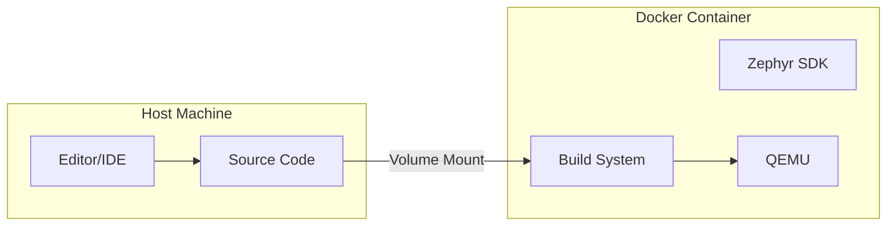

# Docker-Based Development

Docker provides a consistent, reproducible Zephyr development environment without installing tools on your host system.

## Why Use Docker?

- **Reproducible**: Same environment for everyone on the team
- **Isolated**: Doesn't affect your host system
- **Portable**: Works on Linux, macOS, and Windows
- **CI/CD friendly**: Same container for local and CI builds

## Quick Start

### Using Zephyr's Official Image

```bash
# Pull the official Zephyr Docker image
docker pull ghcr.io/zephyrproject-rtos/ci:latest

# Run interactive shell
docker run -it --rm \
  -v $(pwd):/workdir \
  -w /workdir \
  ghcr.io/zephyrproject-rtos/ci:latest \
  /bin/bash
```

### Initialize Workspace Inside Container

```bash
# Inside the container
west init /workdir/zephyrproject
cd /workdir/zephyrproject
west update
pip3 install -r zephyr/scripts/requirements.txt
```

## Custom Dockerfile

Create a Dockerfile optimized for your workflow:

```dockerfile
# Dockerfile for Zephyr development
FROM ghcr.io/zephyrproject-rtos/ci:latest

# Set working directory
WORKDIR /workdir

# Initialize Zephyr workspace
RUN west init /opt/zephyrproject && \
    cd /opt/zephyrproject && \
    west update && \
    pip3 install -r zephyr/scripts/requirements.txt

# Set environment
ENV ZEPHYR_BASE=/opt/zephyrproject/zephyr
ENV ZEPHYR_TOOLCHAIN_VARIANT=zephyr
ENV ZEPHYR_SDK_INSTALL_DIR=/opt/toolchains/zephyr-sdk-0.16.8

# Source Zephyr environment on shell start
RUN echo "source /opt/zephyrproject/zephyr/zephyr-env.sh" >> /etc/bash.bashrc

# Default command
CMD ["/bin/bash"]
```

## Docker Compose Setup

Create `docker-compose.yml` for easier management:

```yaml
version: '3.8'

services:
  zephyr:
    build: .
    volumes:
      # Mount your application source
      - ./my-app:/workdir/my-app
      # Persist build artifacts
      - zephyr-build:/workdir/build
    environment:
      - ZEPHYR_BASE=/opt/zephyrproject/zephyr
    stdin_open: true
    tty: true

volumes:
  zephyr-build:
```

### Usage

```bash
# Start the container
docker-compose up -d

# Enter the container
docker-compose exec zephyr bash

# Build your application
cd /workdir/my-app
west build -b qemu_cortex_m3

# Run in QEMU
west build -t run
```

## Development Workflow



### Edit on Host, Build in Container

```bash
# Terminal 1: Start container and build
docker-compose exec zephyr bash
cd /workdir/my-app
west build -b qemu_cortex_m3

# Terminal 2: Edit files on host with your favorite editor
code my-app/src/main.c
```

## Flashing Hardware from Docker

To flash hardware, you need to pass through USB devices:

### Linux

```yaml
# docker-compose.yml
services:
  zephyr:
    # ... other config ...
    privileged: true
    volumes:
      - /dev:/dev
```

```bash
# Flash from container
west flash
```

### macOS/Windows

USB passthrough is more complex. Consider:
1. Building in Docker, flashing from host
2. Using a networked debug probe (J-Link, etc.)

```bash
# In container: build
west build -b nrf52840dk_nrf52840

# On host: flash (with nrfjprog installed)
nrfjprog --program build/zephyr/zephyr.hex --verify --reset
```

## VS Code Dev Containers

Integrate Docker with VS Code for seamless development:

### .devcontainer/devcontainer.json

```json
{
  "name": "Zephyr Development",
  "image": "ghcr.io/zephyrproject-rtos/ci:latest",
  "customizations": {
    "vscode": {
      "extensions": [
        "ms-vscode.cpptools",
        "ms-vscode.cmake-tools",
        "marus25.cortex-debug"
      ],
      "settings": {
        "cmake.configureOnOpen": false
      }
    }
  },
  "mounts": [
    "source=${localWorkspaceFolder},target=/workdir,type=bind"
  ],
  "workspaceFolder": "/workdir",
  "postCreateCommand": "west init /opt/zephyr && cd /opt/zephyr && west update"
}
```

### Using Dev Containers

1. Install "Dev Containers" VS Code extension
2. Open your project folder
3. Click "Reopen in Container" when prompted
4. VS Code runs inside the container with full tooling

## CI/CD Integration

### GitHub Actions Example

```yaml
# .github/workflows/build.yml
name: Build Zephyr Application

on: [push, pull_request]

jobs:
  build:
    runs-on: ubuntu-latest
    container:
      image: ghcr.io/zephyrproject-rtos/ci:latest

    steps:
      - uses: actions/checkout@v4

      - name: Initialize Zephyr
        run: |
          west init /opt/zephyrproject
          cd /opt/zephyrproject
          west update

      - name: Build
        run: |
          cd /opt/zephyrproject
          west build -b qemu_cortex_m3 $GITHUB_WORKSPACE

      - name: Run Tests
        run: |
          cd /opt/zephyrproject
          west build -t run
```

## Troubleshooting

### Container can't access USB

```bash
# Run with privileged mode
docker run --privileged ...

# Or add specific device
docker run --device=/dev/ttyACM0 ...
```

### Build artifacts owned by root

```bash
# Run container as current user
docker run -u $(id -u):$(id -g) ...
```

### Slow builds with Docker Desktop

On macOS/Windows, enable these Docker Desktop settings:
- Use VirtioFS for file sharing (macOS)
- Increase memory allocation

## Next Steps

Set up your [IDE]() for the best development experience.
