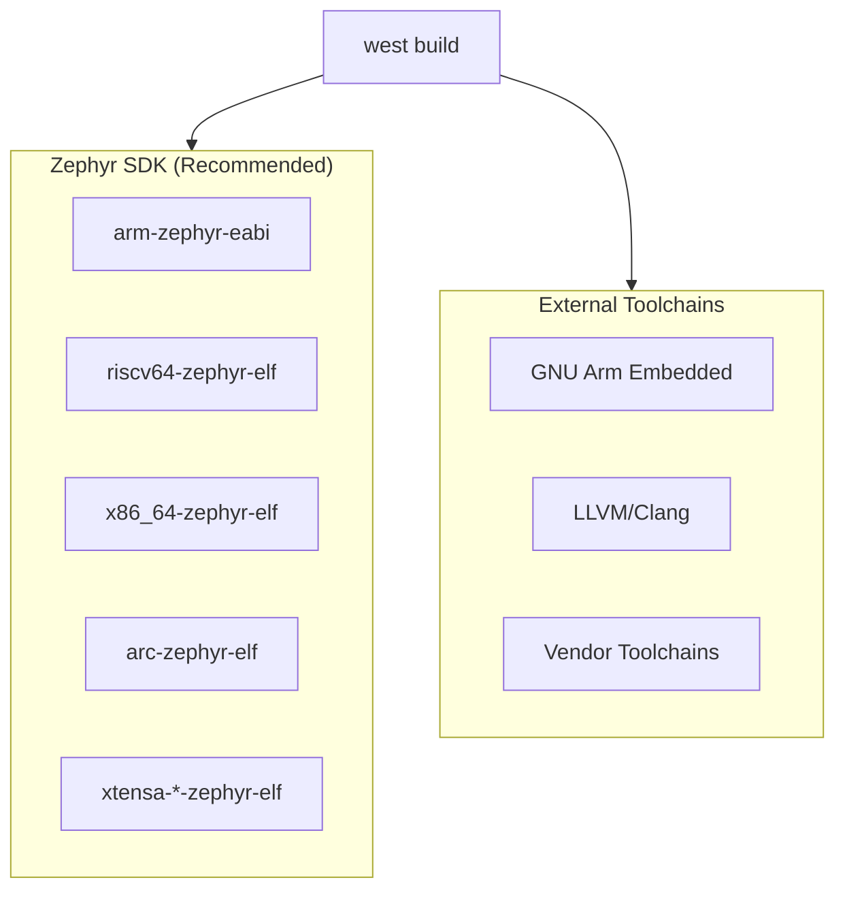
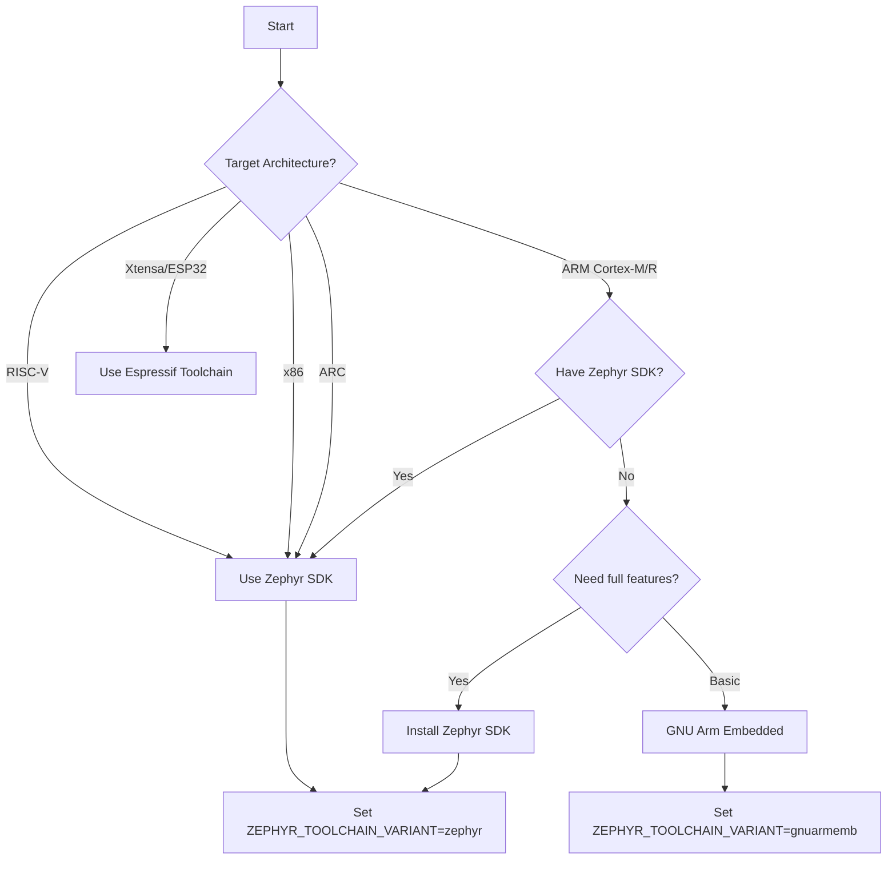

# Toolchain Configuration

Zephyr supports multiple toolchains for different target architectures.

## Toolchain Overview



## Zephyr SDK (Recommended)

The Zephyr SDK includes all supported toolchains in a single package.

### Included Toolchains

| Architecture | Toolchain Prefix | Targets |
|--------------|------------------|---------|
| ARM | arm-zephyr-eabi | Cortex-M, Cortex-R |
| ARM64 | aarch64-zephyr-elf | Cortex-A |
| RISC-V 32-bit | riscv64-zephyr-elf | RV32 cores |
| RISC-V 64-bit | riscv64-zephyr-elf | RV64 cores |
| x86 | x86_64-zephyr-elf | IA-32, x86-64 |
| ARC | arc-zephyr-elf | ARC EM, HS |
| Xtensa | xtensa-*-zephyr-elf | ESP32, etc. |

### Configuration

```bash
# Set environment variables
export ZEPHYR_TOOLCHAIN_VARIANT=zephyr
export ZEPHYR_SDK_INSTALL_DIR=~/zephyr-sdk-0.16.8
```

Add to `~/.bashrc` or `~/.zshrc` for persistence.

### Selecting Specific Toolchains

By default, west uses the appropriate toolchain for your board. To explicitly specify:

```bash
# Use ARM toolchain
west build -b nrf52840dk_nrf52840 -- -DZEPHYR_TOOLCHAIN_VARIANT=zephyr

# Or set in CMakeLists.txt
set(ZEPHYR_TOOLCHAIN_VARIANT zephyr)
```

## GNU Arm Embedded Toolchain

For ARM targets without the full SDK:

### Installation

```bash
# Ubuntu/Debian
sudo apt install gcc-arm-none-eabi

# macOS
brew install arm-none-eabi-gcc

# Or download from ARM
# https://developer.arm.com/downloads/-/gnu-rm
```

### Configuration

```bash
export ZEPHYR_TOOLCHAIN_VARIANT=gnuarmemb
export GNUARMEMB_TOOLCHAIN_PATH=/path/to/gcc-arm-none-eabi
```

## LLVM/Clang Toolchain

For those preferring LLVM:

### Installation

```bash
# Ubuntu/Debian
sudo apt install clang llvm lld

# macOS
brew install llvm
```

### Configuration

```bash
export ZEPHYR_TOOLCHAIN_VARIANT=llvm
export LLVM_TOOLCHAIN_PATH=/usr/lib/llvm-15
```

## Cross-Compile Toolchain

For generic cross-compilation:

```bash
export ZEPHYR_TOOLCHAIN_VARIANT=cross-compile
export CROSS_COMPILE=/path/to/toolchain/bin/prefix-
```

## Verifying Toolchain Setup

### Check Toolchain Detection

```bash
cd ~/zephyrproject

# Build for ARM target
west build -b qemu_cortex_m3 zephyr/samples/hello_world

# Check build output for toolchain info
cat build/CMakeCache.txt | grep TOOLCHAIN
```

### Test Different Architectures

```bash
# ARM Cortex-M
west build -b qemu_cortex_m3 zephyr/samples/hello_world -p

# RISC-V
west build -b qemu_riscv32 zephyr/samples/hello_world -p

# x86
west build -b qemu_x86 zephyr/samples/hello_world -p
```

## Toolchain Selection Flowchart



## Common Board/Toolchain Combinations

| Board | Architecture | Recommended Toolchain |
|-------|--------------|----------------------|
| nrf52840dk | ARM Cortex-M4 | Zephyr SDK |
| stm32f4_disco | ARM Cortex-M4 | Zephyr SDK |
| qemu_cortex_m3 | ARM Cortex-M3 | Zephyr SDK |
| esp32 | Xtensa | Espressif |
| qemu_riscv32 | RISC-V | Zephyr SDK |
| qemu_x86 | x86 | Zephyr SDK |

## Troubleshooting

### "Toolchain not found"

```bash
# Verify SDK path
ls $ZEPHYR_SDK_INSTALL_DIR

# Re-run SDK setup
cd $ZEPHYR_SDK_INSTALL_DIR
./setup.sh
```

### "Could not find compiler"

```bash
# Check if toolchain is in PATH
which arm-zephyr-eabi-gcc

# Or specify full path
export ZEPHYR_SDK_INSTALL_DIR=/full/path/to/sdk
```

### Wrong toolchain used

```bash
# Force pristine build with toolchain
west build -p -- -DZEPHYR_TOOLCHAIN_VARIANT=zephyr
```

## Next Steps

Learn how to set up a [Docker environment]() for reproducible builds.
