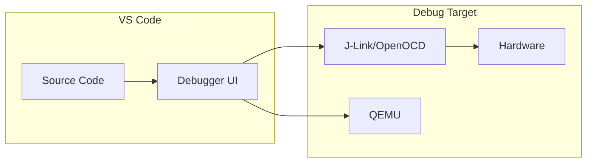

# IDE Setup

A well-configured IDE dramatically improves Zephyr development productivity.

## VS Code (Recommended)

VS Code with the right extensions provides an excellent Zephyr development experience.

### Essential Extensions

| Extension | Purpose |
|-----------|---------|
| C/C++ (Microsoft) | IntelliSense, debugging |
| CMake Tools | CMake integration |
| Cortex-Debug | ARM debugging |
| DeviceTree | DTS syntax highlighting |

### Installation

```bash
# Install via command line
code --install-extension ms-vscode.cpptools
code --install-extension ms-vscode.cmake-tools
code --install-extension marus25.cortex-debug
code --install-extension plorefice.devicetree
```

### Workspace Configuration

Create `.vscode/settings.json` in your project:

```json
{
  "cmake.configureOnOpen": false,
  "cmake.buildDirectory": "${workspaceFolder}/build",

  "C_Cpp.default.configurationProvider": "ms-vscode.cmake-tools",

  "files.associations": {
    "*.conf": "properties",
    "*.overlay": "dts",
    "prj.conf": "properties",
    "Kconfig*": "kconfig"
  },

  "cortex-debug.armToolchainPath": "${env:ZEPHYR_SDK_INSTALL_DIR}/arm-zephyr-eabi/bin",

  "[c]": {
    "editor.defaultFormatter": "ms-vscode.cpptools"
  }
}
```

### IntelliSense Configuration

Create `.vscode/c_cpp_properties.json`:

```json
{
  "configurations": [
    {
      "name": "Zephyr",
      "includePath": [
        "${workspaceFolder}/**",
        "${env:ZEPHYR_BASE}/include/**",
        "${env:ZEPHYR_BASE}/soc/**",
        "${env:ZEPHYR_BASE}/boards/**",
        "${workspaceFolder}/build/zephyr/include/generated/**"
      ],
      "defines": [
        "__ZEPHYR__=1"
      ],
      "compilerPath": "${env:ZEPHYR_SDK_INSTALL_DIR}/arm-zephyr-eabi/bin/arm-zephyr-eabi-gcc",
      "cStandard": "c11",
      "intelliSenseMode": "gcc-arm",
      "configurationProvider": "ms-vscode.cmake-tools"
    }
  ],
  "version": 4
}
```

### Build Tasks

Create `.vscode/tasks.json`:

```json
{
  "version": "2.0.0",
  "tasks": [
    {
      "label": "West Build",
      "type": "shell",
      "command": "west",
      "args": ["build", "-b", "${input:board}"],
      "group": {
        "kind": "build",
        "isDefault": true
      },
      "problemMatcher": ["$gcc"]
    },
    {
      "label": "West Flash",
      "type": "shell",
      "command": "west",
      "args": ["flash"],
      "group": "build",
      "problemMatcher": []
    },
    {
      "label": "West Pristine Build",
      "type": "shell",
      "command": "west",
      "args": ["build", "-p", "-b", "${input:board}"],
      "group": "build",
      "problemMatcher": ["$gcc"]
    }
  ],
  "inputs": [
    {
      "id": "board",
      "type": "promptString",
      "description": "Target board",
      "default": "qemu_cortex_m3"
    }
  ]
}
```

### Debug Configuration

Create `.vscode/launch.json`:

```json
{
  "version": "0.2.0",
  "configurations": [
    {
      "name": "Cortex Debug (J-Link)",
      "type": "cortex-debug",
      "request": "launch",
      "servertype": "jlink",
      "cwd": "${workspaceFolder}",
      "executable": "${workspaceFolder}/build/zephyr/zephyr.elf",
      "device": "nRF52840_xxAA",
      "interface": "swd",
      "runToEntryPoint": "main",
      "svdFile": "${env:ZEPHYR_BASE}/soc/arm/nordic_nrf/nrf52/nrf52840.svd"
    },
    {
      "name": "QEMU Debug",
      "type": "cppdbg",
      "request": "launch",
      "program": "${workspaceFolder}/build/zephyr/zephyr.elf",
      "miDebuggerServerAddress": "localhost:1234",
      "miDebuggerPath": "${env:ZEPHYR_SDK_INSTALL_DIR}/arm-zephyr-eabi/bin/arm-zephyr-eabi-gdb",
      "cwd": "${workspaceFolder}",
      "MIMode": "gdb",
      "setupCommands": [
        {
          "text": "target remote localhost:1234"
        }
      ]
    }
  ]
}
```

## Debugging Workflow



### QEMU Debugging

```bash
# Terminal 1: Start QEMU with GDB server
west build -t debugserver

# Terminal 2: In VS Code, start "QEMU Debug" configuration
```

### Hardware Debugging with J-Link

1. Connect J-Link to your board
2. Install J-Link software from SEGGER
3. Start the "Cortex Debug (J-Link)" configuration

## CLion

JetBrains CLion also works well with Zephyr:

### Setup

1. Open Zephyr workspace as project
2. Configure CMake:
   - Build directory: `build`
   - CMake options: `-DBOARD=your_board`
3. Set environment variables in CMake settings

### Run/Debug Configurations

Create a "CMake Application" configuration:
- Target: `zephyr_final`
- Executable: `build/zephyr/zephyr.elf`

## Eclipse CDT

### Installation

1. Install Eclipse CDT
2. Install GNU MCU Eclipse plugins
3. Configure toolchain paths

### Project Setup

1. File → Import → Existing Code as Makefile Project
2. Select your application directory
3. Configure build command: `west build -b board`

## Terminal-Based Development

For those preferring terminal editors:

### Vim/Neovim

```vim
" .vimrc
" Set filetype for Zephyr files
autocmd BufRead,BufNewFile *.conf set filetype=conf
autocmd BufRead,BufNewFile *.overlay set filetype=dts
autocmd BufRead,BufNewFile Kconfig* set filetype=kconfig

" Use clangd for LSP
let g:coc_global_extensions = ['coc-clangd']
```

### compile_commands.json

Generate compilation database for any editor:

```bash
# West generates this automatically
west build -b board

# Find it at:
ls build/compile_commands.json
```

## Keyboard Shortcuts Reference

| Action | VS Code | CLion |
|--------|---------|-------|
| Build | Ctrl+Shift+B | Ctrl+F9 |
| Debug | F5 | Shift+F9 |
| Step Over | F10 | F8 |
| Step Into | F11 | F7 |
| Continue | F5 | F9 |
| Toggle Breakpoint | F9 | Ctrl+F8 |

## Next Steps

Let's build your first [Hello World]() application!
