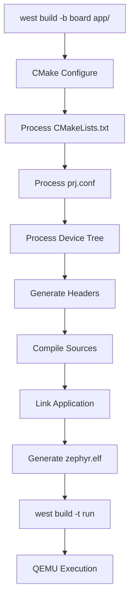

# Your First Zephyr Application

Let's build and run your first Zephyr application to verify your setup is working.

## Building the Sample

Zephyr includes a `hello_world` sample that we'll use to test your environment.

```bash
cd ~/zephyrproject

# Build for QEMU (no hardware needed)
west build -b qemu_cortex_m3 zephyr/samples/hello_world
```

### Build Output

```
-- west build: generating a build system
Loading Zephyr default modules (Zephyr base).
...
[1/108] Preparing syscall dependency handling
...
[108/108] Linking C executable zephyr/zephyr.elf
Memory region         Used Size  Region Size  %age Used
           FLASH:       12544 B       256 KB      4.79%
            SRAM:        4160 B        64 KB      6.35%
        IDT_LIST:          0 GB         2 KB      0.00%
```

## Running in QEMU

```bash
# Run the built application in QEMU
west build -t run
```

### Expected Output

```
*** Booting Zephyr OS build v3.6.0 ***
Hello World! qemu_cortex_m3
```

Press `Ctrl+A` then `X` to exit QEMU.

## Understanding the Sample

Let's examine what makes up a Zephyr application:

### Directory Structure

```
samples/hello_world/
├── CMakeLists.txt    # Build configuration
├── prj.conf          # Kconfig options
├── README.rst        # Documentation
└── src/
    └── main.c        # Application code
```

### CMakeLists.txt

```cmake
# Minimum CMake version
cmake_minimum_required(VERSION 3.20.0)

# Find Zephyr package (sets up build system)
find_package(Zephyr REQUIRED HINTS $ENV{ZEPHYR_BASE})

# Project name
project(hello_world)

# Add source files
target_sources(app PRIVATE src/main.c)
```

### prj.conf

```ini
# Project configuration (empty for hello_world)
# Add Kconfig options here
# Example: CONFIG_PRINTK=y
```

### src/main.c

```c
#include <zephyr/kernel.h>

int main(void)
{
    printk("Hello World! %s\n", CONFIG_BOARD);
    return 0;
}
```

## Creating Your Own Application

Let's create a custom application from scratch.

### Step 1: Create Directory Structure

```bash
mkdir -p ~/zephyrproject/my-apps/my-first-app/src
cd ~/zephyrproject/my-apps/my-first-app
```

### Step 2: Create CMakeLists.txt

```cmake
cmake_minimum_required(VERSION 3.20.0)
find_package(Zephyr REQUIRED HINTS $ENV{ZEPHYR_BASE})
project(my_first_app)

target_sources(app PRIVATE src/main.c)
```

### Step 3: Create prj.conf

```ini
# Enable printk for debug output
CONFIG_PRINTK=y
```

### Step 4: Create src/main.c

```c
#include <zephyr/kernel.h>

int main(void)
{
    int count = 0;

    printk("My First Zephyr App!\n");
    printk("Board: %s\n", CONFIG_BOARD);

    while (1) {
        printk("Loop count: %d\n", count++);
        k_sleep(K_SECONDS(1));
    }

    return 0;
}
```

### Step 5: Build and Run

```bash
cd ~/zephyrproject

# Build your app
west build -b qemu_cortex_m3 my-apps/my-first-app

# Run it
west build -t run
```

### Expected Output

```
*** Booting Zephyr OS build v3.6.0 ***
My First Zephyr App!
Board: qemu_cortex_m3
Loop count: 0
Loop count: 1
Loop count: 2
...
```

## Application Build Flow



## Building for Hardware

If you have a development board:

```bash
# Nordic nRF52840 DK
west build -b nrf52840dk_nrf52840 my-apps/my-first-app
west flash

# STM32F4 Discovery
west build -b stm32f4_disco my-apps/my-first-app
west flash
```

## Common Issues

### "ZEPHYR_BASE not set"

```bash
source ~/zephyrproject/zephyr/zephyr-env.sh
```

### "Board not found"

```bash
# List available boards
west boards | grep cortex
```

### Build errors

```bash
# Clean rebuild
west build -p -b qemu_cortex_m3 my-apps/my-first-app
```

### QEMU won't start

```bash
# Check if QEMU is installed
which qemu-system-arm

# Install if needed (Ubuntu)
sudo apt install qemu-system-arm
```

## Example Code

Complete, tested examples are available:

- [Hello World Example]() - Basic application
- [Blinky Example]() - LED blinking with GPIO

## Exercises

1. **Modify the message**: Change the print statement and rebuild
2. **Change sleep interval**: Make the loop faster or slower
3. **Add a counter limit**: Stop the loop after 10 iterations
4. **Try different boards**: Build for `qemu_x86` or `native_posix`

## What's Next?

Congratulations! You've successfully:
- Built a Zephyr application
- Run it in QEMU
- Created your own application from scratch

In [Part 2](), we'll dive deeper into the build system, learning about west, CMake, Kconfig, and device tree.
