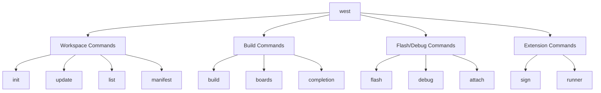
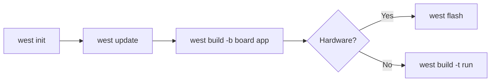

# West Command Reference

West is Zephyr's Swiss Army knife - a meta-tool for managing workspaces, building, flashing, and debugging.

## Command Categories



## Workspace Commands

### west init

Initialize a new Zephyr workspace.

```bash
# Initialize with default Zephyr manifest
west init myworkspace

# Initialize with specific manifest
west init -m https://github.com/myorg/manifest myworkspace

# Initialize with specific revision
west init -m https://github.com/zephyrproject-rtos/zephyr --mr v3.6.0 myworkspace
```

### west update

Fetch and checkout projects defined in the manifest.

```bash
# Update all projects
west update

# Update specific project
west update zephyr

# Update with parallel fetches
west update -o=--depth=1 -n
```

### west list

Show projects in the workspace.

```bash
# List all projects
west list

# Show detailed info
west list -f "{name:20} {path:30} {revision}"

# Show only project names
west list --format "{name}"
```

### west manifest

Work with the west manifest.

```bash
# Show resolved manifest
west manifest --resolve

# Validate manifest
west manifest --validate

# Show manifest path
west manifest --path
```

## Build Commands

### west build

Build a Zephyr application.

```bash
# Basic build
west build -b <board> <source_dir>

# Build with pristine (clean)
west build -p -b <board> <source_dir>

# Build with extra CMake args
west build -b <board> <source_dir> -- -DCONFIG_DEBUG=y

# Incremental build (after initial)
west build

# Build specific target
west build -t menuconfig
west build -t guiconfig
west build -t run
```

#### Build Options

| Option | Description |
|--------|-------------|
| `-b BOARD` | Target board |
| `-p` | Pristine build (clean first) |
| `-d DIR` | Build directory (default: `build`) |
| `-t TARGET` | Build specific target |
| `--` | Pass remaining args to CMake |

### west boards

List available boards.

```bash
# List all boards
west boards

# Filter by name
west boards | grep nrf

# Show board details
west boards -f "{name:30} {arch:15} {dir}"
```

## Flash and Debug Commands

### west flash

Program the built application to hardware.

```bash
# Flash default runner
west flash

# Flash specific runner
west flash --runner jlink
west flash --runner openocd
west flash --runner nrfjprog

# Flash with options
west flash --erase
west flash --hex-file custom.hex
```

### west debug

Start a debug session.

```bash
# Start debugger
west debug

# With specific runner
west debug --runner jlink

# GDB command file
west debug --gdb-init my_commands.gdb
```

### west debugserver

Start debug server without GDB.

```bash
# Start server (for IDE connection)
west debugserver

# QEMU with GDB server
west build -t debugserver
```

### west attach

Attach to running target.

```bash
west attach
```

## Build Targets

Common targets available via `west build -t`:

| Target | Description |
|--------|-------------|
| `run` | Run in QEMU/simulator |
| `debugserver` | Start GDB server |
| `menuconfig` | Text-based Kconfig editor |
| `guiconfig` | GUI Kconfig editor |
| `clean` | Clean build directory |
| `pristine` | Remove build directory |
| `ram_report` | Memory usage report |
| `rom_report` | Flash usage report |

## Workflow Examples

### New Project Workflow



```bash
# Complete new project workflow
west init ~/zephyrproject
cd ~/zephyrproject
west update
pip3 install -r zephyr/scripts/requirements.txt
source zephyr/zephyr-env.sh

# Build and run
west build -b qemu_cortex_m3 zephyr/samples/hello_world
west build -t run
```

### Development Workflow

```bash
# Initial build
west build -b nrf52840dk_nrf52840 my-app

# Edit code...

# Rebuild (incremental)
west build

# Flash
west flash

# Debug
west debug
```

### Multi-Board Testing

```bash
# Test on multiple targets
for board in qemu_cortex_m3 qemu_x86 native_posix; do
    west build -p -b $board my-app
    west build -t run
done
```

## Configuration

### west config

Manage west configuration.

```bash
# Show all config
west config -l

# Set config value
west config build.board nrf52840dk_nrf52840

# Set default build directory
west config build.dir-fmt "build/{board}"
```

### Common Configuration

```ini
# ~/.westconfig
[build]
board = nrf52840dk_nrf52840
dir-fmt = build/{board}

[flash]
runner = jlink
```

## Extension Commands

West can be extended with custom commands.

### Built-in Extensions

```bash
# Sign firmware (with MCUboot)
west sign -t imgtool

# SDK management
west sdk install
```

### Custom Extensions

Projects can provide west extensions in `scripts/west_commands/`.

## Troubleshooting

### "west: command not found"

```bash
pip3 install --user west
export PATH="$HOME/.local/bin:$PATH"
```

### Build directory issues

```bash
# Remove and rebuild
rm -rf build
west build -b board app
```

### Manifest conflicts

```bash
# Force update
west update --rebase
```

## Next Steps

Learn about [CMake basics]() to understand how builds are configured.
