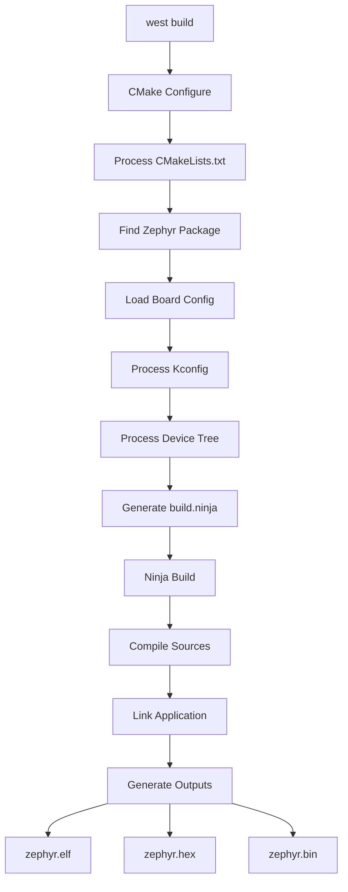

# CMake Build System

Zephyr uses CMake as its build system generator. Understanding CMake is essential for customizing builds.

## Build Flow Overview



## Minimal CMakeLists.txt

Every Zephyr application needs a CMakeLists.txt:

```cmake
# Minimum required CMake version
cmake_minimum_required(VERSION 3.20.0)

# Find and load Zephyr build system
find_package(Zephyr REQUIRED HINTS $ENV{ZEPHYR_BASE})

# Define project name
project(my_app)

# Add source files
target_sources(app PRIVATE src/main.c)
```

### Key Elements

| Element | Purpose |
|---------|---------|
| `cmake_minimum_required` | Ensures CMake version compatibility |
| `find_package(Zephyr)` | Loads Zephyr's build system |
| `project()` | Names your project |
| `target_sources()` | Adds source files to build |

## The `app` Target

After `find_package(Zephyr)`, a target named `app` is created. This is your application:

```cmake
# Add source files
target_sources(app PRIVATE
    src/main.c
    src/utils.c
    src/drivers/my_driver.c
)

# Add include directories
target_include_directories(app PRIVATE
    src/include
    ${CMAKE_CURRENT_SOURCE_DIR}/lib
)

# Add compile definitions
target_compile_definitions(app PRIVATE
    MY_FEATURE_ENABLED=1
    VERSION_STRING="1.0.0"
)

# Link libraries
target_link_libraries(app PRIVATE my_library)
```

## Adding Source Files

### Single Directory

```cmake
target_sources(app PRIVATE src/main.c)
```

### Multiple Files

```cmake
target_sources(app PRIVATE
    src/main.c
    src/config.c
    src/handlers.c
)
```

### Using Glob (Not Recommended)

```cmake
# Works but not recommended - CMake won't detect new files
file(GLOB SOURCES "src/*.c")
target_sources(app PRIVATE ${SOURCES})
```

### Conditional Sources

```cmake
target_sources(app PRIVATE src/main.c)

if(CONFIG_MY_FEATURE)
    target_sources(app PRIVATE src/my_feature.c)
endif()
```

## Include Directories

```cmake
# Application includes
target_include_directories(app PRIVATE
    ${CMAKE_CURRENT_SOURCE_DIR}/include
)

# System includes (suppress warnings)
target_include_directories(app SYSTEM PRIVATE
    ${CMAKE_CURRENT_SOURCE_DIR}/third_party/include
)
```

## Compile Definitions

```cmake
# Add preprocessor defines
target_compile_definitions(app PRIVATE
    DEBUG_ENABLED
    MAX_CONNECTIONS=10
    DEVICE_NAME="MyDevice"
)

# Conditional defines
if(CONFIG_DEBUG_OPTIMIZATIONS)
    target_compile_definitions(app PRIVATE DEBUG_BUILD)
endif()
```

## Compile Options

```cmake
# Add compiler flags
target_compile_options(app PRIVATE
    -Wall
    -Wextra
    -Werror
)

# Architecture-specific
if(CONFIG_ARM)
    target_compile_options(app PRIVATE -mthumb)
endif()
```

## Linking Libraries

### Zephyr Libraries

```cmake
# Link against Zephyr subsystems
target_link_libraries(app PRIVATE
    subsys__net__ip
    subsys__bluetooth
)
```

### External Libraries

```cmake
# Add external static library
add_library(mylib STATIC IMPORTED)
set_target_properties(mylib PROPERTIES
    IMPORTED_LOCATION ${CMAKE_CURRENT_SOURCE_DIR}/lib/libmylib.a
)
target_link_libraries(app PRIVATE mylib)
```

## Using Kconfig Values in CMake

Kconfig options are available as CMake variables with `CONFIG_` prefix:

```cmake
if(CONFIG_MY_FEATURE)
    target_sources(app PRIVATE src/my_feature.c)
endif()

if(CONFIG_LOG)
    target_compile_definitions(app PRIVATE LOGGING_ENABLED)
endif()

# Use Kconfig string values
message(STATUS "Board: ${CONFIG_BOARD}")
```

## Project Structure

### Typical Layout

```
my-app/
├── CMakeLists.txt
├── prj.conf
├── Kconfig                 # Optional: app-specific options
├── src/
│   ├── main.c
│   └── modules/
│       ├── CMakeLists.txt  # Optional: subdirectory
│       └── module.c
├── include/
│   └── my_app.h
└── boards/
    └── nrf52840dk_nrf52840.overlay
```

### Subdirectory CMakeLists.txt

```cmake
# src/modules/CMakeLists.txt
target_sources(app PRIVATE
    ${CMAKE_CURRENT_SOURCE_DIR}/module.c
)
```

Main CMakeLists.txt:
```cmake
add_subdirectory(src/modules)
```

## Build Directory Structure

After building:

```
build/
├── CMakeCache.txt          # CMake cache
├── build.ninja             # Ninja build file
├── compile_commands.json   # For IDE integration
├── zephyr/
│   ├── zephyr.elf          # Main output
│   ├── zephyr.hex
│   ├── zephyr.bin
│   ├── .config             # Final Kconfig
│   └── include/generated/  # Generated headers
└── Kconfig/                # Kconfig processing
```

## CMake Variables

### Useful Zephyr Variables

| Variable | Description |
|----------|-------------|
| `ZEPHYR_BASE` | Path to Zephyr |
| `BOARD` | Target board name |
| `BOARD_DIR` | Board directory path |
| `APPLICATION_SOURCE_DIR` | Your app's source dir |
| `PROJECT_BINARY_DIR` | Build directory |

### Using Variables

```cmake
message(STATUS "Building for: ${BOARD}")
message(STATUS "Zephyr base: ${ZEPHYR_BASE}")
message(STATUS "App source: ${APPLICATION_SOURCE_DIR}")
```

## Advanced Topics

### Custom CMake Modules

```cmake
# Add module path
list(APPEND CMAKE_MODULE_PATH ${CMAKE_CURRENT_SOURCE_DIR}/cmake)

# Include custom module
include(MyModule)
```

### Post-Build Commands

```cmake
# Run command after build
add_custom_command(TARGET app POST_BUILD
    COMMAND ${CMAKE_COMMAND} -E echo "Build complete!"
    COMMAND ${CMAKE_COMMAND} -E copy
        ${PROJECT_BINARY_DIR}/zephyr/zephyr.hex
        ${CMAKE_CURRENT_SOURCE_DIR}/output/
)
```

### Custom Targets

```cmake
# Add custom target
add_custom_target(docs
    COMMAND doxygen ${CMAKE_CURRENT_SOURCE_DIR}/Doxyfile
    WORKING_DIRECTORY ${CMAKE_CURRENT_SOURCE_DIR}
    COMMENT "Generating documentation"
)
```

## Troubleshooting

### "Zephyr package not found"

```bash
export ZEPHYR_BASE=~/zephyrproject/zephyr
# Or
source ~/zephyrproject/zephyr/zephyr-env.sh
```

### CMake cache issues

```bash
# Clean rebuild
west build -p
```

### View CMake configuration

```bash
# See all variables
cmake -LA build/
```

## Next Steps

Learn about [Kconfig]() to configure your application's features.
