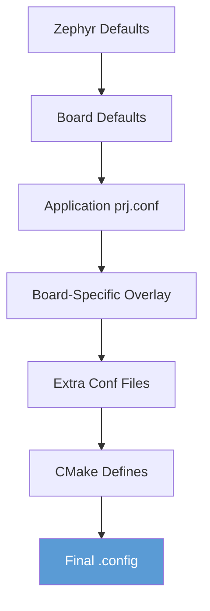

# Kconfig Configuration System

Kconfig is Zephyr's configuration system, inherited from the Linux kernel. It provides a hierarchical way to configure features.

## Configuration Hierarchy



Higher levels override lower levels. Your `prj.conf` overrides Zephyr defaults but can be overridden by board-specific settings.

## prj.conf Basics

The main configuration file for your application:

```ini
# Enable logging
CONFIG_LOG=y
CONFIG_LOG_DEFAULT_LEVEL=3

# Enable networking
CONFIG_NETWORKING=y
CONFIG_NET_IPV4=y
CONFIG_NET_TCP=y

# Set string value
CONFIG_BT_DEVICE_NAME="MyDevice"

# Set numeric value
CONFIG_MAIN_STACK_SIZE=2048
```

### Syntax Rules

| Type | Syntax | Example |
|------|--------|---------|
| Boolean enable | `CONFIG_X=y` | `CONFIG_LOG=y` |
| Boolean disable | `CONFIG_X=n` | `CONFIG_LOG=n` |
| Integer | `CONFIG_X=N` | `CONFIG_HEAP_SIZE=4096` |
| String | `CONFIG_X="str"` | `CONFIG_BT_DEVICE_NAME="Dev"` |
| Hex | `CONFIG_X=0xN` | `CONFIG_FLASH_BASE=0x08000000` |

## Using menuconfig

Interactive configuration editor:

```bash
# Text-based interface
west build -t menuconfig

# GUI interface (requires Python Tk)
west build -t guiconfig
```

### menuconfig Navigation

| Key | Action |
|-----|--------|
| ↑↓ | Move between options |
| Space | Toggle boolean |
| Enter | Enter submenu |
| / | Search |
| ? | Show help for item |
| S | Save |
| Q | Quit |

## Kconfig Files

### Application Kconfig

Create custom options in your application:

```kconfig
# Kconfig in application root

mainmenu "My Application Configuration"

config MY_FEATURE
    bool "Enable my feature"
    default y
    help
      This enables my custom feature.

config MY_BUFFER_SIZE
    int "Buffer size"
    default 256
    range 64 4096
    depends on MY_FEATURE
    help
      Size of the internal buffer in bytes.

config MY_DEVICE_NAME
    string "Device name"
    default "MyDevice"
```

### Using in prj.conf

```ini
CONFIG_MY_FEATURE=y
CONFIG_MY_BUFFER_SIZE=512
CONFIG_MY_DEVICE_NAME="CustomName"
```

### Using in Code

```c
#include <zephyr/kernel.h>

#if defined(CONFIG_MY_FEATURE)
static uint8_t buffer[CONFIG_MY_BUFFER_SIZE];
#endif

void init(void)
{
    printk("Device: %s\n", CONFIG_MY_DEVICE_NAME);

    #if CONFIG_MY_FEATURE
    /* Feature-specific code */
    #endif
}
```

## Kconfig Dependencies

### depends on

Option only visible if dependency is met:

```kconfig
config MY_WIFI_FEATURE
    bool "WiFi feature"
    depends on WIFI
```

### select

Automatically enable another option:

```kconfig
config MY_NET_FEATURE
    bool "Networking feature"
    select NETWORKING
    select NET_IPV4
```

### imply

Soft dependency (can be overridden):

```kconfig
config MY_DEBUG_FEATURE
    bool "Debug feature"
    imply LOG
    imply LOG_DEFAULT_LEVEL_DBG
```

## Configuration Fragments

### Board-Specific Configuration

Create board-specific overrides:

```
my-app/
├── prj.conf                          # Base config
└── boards/
    ├── nrf52840dk_nrf52840.conf      # nRF52840 specific
    └── stm32f4_disco.conf            # STM32F4 specific
```

Build system automatically picks the right fragment.

### Extra Conf Files

Add additional configuration files:

```bash
# Via command line
west build -b board -- -DEXTRA_CONF_FILE="debug.conf;network.conf"

# Or in CMakeLists.txt
set(EXTRA_CONF_FILE ${CMAKE_CURRENT_SOURCE_DIR}/debug.conf)
```

## Common Configuration Patterns

### Enabling Subsystems

```ini
# Logging
CONFIG_LOG=y
CONFIG_LOG_DEFAULT_LEVEL=4

# Shell
CONFIG_SHELL=y
CONFIG_SHELL_BACKEND_SERIAL=y

# Bluetooth
CONFIG_BT=y
CONFIG_BT_PERIPHERAL=y

# Networking
CONFIG_NETWORKING=y
CONFIG_NET_IPV4=y
CONFIG_NET_SOCKETS=y
```

### Memory Configuration

```ini
# Stack sizes
CONFIG_MAIN_STACK_SIZE=2048
CONFIG_SYSTEM_WORKQUEUE_STACK_SIZE=1024
CONFIG_ISR_STACK_SIZE=1024

# Heap
CONFIG_HEAP_MEM_POOL_SIZE=4096
```

### Debug Configuration

```ini
# Debug optimizations
CONFIG_DEBUG_OPTIMIZATIONS=y
CONFIG_DEBUG_THREAD_INFO=y

# Assert
CONFIG_ASSERT=y
CONFIG_ASSERT_LEVEL=2

# Stack protection
CONFIG_STACK_SENTINEL=y
```

## Finding Configuration Options

### Search in menuconfig

```bash
west build -t menuconfig
# Press / and search
```

### Search in Documentation

```bash
# Search Kconfig files
grep -r "CONFIG_MY_OPTION" $ZEPHYR_BASE/Kconfig*
```

### Online Documentation

Zephyr's documentation has a complete [Kconfig reference](https://docs.zephyrproject.org/latest/kconfig.html).

## Best Practices

### 1. Use prj.conf for Application Settings

```ini
# prj.conf - application-level settings
CONFIG_LOG=y
CONFIG_MY_APP_FEATURE=y
```

### 2. Use Board Fragments for Hardware-Specific

```ini
# boards/my_board.conf - hardware-specific
CONFIG_GPIO=y
CONFIG_I2C=y
```

### 3. Document Your Choices

```ini
# Enable logging for debugging sensor readings
CONFIG_LOG=y
CONFIG_SENSOR_LOG_LEVEL_DBG=y

# Need larger stack for TLS
CONFIG_MAIN_STACK_SIZE=4096
```

### 4. Check Dependencies

```bash
# See what a symbol depends on
west build -t menuconfig
# Navigate to symbol, press ?
```

## Troubleshooting

### Option Not Taking Effect

```bash
# Check final .config
cat build/zephyr/.config | grep MY_OPTION

# Check dependencies
west build -t menuconfig
# Search for option and check depends on
```

### Unknown Symbol Warnings

```
warning: MY_OPTION (defined at ...) was assigned the value "y" but...
```

Check if the option exists and its dependencies are met.

### Conflicting Options

```bash
# Use guiconfig to visualize conflicts
west build -t guiconfig
```

## Next Steps

Learn about [Device Tree]() to describe your hardware.
