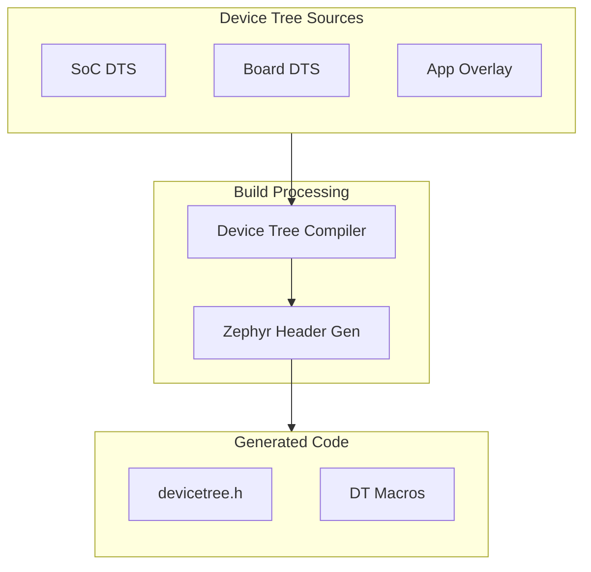
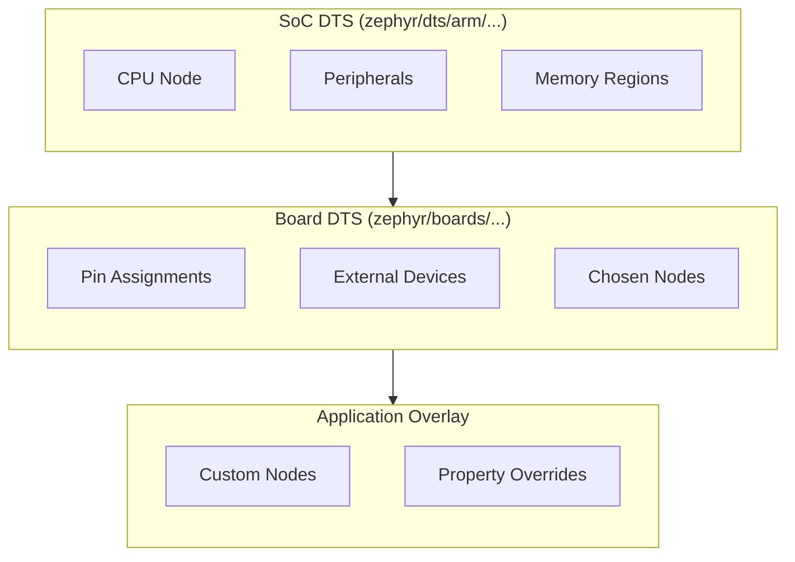

# Device Tree Fundamentals

Device Tree describes hardware in a structured way, allowing the same code to run on different boards.

## What is Device Tree?

Device Tree Source (DTS) files describe:
- SoC peripherals (GPIO, I2C, SPI, UART)
- Board-specific hardware (LEDs, buttons, sensors)
- Memory layout
- Pin configurations



## DTS Syntax Basics

### Node Structure

```dts
/ {
    /* Root node */

    node-name@unit-address {
        compatible = "vendor,device";
        reg = <base_address size>;
        status = "okay";

        child-node {
            /* Child properties */
        };
    };
};
```

### Property Types

| Type | Syntax | Example |
|------|--------|---------|
| String | `property = "value";` | `label = "LED0";` |
| Integer | `property = <value>;` | `reg = <0x40000000>;` |
| Array | `property = <v1 v2>;` | `reg = <0x0 0x1000>;` |
| Boolean | `property;` | `read-only;` |
| Phandle | `property = <&label>;` | `gpios = <&gpio0 13>;` |

### Labels

Labels create references to nodes:

```dts
led0: led_0 {
    gpios = <&gpio0 13 GPIO_ACTIVE_LOW>;
};

/* Can reference as &led0 elsewhere */
```

## Example: LED Definition

```dts
/ {
    leds {
        compatible = "gpio-leds";

        led0: led_0 {
            gpios = <&gpio0 13 GPIO_ACTIVE_LOW>;
            label = "Green LED";
        };

        led1: led_1 {
            gpios = <&gpio0 14 GPIO_ACTIVE_LOW>;
            label = "Red LED";
        };
    };

    aliases {
        led0 = &led0;
        led1 = &led1;
    };
};
```

## Using Device Tree in Code

### Device Tree Macros

```c
#include <zephyr/devicetree.h>

/* Get node by alias */
#define LED0_NODE DT_ALIAS(led0)

/* Get GPIO spec from node */
static const struct gpio_dt_spec led =
    GPIO_DT_SPEC_GET(LED0_NODE, gpios);

/* Check if node exists */
#if DT_NODE_EXISTS(DT_ALIAS(led0))
    /* LED is defined */
#endif

/* Get property values */
#define MY_REG_ADDR DT_REG_ADDR(DT_NODELABEL(my_device))
#define MY_REG_SIZE DT_REG_SIZE(DT_NODELABEL(my_device))
```

### Common Macros

| Macro | Purpose |
|-------|---------|
| `DT_NODELABEL(label)` | Get node by label |
| `DT_ALIAS(alias)` | Get node by alias |
| `DT_CHOSEN(chosen)` | Get chosen node |
| `DT_PROP(node, prop)` | Get property value |
| `DT_REG_ADDR(node)` | Get register address |
| `DT_NODE_EXISTS(node)` | Check if node exists |

### Practical Example

```c
#include <zephyr/kernel.h>
#include <zephyr/device.h>
#include <zephyr/drivers/gpio.h>

/* Get LED specification from device tree */
#define LED0_NODE DT_ALIAS(led0)

#if !DT_NODE_HAS_STATUS(LED0_NODE, okay)
#error "LED0 not defined in device tree"
#endif

static const struct gpio_dt_spec led =
    GPIO_DT_SPEC_GET(LED0_NODE, gpios);

int main(void)
{
    if (!gpio_is_ready_dt(&led)) {
        return -1;
    }

    gpio_pin_configure_dt(&led, GPIO_OUTPUT_ACTIVE);

    while (1) {
        gpio_pin_toggle_dt(&led);
        k_msleep(1000);
    }
}
```

## Device Tree Hierarchy



## Bindings

Bindings define what properties a device type can have:

```yaml
# dts/bindings/gpio-leds.yaml
description: GPIO LEDs

compatible: "gpio-leds"

child-binding:
  description: An LED
  properties:
    gpios:
      type: phandle-array
      required: true
    label:
      type: string
```

## Common Node Types

### GPIO Controller

```dts
gpio0: gpio@50000000 {
    compatible = "nordic,nrf-gpio";
    reg = <0x50000000 0x1000>;
    gpio-controller;
    #gpio-cells = <2>;
};
```

### I2C Controller

```dts
i2c0: i2c@40003000 {
    compatible = "nordic,nrf-twim";
    reg = <0x40003000 0x1000>;
    #address-cells = <1>;
    #size-cells = <0>;
    status = "okay";

    sensor@48 {
        compatible = "ti,tmp102";
        reg = <0x48>;
    };
};
```

### SPI Controller

```dts
spi0: spi@40004000 {
    compatible = "nordic,nrf-spim";
    reg = <0x40004000 0x1000>;
    #address-cells = <1>;
    #size-cells = <0>;
    status = "okay";

    flash@0 {
        compatible = "jedec,spi-nor";
        reg = <0>;
        spi-max-frequency = <8000000>;
    };
};
```

## Chosen Nodes

Special nodes that point to preferred devices:

```dts
/ {
    chosen {
        zephyr,console = &uart0;
        zephyr,shell-uart = &uart0;
        zephyr,sram = &sram0;
        zephyr,flash = &flash0;
    };
};
```

Use in code:
```c
#define CONSOLE_DEV DT_CHOSEN(zephyr_console)
```

## Examining Device Tree

### View Preprocessed DTS

```bash
# After building
cat build/zephyr/zephyr.dts.pre
```

### View Final DTS

```bash
cat build/zephyr/zephyr.dts
```

### Generated Header

```bash
cat build/zephyr/include/generated/devicetree_generated.h
```

## Troubleshooting

### "Node not found"

Check:
1. Node label is correct
2. Node has `status = "okay"`
3. Binding exists for compatible string

### "Property not found"

```c
/* Check if property exists first */
#if DT_NODE_HAS_PROP(MY_NODE, my_prop)
    int val = DT_PROP(MY_NODE, my_prop);
#endif
```

### Debugging DTS Issues

```bash
# Check generated devicetree
cat build/zephyr/zephyr.dts | grep -A 10 "my_node"
```

## Next Steps

Learn about [Device Tree Overlays]() to customize hardware for your application.
