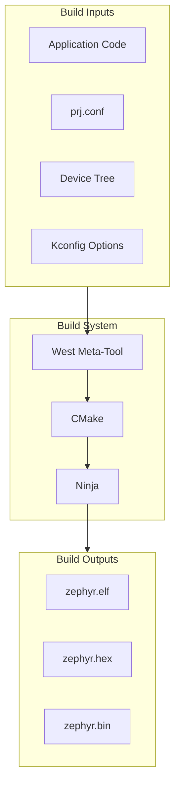

# Part 2: Build System Fundamentals

This section covers Zephyr's powerful build system, including west, CMake, Kconfig, and device tree.

## What You'll Learn

- Deep dive into west commands and workspace management
- CMake build system structure and customization
- Kconfig configuration system and troubleshooting
- Device tree fundamentals, overlays, and troubleshooting
- Standard application structure and organization

## Chapters

| Chapter | Description |
|---------|-------------|
| [West Commands]() | Complete west command reference with workflows |
| [CMake Basics]() | CMakeLists.txt structure and build flow |
| [Kconfig]() | Configuration system with hierarchy diagrams |
| [Kconfig Troubleshooting]() | Common Kconfig errors and how to fix them |
| [Device Tree]() | DTS fundamentals and syntax |
| [Overlays]() | Device tree overlays and config fragments |
| [Devicetree Troubleshooting]() | Decoding DTS errors and debugging strategies |
| [Application Structure]() | Standard Zephyr app layout |

## Build System Overview

## Prerequisites

Before starting this section, you should have:

- Completed Part 1 (working Zephyr environment)
- Basic understanding of build systems
- Familiarity with configuration files

## Key Concepts

### West
The meta-tool that orchestrates everything - workspace management, building, flashing, and debugging.

### CMake
The build system generator that creates ninja build files from your CMakeLists.txt.

### Kconfig
Linux kernel-style configuration system that lets you enable/disable features and set options.

### Device Tree
Hardware description language that tells Zephyr about your board's peripherals.

{: .note }
Understanding the build system is crucial for effective Zephyr development. Take your time with this section.
