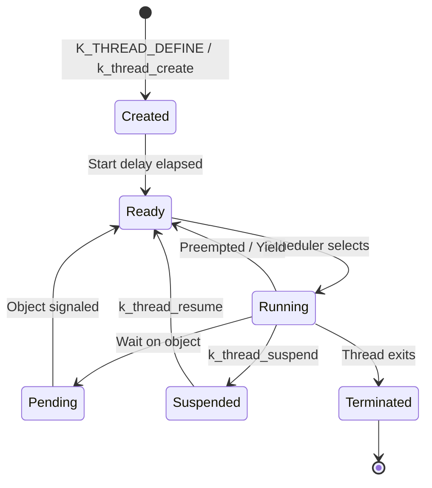

# Threads

Threads are the basic unit of execution in Zephyr. Understanding threads is fundamental to Zephyr development.

## Thread Lifecycle



## Creating Threads

### Static Creation (K_THREAD_DEFINE)

Preferred for threads known at compile time:

```c
#include <zephyr/kernel.h>

#define STACK_SIZE 1024
#define PRIORITY 5

void my_thread_entry(void *p1, void *p2, void *p3)
{
    while (1) {
        printk("Thread running\n");
        k_sleep(K_SECONDS(1));
    }
}

K_THREAD_DEFINE(my_thread, STACK_SIZE,
                my_thread_entry, NULL, NULL, NULL,
                PRIORITY, 0, 0);
```

### Dynamic Creation (k_thread_create)

For threads created at runtime:

```c
#include <zephyr/kernel.h>

#define STACK_SIZE 1024
K_THREAD_STACK_DEFINE(my_stack, STACK_SIZE);
struct k_thread my_thread_data;

void my_thread_entry(void *p1, void *p2, void *p3)
{
    int *value = (int *)p1;
    printk("Received value: %d\n", *value);
}

int main(void)
{
    static int my_value = 42;

    k_tid_t tid = k_thread_create(&my_thread_data, my_stack,
                                  K_THREAD_STACK_SIZEOF(my_stack),
                                  my_thread_entry,
                                  &my_value, NULL, NULL,
                                  5, 0, K_NO_WAIT);
    return 0;
}
```

## Thread Parameters

### Priority

```c
/* Cooperative priorities: negative values */
#define COOP_PRIORITY -1   /* Won't be preempted */

/* Preemptive priorities: 0 to CONFIG_NUM_PREEMPT_PRIORITIES-1 */
#define PREEMPT_PRIORITY 5  /* Can be preempted */

/* Lower number = higher priority */
K_THREAD_DEFINE(high_prio, 1024, entry, NULL, NULL, NULL, 1, 0, 0);
K_THREAD_DEFINE(low_prio, 1024, entry, NULL, NULL, NULL, 10, 0, 0);
```

### Stack Size

```c
/* Minimum recommended: 256 bytes for simple threads */
/* With logging/printk: 1024+ bytes */
/* With floating point: add more */

#define MY_STACK_SIZE 1024

/* Check actual usage after running */
size_t unused = k_thread_stack_space_get(k_current_get());
printk("Stack unused: %zu bytes\n", unused);
```

### Options

```c
/* Thread options (OR together) */
#define OPTIONS (K_ESSENTIAL | K_FP_REGS)

K_THREAD_DEFINE(my_thread, STACK_SIZE,
                entry, NULL, NULL, NULL,
                PRIORITY, OPTIONS, 0);
```

| Option | Description |
|--------|-------------|
| `K_ESSENTIAL` | System aborts if thread aborts |
| `K_FP_REGS` | Thread uses floating point |
| `K_USER` | User mode thread |
| `K_INHERIT_PERMS` | Inherit memory permissions |

### Start Delay

```c
/* Start immediately */
K_THREAD_DEFINE(..., K_NO_WAIT);

/* Start after delay */
K_THREAD_DEFINE(..., K_MSEC(100));

/* Don't start automatically (start manually with k_thread_start) */
K_THREAD_DEFINE(..., K_FOREVER);
```

## Thread Control

### Sleeping

```c
/* Sleep for duration */
k_sleep(K_MSEC(500));
k_sleep(K_SECONDS(1));
k_msleep(500);          /* Convenience: milliseconds */
k_usleep(1000);         /* Convenience: microseconds */

/* Sleep until absolute time */
k_sleep(K_TIMEOUT_ABS_MS(target_ms));
```

### Yielding

```c
/* Give up CPU to other threads of same priority */
k_yield();
```

### Suspend and Resume

```c
k_tid_t tid = /* ... */;

/* Suspend a thread */
k_thread_suspend(tid);

/* Resume a suspended thread */
k_thread_resume(tid);
```

### Thread Abort

```c
/* Abort a thread */
k_thread_abort(tid);

/* Thread aborts itself */
k_thread_abort(k_current_get());
/* Or simply return from entry function */
```

## Thread Information

```c
/* Get current thread */
k_tid_t current = k_current_get();

/* Get thread name (if CONFIG_THREAD_NAME=y) */
const char *name = k_thread_name_get(tid);

/* Set thread name */
k_thread_name_set(tid, "my_thread");

/* Check stack usage */
size_t unused = k_thread_stack_space_get(tid);
```

## Passing Data to Threads

### Via Parameters

```c
struct thread_data {
    int id;
    char name[32];
};

void thread_entry(void *p1, void *p2, void *p3)
{
    struct thread_data *data = (struct thread_data *)p1;
    printk("Thread %d: %s\n", data->id, data->name);
}

static struct thread_data my_data = {.id = 1, .name = "worker"};

K_THREAD_DEFINE(worker, 1024, thread_entry, &my_data, NULL, NULL, 5, 0, 0);
```

### Via Thread Local Storage

```c
/* Requires CONFIG_THREAD_LOCAL_STORAGE=y */
__thread int my_tls_var;

void thread_entry(void *p1, void *p2, void *p3)
{
    my_tls_var = 42;  /* Each thread has its own copy */
}
```

## Common Patterns

### Worker Thread

```c
void worker_thread(void *p1, void *p2, void *p3)
{
    struct k_msgq *queue = (struct k_msgq *)p1;
    struct work_item item;

    while (1) {
        /* Block until work available */
        k_msgq_get(queue, &item, K_FOREVER);

        /* Process work */
        process_item(&item);
    }
}
```

### Periodic Thread

```c
void periodic_thread(void *p1, void *p2, void *p3)
{
    int64_t next_wake = k_uptime_get();

    while (1) {
        /* Do periodic work */
        do_periodic_task();

        /* Sleep until next period */
        next_wake += 1000;  /* 1 second period */
        k_sleep(K_TIMEOUT_ABS_MS(next_wake));
    }
}
```

## Best Practices

1. **Size stacks appropriately** - Use `CONFIG_STACK_SENTINEL` to detect overflow
2. **Choose priorities carefully** - Avoid priority inversion
3. **Use static threads when possible** - More efficient than dynamic
4. **Name threads** - Helps with debugging (`CONFIG_THREAD_NAME=y`)
5. **Don't busy-wait** - Use `k_sleep` or wait on kernel objects

## Debugging Threads

```bash
# Enable thread monitoring
CONFIG_THREAD_MONITOR=y
CONFIG_THREAD_NAME=y
CONFIG_THREAD_STACK_INFO=y

# Use shell to inspect
kernel threads
kernel stacks
```

## Example Code

See the complete [Threads Example]() demonstrating thread creation and coordination.

## Next Steps

Learn about [Scheduling]() to understand how threads share the CPU.
