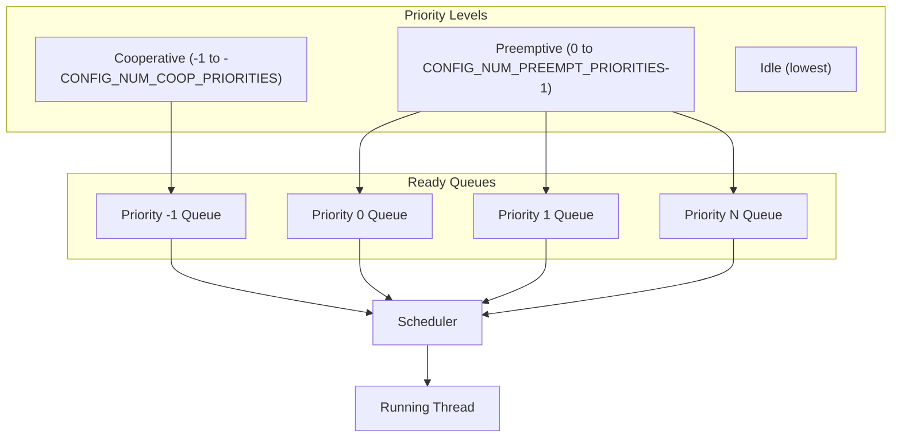
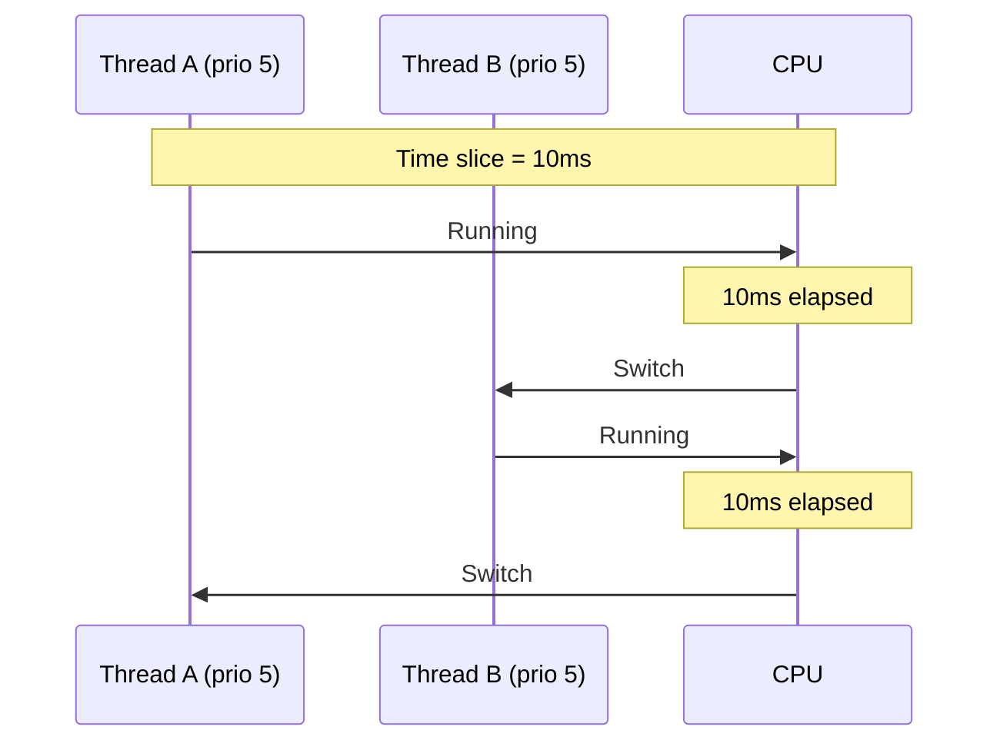
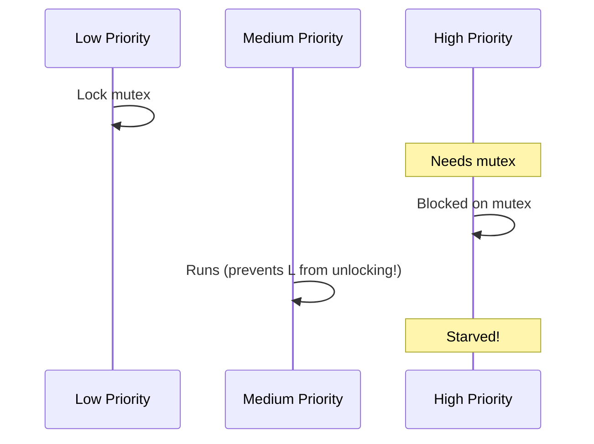

# Scheduling

The Zephyr scheduler determines which thread runs and when. Understanding scheduling is crucial for real-time applications.

## Scheduler Overview



## Priority Types

### Cooperative Threads

Negative priority values. Not preempted by other threads:

```c
/* Cooperative thread - only yields voluntarily */
#define COOP_PRIORITY -1

void coop_thread(void *p1, void *p2, void *p3)
{
    while (1) {
        do_critical_work();
        k_yield();  /* Must yield to let others run */
    }
}

K_THREAD_DEFINE(coop, 1024, coop_thread, NULL, NULL, NULL,
                COOP_PRIORITY, 0, 0);
```

### Preemptive Threads

Non-negative priority values. Can be preempted:

```c
/* Preemptive thread - can be preempted by higher priority */
#define HIGH_PRIORITY 2
#define LOW_PRIORITY 7

void preempt_thread(void *p1, void *p2, void *p3)
{
    while (1) {
        do_work();
        k_sleep(K_MSEC(100));
    }
}

K_THREAD_DEFINE(high, 1024, preempt_thread, NULL, NULL, NULL,
                HIGH_PRIORITY, 0, 0);
K_THREAD_DEFINE(low, 1024, preempt_thread, NULL, NULL, NULL,
                LOW_PRIORITY, 0, 0);
```

## Scheduling Rules

1. **Highest priority runs** - Lower number = higher priority
2. **Cooperative threads not preempted** - Except by ISRs
3. **Equal priority = round-robin** - Time-sliced if enabled
4. **Preemption on state change** - When higher priority becomes ready

## Time Slicing

Enable round-robin for equal-priority preemptive threads:

```ini
# prj.conf
CONFIG_TIMESLICING=y
CONFIG_TIMESLICE_SIZE=10    # Milliseconds
CONFIG_TIMESLICE_PRIORITY=0 # Apply to priorities >= this
```



## Priority Manipulation

### Change Priority at Runtime

```c
k_tid_t tid = k_current_get();

/* Get current priority */
int prio = k_thread_priority_get(tid);

/* Set new priority */
k_thread_priority_set(tid, 3);
```

### Priority Inheritance (Mutexes)

Zephyr mutexes implement priority inheritance to prevent priority inversion:

```c
struct k_mutex my_mutex;

void low_priority_thread(void *p1, void *p2, void *p3)
{
    k_mutex_lock(&my_mutex, K_FOREVER);
    /* If high priority thread waits, this thread's priority is boosted */
    do_work();
    k_mutex_unlock(&my_mutex);
}
```

## Scheduler Locking

Temporarily prevent scheduling (except ISRs):

```c
/* Lock scheduler */
k_sched_lock();

/* Critical section - no thread switch possible */
critical_operation();

/* Unlock scheduler */
k_sched_unlock();
```

{: .warning }
Use scheduler locking sparingly. It delays all other threads.

## Preemption Points

Preemption can occur at these points:

1. **Return from ISR** - If higher priority thread became ready
2. **Kernel API calls** - That may wake other threads
3. **Time slice expiry** - For equal priority threads
4. **Explicit yield** - `k_yield()`

## Practical Examples

### High Priority Event Handler

```c
#define EVENT_PRIO 1      /* High priority */
#define WORKER_PRIO 5     /* Normal priority */

void event_handler(void *p1, void *p2, void *p3)
{
    struct k_sem *event_sem = (struct k_sem *)p1;

    while (1) {
        k_sem_take(event_sem, K_FOREVER);
        /* Handle event with high priority */
        handle_event();
    }
}

void worker_thread(void *p1, void *p2, void *p3)
{
    while (1) {
        /* Background work - interrupted by events */
        do_background_work();
        k_yield();
    }
}
```

### Priority-Based Task Structure

```c
/* Priority assignments */
#define ISR_DEFERRED_PRIO  -1  /* Cooperative, ISR follow-up */
#define CRITICAL_TASK_PRIO  1  /* Time-critical */
#define NORMAL_TASK_PRIO    5  /* Normal operations */
#define BACKGROUND_PRIO    10  /* Low priority background */
#define IDLE_TASK_PRIO     14  /* Just above idle */
```

## Debugging Scheduling

### Thread Shell Commands

```bash
# Enable shell
CONFIG_SHELL=y
CONFIG_KERNEL_SHELL=y

# In shell:
kernel threads    # Show all threads
kernel ready      # Show ready queue
```

### Runtime Statistics

```c
/* Enable thread runtime stats */
CONFIG_THREAD_RUNTIME_STATS=y

k_thread_runtime_stats_t stats;
k_thread_runtime_stats_get(tid, &stats);
printk("Execution cycles: %llu\n", stats.execution_cycles);
```

## Common Pitfalls

### Priority Inversion



**Solution**: Use mutexes (they have priority inheritance).

### Starvation

High priority threads that never block prevent lower priority from running.

**Solution**: Ensure high priority threads block or yield.

## Best Practices

1. **Minimize cooperative thread usage** - Use only when necessary
2. **Keep priority ranges small** - Easier to reason about
3. **Use mutexes for shared resources** - Priority inheritance helps
4. **Test under load** - Verify scheduling behavior
5. **Document priority assignments** - Comment why each priority

## Next Steps

Learn about [Interrupts]() and how they interact with scheduling.
