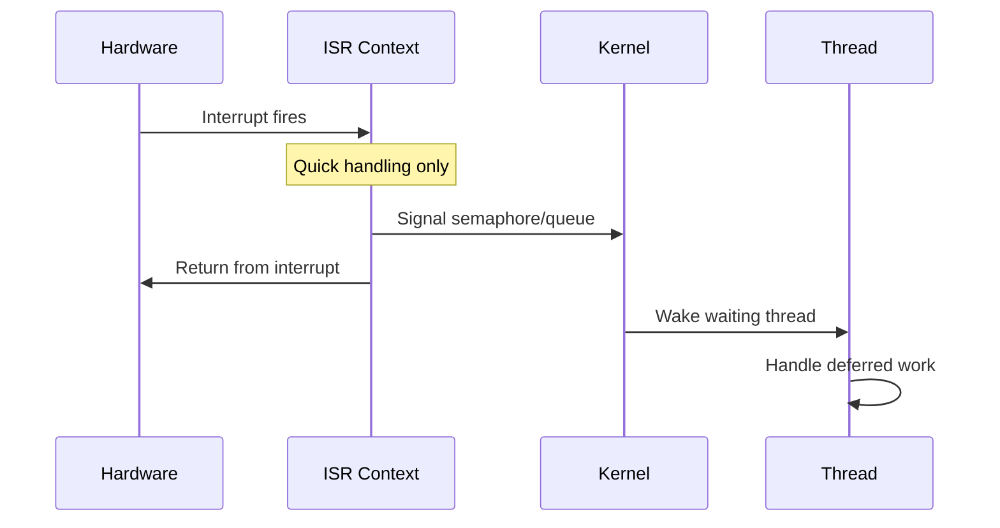

# Interrupt Handling

Interrupts (ISRs) handle hardware events with minimal latency. Understanding ISR constraints is critical for reliable systems.

## ISR to Thread Flow



## Defining ISRs

### Standard ISR (IRQ_CONNECT)

```c
#include <zephyr/kernel.h>
#include <zephyr/irq.h>

#define MY_IRQ 15
#define MY_IRQ_PRIORITY 2
#define MY_IRQ_FLAGS 0

void my_isr(const void *arg)
{
    /* Handle interrupt - keep it short! */
    volatile uint32_t *status = (uint32_t *)arg;
    *status = 0;  /* Clear interrupt */

    /* Signal thread to handle */
    k_sem_give(&my_sem);
}

void setup_irq(void)
{
    IRQ_CONNECT(MY_IRQ, MY_IRQ_PRIORITY, my_isr,
                (void *)STATUS_REG_ADDR, MY_IRQ_FLAGS);
    irq_enable(MY_IRQ);
}
```

### Direct ISR (Lower Latency)

```c
#include <zephyr/irq.h>

ISR_DIRECT_DECLARE(my_direct_isr)
{
    /* Minimal overhead ISR */
    /* Cannot use most kernel APIs! */

    return 1;  /* Return 1 to indicate handled */
}

void setup_direct_irq(void)
{
    IRQ_DIRECT_CONNECT(MY_IRQ, MY_IRQ_PRIORITY,
                       my_direct_isr, MY_IRQ_FLAGS);
    irq_enable(MY_IRQ);
}
```

## ISR Restrictions

### APIs Safe in ISR

| API | Safe? | Notes |
|-----|-------|-------|
| `k_sem_give()` | ✓ | Signal semaphore |
| `k_msgq_put()` | ✓ | Non-blocking only |
| `k_fifo_put()` | ✓ | Add to FIFO |
| `k_work_submit()` | ✓ | Submit work item |
| `k_poll_signal_raise()` | ✓ | Signal poll |

### APIs NOT Safe in ISR

| API | Notes |
|-----|-------|
| `k_sem_take()` | Blocking not allowed |
| `k_sleep()` | Cannot sleep in ISR |
| `k_mutex_*()` | Mutexes are for threads |
| `printk()` | Usually unsafe (blocks) |
| `malloc()` | Not ISR-safe |

### Check if in ISR

```c
void my_function(void)
{
    if (k_is_in_isr()) {
        /* Use ISR-safe path */
        k_sem_give(&my_sem);
    } else {
        /* Can use normal APIs */
        k_sem_take(&my_sem, K_FOREVER);
    }
}
```

## ISR to Thread Communication

### Using Semaphore

```c
K_SEM_DEFINE(data_ready, 0, 1);

void my_isr(const void *arg)
{
    /* Quick: acknowledge interrupt, signal thread */
    k_sem_give(&data_ready);
}

void data_thread(void *p1, void *p2, void *p3)
{
    while (1) {
        k_sem_take(&data_ready, K_FOREVER);
        /* Process data - can take time */
        process_data();
    }
}
```

### Using Work Queue

```c
struct k_work my_work;

void work_handler(struct k_work *work)
{
    /* Runs in thread context - safe to use all APIs */
    process_interrupt_data();
}

void my_isr(const void *arg)
{
    /* Submit work from ISR */
    k_work_submit(&my_work);
}

void init(void)
{
    k_work_init(&my_work, work_handler);
}
```

### Using Message Queue

```c
K_MSGQ_DEFINE(event_queue, sizeof(struct event), 10, 4);

void my_isr(const void *arg)
{
    struct event evt = {.type = EVENT_DATA_READY};

    /* Non-blocking put */
    k_msgq_put(&event_queue, &evt, K_NO_WAIT);
}

void event_thread(void *p1, void *p2, void *p3)
{
    struct event evt;

    while (1) {
        k_msgq_get(&event_queue, &evt, K_FOREVER);
        handle_event(&evt);
    }
}
```

## Interrupt Control

### Enable/Disable Specific IRQ

```c
/* Disable specific interrupt */
irq_disable(MY_IRQ);

/* Enable specific interrupt */
irq_enable(MY_IRQ);

/* Check if enabled */
bool enabled = irq_is_enabled(MY_IRQ);
```

### Global Interrupt Control

```c
/* Disable all interrupts */
unsigned int key = irq_lock();

/* Critical section - no interrupts */

/* Restore interrupt state */
irq_unlock(key);
```

{: .warning }
Minimize time with interrupts disabled. It increases interrupt latency.

## Device Tree IRQ Configuration

Many drivers get IRQ configuration from device tree:

```dts
my_device: my_device@40000000 {
    compatible = "vendor,device";
    reg = <0x40000000 0x1000>;
    interrupts = <15 2>;  /* IRQ 15, priority 2 */
    status = "okay";
};
```

Access in driver:
```c
#define MY_DEV_NODE DT_NODELABEL(my_device)

IRQ_CONNECT(DT_IRQN(MY_DEV_NODE),
            DT_IRQ(MY_DEV_NODE, priority),
            my_isr, NULL, 0);
```

## Nested Interrupts

Zephyr supports nested interrupts on most architectures:

```c
/* Higher priority IRQ can interrupt lower priority ISR */
#define LOW_PRIO_IRQ_PRIORITY 3
#define HIGH_PRIO_IRQ_PRIORITY 1  /* Can nest */
```

## Best Practices

### 1. Keep ISRs Short

```c
/* BAD - too much work in ISR */
void bad_isr(const void *arg)
{
    for (int i = 0; i < 1000; i++) {
        process_byte(buffer[i]);  /* Too slow! */
    }
}

/* GOOD - defer to thread */
void good_isr(const void *arg)
{
    read_hw_to_buffer();  /* Quick HW access */
    k_sem_give(&data_ready);  /* Signal thread */
}
```

### 2. Don't Allocate in ISR

```c
/* BAD */
void bad_isr(const void *arg)
{
    void *ptr = k_malloc(100);  /* Never do this! */
}

/* GOOD - use pre-allocated buffers */
static uint8_t isr_buffer[100];

void good_isr(const void *arg)
{
    copy_to_buffer(isr_buffer);
    k_work_submit(&process_work);
}
```

### 3. Use Correct Priorities

Higher priority interrupts for time-critical operations:

```c
/* Highest priority for critical timing */
#define MOTOR_CONTROL_PRIORITY 0

/* Lower priority for non-time-critical */
#define BUTTON_PRIORITY 3
```

## Debugging ISRs

### ISR Timing

```c
void my_isr(const void *arg)
{
    uint32_t start = k_cycle_get_32();

    /* ISR work */

    uint32_t cycles = k_cycle_get_32() - start;
    /* Log or track cycles for analysis */
}
```

### ISR Shell Commands

```bash
# Enable interrupt info
CONFIG_IRQ_SHELL=y

# In shell:
irq list      # Show registered interrupts
```

## Next Steps

Learn about [Timing Services]() for delays and timers.
