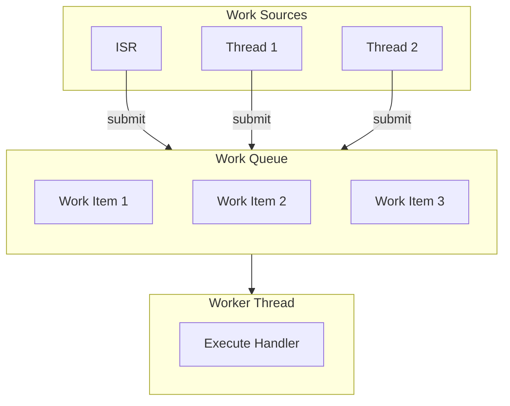

# Workqueues

Workqueues provide deferred execution - scheduling work to run in thread context from ISRs or other threads.

## Workqueue Architecture



## System Workqueue

Zephyr provides a built-in system workqueue:

```c
#include <zephyr/kernel.h>

void my_work_handler(struct k_work *work)
{
    /* Runs in system workqueue thread context */
    /* Safe to use all kernel APIs */
    process_data();
}

struct k_work my_work;

void init(void)
{
    k_work_init(&my_work, my_work_handler);
}

void submit_work(void)
{
    /* Can be called from ISR or thread */
    k_work_submit(&my_work);
}
```

## Work Types

### Basic Work (k_work)

Single-shot work item:

```c
struct k_work my_work;

void handler(struct k_work *work)
{
    printk("Work executed\n");
}

void main(void)
{
    k_work_init(&my_work, handler);
    k_work_submit(&my_work);
}
```

### Delayable Work (k_work_delayable)

Work that executes after a delay:

```c
struct k_work_delayable delayed_work;

void delayed_handler(struct k_work *work)
{
    printk("Delayed work executed\n");
}

void main(void)
{
    k_work_init_delayable(&delayed_work, delayed_handler);

    /* Submit to run after 1 second */
    k_work_schedule(&delayed_work, K_SECONDS(1));
}
```

### Periodic Delayable Work

```c
struct k_work_delayable periodic_work;

void periodic_handler(struct k_work *work)
{
    struct k_work_delayable *dwork = k_work_delayable_from_work(work);

    do_periodic_task();

    /* Reschedule for next period */
    k_work_reschedule(dwork, K_MSEC(100));
}

void start_periodic(void)
{
    k_work_init_delayable(&periodic_work, periodic_handler);
    k_work_schedule(&periodic_work, K_NO_WAIT);  /* Start immediately */
}
```

## Passing Data to Work Handlers

### Using Container Pattern

```c
struct my_work_context {
    struct k_work work;
    int data;
    char buffer[64];
};

void work_handler(struct k_work *work)
{
    struct my_work_context *ctx =
        CONTAINER_OF(work, struct my_work_context, work);

    printk("Data: %d, Buffer: %s\n", ctx->data, ctx->buffer);
}

struct my_work_context my_ctx;

void main(void)
{
    my_ctx.data = 42;
    strcpy(my_ctx.buffer, "Hello");

    k_work_init(&my_ctx.work, work_handler);
    k_work_submit(&my_ctx.work);
}
```

### For Delayable Work

```c
struct my_delayed_context {
    struct k_work_delayable dwork;
    int value;
};

void delayed_handler(struct k_work *work)
{
    struct k_work_delayable *dwork = k_work_delayable_from_work(work);
    struct my_delayed_context *ctx =
        CONTAINER_OF(dwork, struct my_delayed_context, dwork);

    printk("Value: %d\n", ctx->value);
}
```

## Custom Workqueues

Create dedicated workqueues for specific purposes:

```c
#define MY_WORKQ_STACK_SIZE 1024
#define MY_WORKQ_PRIORITY 5

K_THREAD_STACK_DEFINE(my_workq_stack, MY_WORKQ_STACK_SIZE);
struct k_work_q my_workq;

void init_custom_workq(void)
{
    k_work_queue_init(&my_workq);
    k_work_queue_start(&my_workq, my_workq_stack,
                       K_THREAD_STACK_SIZEOF(my_workq_stack),
                       MY_WORKQ_PRIORITY, NULL);
}

/* Submit to custom workqueue */
void submit_to_custom(void)
{
    k_work_submit_to_queue(&my_workq, &my_work);
}
```

### Why Custom Workqueues?

| Use Case | Reason |
|----------|--------|
| Different priority | Isolate time-critical work |
| Separate domain | Network work separate from sensor work |
| Blocking operations | Don't block system workqueue |
| Real-time requirements | Dedicated priority |

## Work API Reference

### Basic Work

```c
/* Initialize */
k_work_init(&work, handler);

/* Submit to system workqueue */
k_work_submit(&work);

/* Submit to specific workqueue */
k_work_submit_to_queue(&my_workq, &work);

/* Check if pending */
bool pending = k_work_is_pending(&work);

/* Cancel (if not yet running) */
int ret = k_work_cancel(&work);
```

### Delayable Work

```c
/* Initialize */
k_work_init_delayable(&dwork, handler);

/* Schedule with delay */
k_work_schedule(&dwork, K_MSEC(100));

/* Schedule to specific queue */
k_work_schedule_for_queue(&my_workq, &dwork, K_MSEC(100));

/* Reschedule (cancel and schedule) */
k_work_reschedule(&dwork, K_MSEC(100));

/* Cancel */
k_work_cancel_delayable(&dwork);

/* Get remaining time */
k_ticks_t remaining = k_work_delayable_remaining_get(&dwork);
```

## Common Patterns

### ISR Deferred Processing

```c
struct k_work isr_work;
static volatile uint8_t isr_data;

void isr_work_handler(struct k_work *work)
{
    /* Safe to do heavy processing here */
    process_isr_data(isr_data);
}

void my_isr(const void *arg)
{
    isr_data = read_hardware();
    k_work_submit(&isr_work);
}
```

### Timeout with Retry

```c
struct retry_context {
    struct k_work_delayable dwork;
    int attempts;
    int max_attempts;
};

void retry_handler(struct k_work *work)
{
    struct k_work_delayable *dwork = k_work_delayable_from_work(work);
    struct retry_context *ctx =
        CONTAINER_OF(dwork, struct retry_context, dwork);

    if (try_operation()) {
        printk("Success!\n");
        return;
    }

    ctx->attempts++;
    if (ctx->attempts < ctx->max_attempts) {
        /* Retry with backoff */
        k_work_reschedule(dwork, K_MSEC(100 * ctx->attempts));
    } else {
        printk("Max retries reached\n");
    }
}
```

### Work Pool

```c
#define WORK_POOL_SIZE 4

struct work_item {
    struct k_work work;
    uint8_t data[64];
    bool in_use;
};

static struct work_item work_pool[WORK_POOL_SIZE];

struct work_item *alloc_work_item(void)
{
    for (int i = 0; i < WORK_POOL_SIZE; i++) {
        if (!work_pool[i].in_use) {
            work_pool[i].in_use = true;
            return &work_pool[i];
        }
    }
    return NULL;
}

void free_work_item(struct work_item *item)
{
    item->in_use = false;
}
```

## Configuration

```ini
# prj.conf

# System workqueue stack size
CONFIG_SYSTEM_WORKQUEUE_STACK_SIZE=1024

# System workqueue priority
CONFIG_SYSTEM_WORKQUEUE_PRIORITY=0
```

## Best Practices

1. **Keep handlers short** - Don't block the workqueue
2. **Use custom queues for blocking work** - Don't starve system workqueue
3. **Use delayable work for periodic tasks** - More efficient than timers + work
4. **Don't submit same work item twice** - Check `k_work_is_pending()`
5. **Initialize work items once** - Usually at startup

## Example Code

See the complete [Workqueue Example]() demonstrating basic work items, delayed work, and custom workqueues.

## Next Steps

Learn about [Kernel Objects]() to choose the right synchronization primitives.
