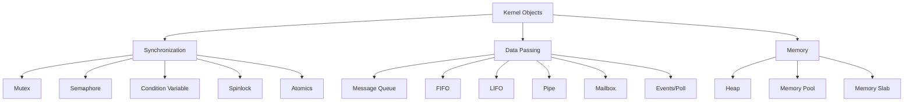
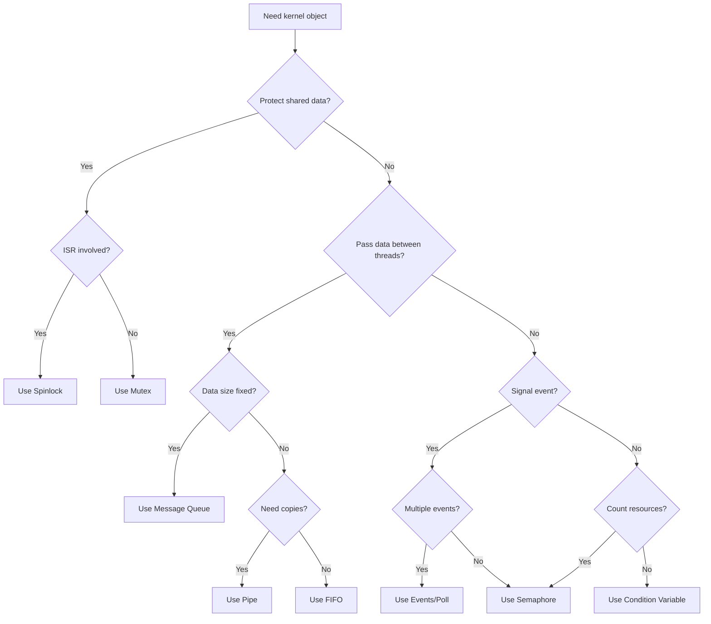

# Kernel Objects Overview

Zephyr provides various kernel objects for synchronization and inter-thread communication. This guide helps you choose the right one.

## Object Taxonomy



## Quick Reference

| Object | Use Case | ISR Safe? | Blocking? |
|--------|----------|-----------|-----------|
| Mutex | Protect shared resource | No | Yes |
| Semaphore | Signaling, counting | Give: Yes | Yes |
| Spinlock | Short critical sections | Yes | Busy-wait |
| Message Queue | Fixed-size message passing | Put: Yes | Yes |
| FIFO | Variable-size data, pointers | Put: Yes | Yes |
| LIFO | Stack-like data | Put: Yes | Yes |
| Pipe | Byte streams | No | Yes |
| Mailbox | Synchronous messaging | No | Yes |
| Events | Multi-event waiting | Signal: Yes | Yes |

## Selection Flowchart



## Object Summaries

### Mutex
Best for protecting shared resources in thread context:
```c
K_MUTEX_DEFINE(my_mutex);
k_mutex_lock(&my_mutex, K_FOREVER);
/* Critical section */
k_mutex_unlock(&my_mutex);
```
- Has priority inheritance
- Not ISR-safe
- Tracks ownership

### Semaphore
Best for signaling and resource counting:
```c
K_SEM_DEFINE(my_sem, 0, 10);
k_sem_give(&my_sem);      /* ISR-safe */
k_sem_take(&my_sem, K_FOREVER);
```
- ISR-safe for give
- No ownership tracking
- Count-based

### Spinlock
Best for short critical sections with ISRs:
```c
K_SPINLOCK_DEFINE(my_lock);
k_spinlock_key_t key = k_spin_lock(&my_lock);
/* Very short critical section */
k_spin_unlock(&my_lock, key);
```
- ISR-safe
- Busy-waits
- Keep sections minimal

### Message Queue
Best for fixed-size message passing:
```c
K_MSGQ_DEFINE(my_msgq, sizeof(struct msg), 10, 4);
k_msgq_put(&my_msgq, &msg, K_NO_WAIT);  /* ISR-safe */
k_msgq_get(&my_msgq, &msg, K_FOREVER);
```
- Copies data
- Fixed message size
- Put is ISR-safe (non-blocking)

### FIFO
Best for passing pointers/variable data:
```c
K_FIFO_DEFINE(my_fifo);
k_fifo_put(&my_fifo, item);  /* ISR-safe */
void *item = k_fifo_get(&my_fifo, K_FOREVER);
```
- Passes pointers
- Variable sizes
- First-in-first-out

### Events
Best for waiting on multiple conditions:
```c
K_EVENT_DEFINE(my_event);
k_event_post(&my_event, 0x01);  /* ISR-safe */
k_event_wait(&my_event, 0x03, false, K_FOREVER);
```
- Bitmask-based
- Wait for any/all
- Signal is ISR-safe

## Common Patterns

### Producer-Consumer

```c
/* Producer (can be ISR) */
void producer(void)
{
    struct data_item item = get_data();
    k_msgq_put(&data_queue, &item, K_NO_WAIT);
}

/* Consumer thread */
void consumer(void *p1, void *p2, void *p3)
{
    struct data_item item;
    while (1) {
        k_msgq_get(&data_queue, &item, K_FOREVER);
        process_item(&item);
    }
}
```

### Resource Pool

```c
K_SEM_DEFINE(buffer_sem, NUM_BUFFERS, NUM_BUFFERS);

void *acquire_buffer(k_timeout_t timeout)
{
    if (k_sem_take(&buffer_sem, timeout) == 0) {
        return allocate_from_pool();
    }
    return NULL;
}

void release_buffer(void *buf)
{
    return_to_pool(buf);
    k_sem_give(&buffer_sem);
}
```

### Event-Driven Processing

```c
#define EVENT_DATA_READY  BIT(0)
#define EVENT_TIMEOUT     BIT(1)
#define EVENT_SHUTDOWN    BIT(2)

void event_thread(void *p1, void *p2, void *p3)
{
    while (1) {
        uint32_t events = k_event_wait(&my_event,
                                       EVENT_DATA_READY | EVENT_SHUTDOWN,
                                       false, K_FOREVER);

        if (events & EVENT_SHUTDOWN) {
            break;
        }
        if (events & EVENT_DATA_READY) {
            process_data();
        }
    }
}
```

## Memory Objects

### Memory Slab (Fixed-Size Blocks)

```c
K_MEM_SLAB_DEFINE(my_slab, BLOCK_SIZE, NUM_BLOCKS, ALIGN);

void *block;
k_mem_slab_alloc(&my_slab, &block, K_NO_WAIT);
/* Use block */
k_mem_slab_free(&my_slab, block);
```

### Heap

```c
/* System heap */
void *ptr = k_malloc(size);
k_free(ptr);

/* Custom heap */
K_HEAP_DEFINE(my_heap, HEAP_SIZE);
void *ptr = k_heap_alloc(&my_heap, size, K_NO_WAIT);
k_heap_free(&my_heap, ptr);
```

## Decision Table

| Scenario | Recommended Object |
|----------|-------------------|
| Protect global variable | Mutex |
| ISR signals thread | Semaphore |
| Pass sensor readings | Message Queue |
| Pass network packets | FIFO + buffer pool |
| Thread waits for multiple sources | Events + k_poll |
| Fixed-size buffer allocation | Memory Slab |
| Variable-size allocation | Heap |
| Short ISR-thread shared access | Spinlock |

## Next Steps

Part 4 covers [Synchronization and IPC]() in detail.
