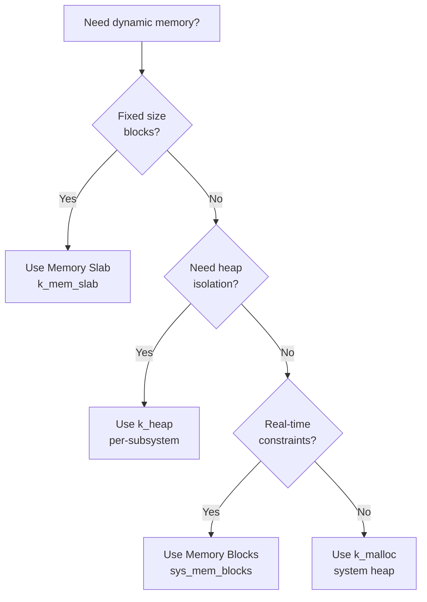

# Memory Management

Zephyr provides several memory management mechanisms suited to different embedded use cases. This chapter covers the memory allocation strategies available and when to use each one.

## Overview

Unlike desktop operating systems, embedded systems have limited RAM and no virtual memory. Zephyr offers multiple allocation strategies, each with different tradeoffs:

| Mechanism | Allocation Size | Fragmentation | Deterministic | Thread-Safe |
|:--|:--|:--|:--|:--|
| Stack variables | Fixed at compile time | None | Yes | Yes (per-thread) |
| k_malloc/k_free | Variable | Yes | No | Yes |
| k_heap | Variable (per-heap) | Yes | No | Yes |
| Memory Slabs | Fixed-size blocks | None | Yes | Yes |
| Memory Blocks | Variable (pool) | Reduced | Configurable | Yes |

{: .warning }
Dynamic memory allocation in embedded systems should be used judiciously. Heap fragmentation can cause out-of-memory failures that are hard to debug. Prefer static allocation or fixed-size allocators when possible.

## Code Relocation

By default, Zephyr places code in flash (XIP — execute in place) and data in RAM. You can relocate code or data to different memory regions for performance or hardware requirements.

### Why Relocate Code?

- **Performance** — execute code from SRAM instead of flash for faster execution
- **TCM (Tightly Coupled Memory)** — place critical ISR handlers in fast memory
- **External memory** — place large data buffers in external SDRAM

### Configuration

```ini
# prj.conf
CONFIG_CODE_DATA_RELOCATION=y
```

In your `CMakeLists.txt`:

```cmake
# Relocate a source file to SRAM
zephyr_code_relocate(FILES src/critical_path.c LOCATION SRAM)

# Relocate data only
zephyr_code_relocate(FILES src/big_buffer.c LOCATION SRAM_DATA)
```

### Linker Regions

Common memory regions available (board-dependent):

| Region | Typical Use |
|:--|:--|
| FLASH | Default code location (XIP) |
| SRAM | Fast execution, variables |
| CCM | Core-coupled memory (STM32) |
| DTCM/ITCM | Tightly coupled memory (Cortex-M7) |
| SDRAM | External large memory |

## System Heap (k_malloc / k_free)

Zephyr provides a system heap for general-purpose dynamic allocation.

### Configuration

```ini
# prj.conf
CONFIG_HEAP_MEM_POOL_SIZE=4096  # System heap size in bytes
```

### Usage

```c
#include <zephyr/kernel.h>

void example(void)
{
    /* Allocate memory */
    void *ptr = k_malloc(256);
    if (ptr == NULL) {
        /* Allocation failed — heap exhausted or fragmented */
        return;
    }

    /* Use the memory */
    memset(ptr, 0, 256);

    /* Free when done */
    k_free(ptr);
}
```

### Aligned Allocation

```c
/* Allocate with specific alignment */
void *aligned_ptr = k_aligned_alloc(16, 256);  /* 16-byte aligned, 256 bytes */
```

### Calloc

```c
/* Allocate and zero-initialize */
void *ptr = k_calloc(10, sizeof(struct my_data));  /* 10 elements */
```

{: .warning }
`k_malloc` and `k_free` use a system-wide heap. In long-running applications, repeated alloc/free cycles can fragment the heap, eventually causing allocation failures even when total free memory is sufficient.

## Synchronized Heaps (k_heap)

For better control, use `k_heap` to create dedicated heaps for specific subsystems or tasks.

### Why Use k_heap Over k_malloc?

- **Isolation** — each subsystem gets its own heap; one subsystem's exhaustion doesn't affect others
- **Sizing** — you can size each heap according to its needs
- **Debugging** — easier to track memory usage per subsystem
- **Timeout support** — can block waiting for memory to become available

### Usage

```c
#include <zephyr/kernel.h>

/* Define a 2KB heap */
K_HEAP_DEFINE(my_heap, 2048);

void example(void)
{
    /* Allocate from the specific heap */
    void *ptr = k_heap_alloc(&my_heap, 128, K_NO_WAIT);
    if (ptr == NULL) {
        return;
    }

    /* Use the memory */

    /* Free back to the same heap */
    k_heap_free(&my_heap, ptr);
}
```

### Blocking Allocation

```c
/* Wait up to 100ms for memory to become available */
void *ptr = k_heap_alloc(&my_heap, 128, K_MSEC(100));
if (ptr == NULL) {
    /* Timed out — no memory available within 100ms */
}

/* Wait forever (careful — can deadlock!) */
void *ptr2 = k_heap_alloc(&my_heap, 64, K_FOREVER);
```

### Aligned Heap Allocation

```c
/* Allocate with alignment from a specific heap */
void *ptr = k_heap_aligned_alloc(&my_heap, 32, 256, K_NO_WAIT);
```

## Memory Slabs

Memory slabs provide **fixed-size block allocation** — the fastest and most deterministic allocation method.

### Why Memory Slabs?

- **Zero fragmentation** — all blocks are the same size
- **O(1) allocation** — constant time alloc and free
- **Deterministic** — guaranteed allocation time (important for real-time)
- **Simple** — no coalescing or splitting needed

### Usage

```c
#include <zephyr/kernel.h>

/* Define a slab: 16 blocks of 256 bytes each */
K_MEM_SLAB_DEFINE(my_slab, 256, 16, 4);  /* block_size, num_blocks, align */

void example(void)
{
    void *block;

    /* Allocate a block */
    int ret = k_mem_slab_alloc(&my_slab, &block, K_NO_WAIT);
    if (ret != 0) {
        /* No blocks available */
        return;
    }

    /* Use the fixed-size block */
    struct my_message *msg = (struct my_message *)block;
    msg->type = MSG_SENSOR_DATA;
    msg->value = 42;

    /* Free the block */
    k_mem_slab_free(&my_slab, block);
}
```

### Checking Availability

```c
/* How many blocks are currently used? */
uint32_t used = k_mem_slab_num_used_get(&my_slab);

/* How many free blocks remain? */
uint32_t free_blocks = k_mem_slab_num_free_get(&my_slab);
```

### When to Use Memory Slabs

Memory slabs are ideal for:

- **Message buffers** — fixed-size messages between threads
- **Network packet buffers** — all packets same size
- **DMA buffers** — hardware needs fixed-size aligned buffers
- **Real-time contexts** — ISRs that need guaranteed allocation

## Memory Blocks Allocator

The memory blocks allocator (`sys_mem_blocks`) provides a pool-based allocator with support for multi-block allocations.

### Configuration

```ini
# prj.conf
CONFIG_SYS_MEM_BLOCKS=y
```

### Usage

```c
#include <zephyr/sys/mem_blocks.h>

/* Define: 64-byte blocks, 32 blocks total */
SYS_MEM_BLOCKS_DEFINE(my_blocks, 64, 32, 4);

void example(void)
{
    void *blocks[4];

    /* Allocate 4 contiguous blocks (256 bytes total) */
    int ret = sys_mem_blocks_alloc_contiguous(&my_blocks, 4, blocks);
    if (ret != 0) {
        return;
    }

    /* Use the memory */

    /* Free all 4 blocks */
    sys_mem_blocks_free_contiguous(&my_blocks, blocks[0], 4);
}
```

## Userspace and Memory Protection

When using Zephyr's userspace feature, memory access is restricted by the Memory Protection Unit (MPU).

### Configuration

```ini
# prj.conf
CONFIG_USERSPACE=y
```

### Memory Domains

Threads in userspace can only access memory explicitly granted to them:

```c
#include <zephyr/kernel.h>

/* Memory partitions accessible to user threads */
K_MEM_PARTITION_DEFINE(my_partition, my_buffer, sizeof(my_buffer),
                       K_MEM_PARTITION_P_RW_U_RW);

/* Add partition to a memory domain */
struct k_mem_domain my_domain;
struct k_mem_partition *parts[] = { &my_partition };

void setup(void)
{
    k_mem_domain_init(&my_domain, ARRAY_SIZE(parts), parts);
    k_mem_domain_add_thread(&my_domain, my_thread_id);
}
```

### Shared Memory Between Threads

```c
/* Grant a kernel object to a user thread */
k_object_access_grant(&my_mutex, my_thread_id);

/* Grant memory to a user thread */
k_mem_domain_add_partition(&my_domain, &shared_partition);
```

## Choosing the Right Allocator



### Decision Guide

| Scenario | Recommended | Reason |
|:--|:--|:--|
| Message passing between threads | Memory Slab | Fixed size, deterministic |
| Network buffers | Memory Slab or net_buf | Designed for this use case |
| Occasional large allocation | k_heap | Variable size with isolation |
| Quick prototyping | k_malloc | Simplest API |
| Safety-critical code | Memory Slab | Deterministic, no fragmentation |
| Multiple independent subsystems | k_heap (per-subsystem) | Fault isolation |

## Product Development Tips

1. **Prefer static allocation** — stack variables and static buffers are always safest
2. **Use memory slabs for IPC** — when passing data between threads, fixed-size blocks prevent fragmentation
3. **Size heaps carefully** — use `CONFIG_HEAP_MEM_POOL_SIZE` wisely; too small causes failures, too large wastes RAM
4. **Monitor usage** — enable `CONFIG_SYS_HEAP_RUNTIME_STATS=y` to track heap usage at runtime
5. **Test with constrained memory** — simulate low-memory conditions to find allocation failures early
6. **Avoid malloc in ISRs** — never call `k_malloc` from interrupt context; use `K_NO_WAIT` with slabs if needed

## Example Code

[View the complete memory management example](https://github.com/MichaelTien8901/zephyr-guide-tutorial/tree/main/examples/part3/memory) — demonstrates k_malloc, k_heap, and memory slabs.

```bash
west build -b qemu_cortex_m3 examples/part3/memory
west build -t run
```

## Next Steps

Continue to [Part 4: Synchronization & IPC]() to learn about inter-thread communication and synchronization.
