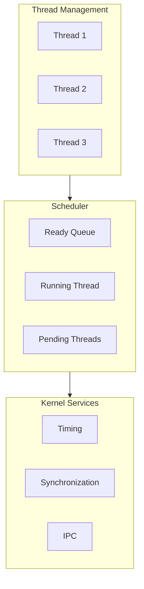

# Part 3: Kernel Essentials

This section covers Zephyr's kernel fundamentals - threads, scheduling, interrupts, timing, and kernel objects.

## What You'll Learn

- Creating and managing threads
- Understanding the scheduler and priorities
- Implementing interrupt handlers (ISRs)
- Using timing services (delays, timers)
- Working with workqueues
- Choosing the right kernel objects

## Chapters

| Chapter | Description |
|---------|-------------|
| [Threads]() | Thread creation, lifecycle, and attributes |
| [Scheduling]() | Scheduler, priorities, and preemption |
| [Interrupts]() | ISR implementation and restrictions |
| [Timing]() | Kernel ticks, delays, sleep, timers |
| [Workqueues]() | System workqueue and k_work |
| [Kernel Objects]() | Object taxonomy and selection |

## Kernel Architecture Overview

## Prerequisites

Before starting this section, you should have:

- Completed Parts 1-2 (working build environment)
- Understanding of C programming
- Basic knowledge of concurrent programming concepts

{: .note }
The kernel is the heart of Zephyr. Understanding these concepts is essential for writing reliable embedded applications.
