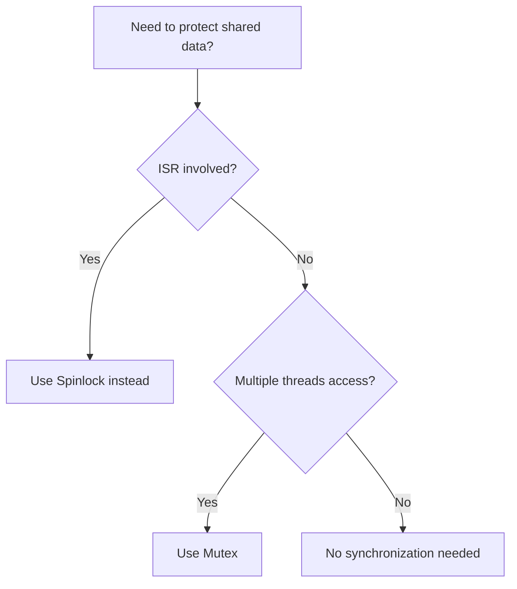
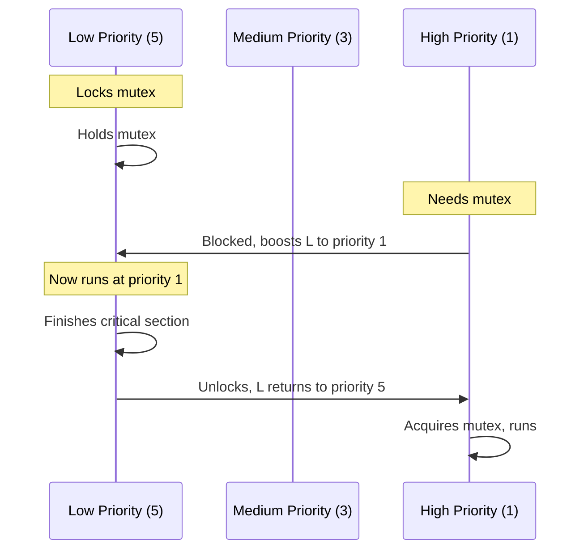

# Mutexes

Mutexes provide mutual exclusion for protecting shared resources between threads.

## When to Use Mutexes



Use mutexes when:
- Multiple threads access shared data
- Only thread context (not ISR)
- Need priority inheritance
- Critical section may take time

## Basic Usage

### Defining a Mutex

```c
#include <zephyr/kernel.h>

/* Static definition */
K_MUTEX_DEFINE(my_mutex);

/* Or runtime initialization */
struct k_mutex my_mutex;

void init(void)
{
    k_mutex_init(&my_mutex);
}
```

### Lock and Unlock

```c
void access_shared_resource(void)
{
    /* Lock with timeout */
    int ret = k_mutex_lock(&my_mutex, K_MSEC(100));
    if (ret != 0) {
        /* Failed to acquire - timeout or error */
        return;
    }

    /* Critical section - safe to access shared data */
    shared_counter++;
    process_shared_data();

    /* Always unlock when done */
    k_mutex_unlock(&my_mutex);
}
```

### Lock Forever

```c
void must_access_resource(void)
{
    /* Block until mutex available */
    k_mutex_lock(&my_mutex, K_FOREVER);

    /* Critical section */
    do_critical_work();

    k_mutex_unlock(&my_mutex);
}
```

## Priority Inheritance

Zephyr mutexes implement priority inheritance to prevent priority inversion.



### Without Priority Inheritance (Problem)

```
Time -->
Low:    [====LOCK====]----wait----[continue]
Medium:              [=========runs=========]
High:        X blocked............[finally runs]
             ^ High blocked by Medium (inversion!)
```

### With Priority Inheritance (Solution)

```
Time -->
Low:    [====LOCK=boosted=]
Medium:                    [runs]
High:        X blocked---->[runs immediately]
             ^ Low boosted, finishes quickly
```

## Mutex vs Spinlock

| Feature | Mutex | Spinlock |
|---------|-------|----------|
| ISR-safe | No | Yes |
| Blocking | Yes (sleeps) | Yes (busy-wait) |
| Priority inheritance | Yes | No |
| Ownership tracking | Yes | No |
| Use case | Long critical sections | Very short sections |

## Common Patterns

### Protecting a Data Structure

```c
struct shared_data {
    struct k_mutex lock;
    int value;
    char buffer[64];
};

struct shared_data my_data;

void init_shared_data(void)
{
    k_mutex_init(&my_data.lock);
    my_data.value = 0;
}

int get_value(void)
{
    int val;
    k_mutex_lock(&my_data.lock, K_FOREVER);
    val = my_data.value;
    k_mutex_unlock(&my_data.lock);
    return val;
}

void set_value(int new_val)
{
    k_mutex_lock(&my_data.lock, K_FOREVER);
    my_data.value = new_val;
    k_mutex_unlock(&my_data.lock);
}
```

### RAII-Style Pattern (Cleanup on All Paths)

```c
#define MUTEX_LOCK_GUARD(mutex) \
    for (int _i = (k_mutex_lock(mutex, K_FOREVER), 0); \
         _i == 0; \
         _i = 1, k_mutex_unlock(mutex))

void safe_operation(void)
{
    MUTEX_LOCK_GUARD(&my_mutex) {
        /* Mutex automatically unlocked when block exits */
        if (error_condition) {
            return;  /* Mutex still unlocked! */
        }
        do_work();
    }
}
```

### Nested Locking (Same Thread)

Zephyr mutexes support recursive locking by the same thread:

```c
void outer_function(void)
{
    k_mutex_lock(&my_mutex, K_FOREVER);
    inner_function();  /* Can lock same mutex */
    k_mutex_unlock(&my_mutex);
}

void inner_function(void)
{
    k_mutex_lock(&my_mutex, K_FOREVER);  /* OK - same thread */
    do_work();
    k_mutex_unlock(&my_mutex);
}
```

## API Reference

```c
/* Initialize */
int k_mutex_init(struct k_mutex *mutex);

/* Lock with timeout */
int k_mutex_lock(struct k_mutex *mutex, k_timeout_t timeout);
/* Returns: 0 on success, -EAGAIN on timeout, -EBUSY if would block */

/* Unlock */
void k_mutex_unlock(struct k_mutex *mutex);
```

## Best Practices

1. **Always unlock** - Use consistent lock/unlock pairs
2. **Keep critical sections short** - Don't hold mutex longer than needed
3. **Avoid nested locks on different mutexes** - Risk of deadlock
4. **Use timeout for debugging** - Helps identify deadlocks
5. **Don't use in ISR** - Use spinlock or semaphore instead

## Common Pitfalls

### Forgetting to Unlock

```c
/* BAD - mutex never unlocked on error */
void bad_function(void)
{
    k_mutex_lock(&my_mutex, K_FOREVER);
    if (error) {
        return;  /* LEAKED! */
    }
    k_mutex_unlock(&my_mutex);
}

/* GOOD - always unlock */
void good_function(void)
{
    k_mutex_lock(&my_mutex, K_FOREVER);
    if (error) {
        k_mutex_unlock(&my_mutex);
        return;
    }
    k_mutex_unlock(&my_mutex);
}
```

### Deadlock from Lock Ordering

```c
/* Thread 1 */
k_mutex_lock(&mutex_a, K_FOREVER);
k_mutex_lock(&mutex_b, K_FOREVER);  /* Waits for Thread 2 */

/* Thread 2 */
k_mutex_lock(&mutex_b, K_FOREVER);
k_mutex_lock(&mutex_a, K_FOREVER);  /* Waits for Thread 1 */
/* DEADLOCK! */

/* Solution: Always lock in same order */
```

## Example Code

See the complete [Mutex Example]() demonstrating mutex usage for protecting shared resources.

## Next Steps

Learn about [Semaphores]() for signaling and counting.
