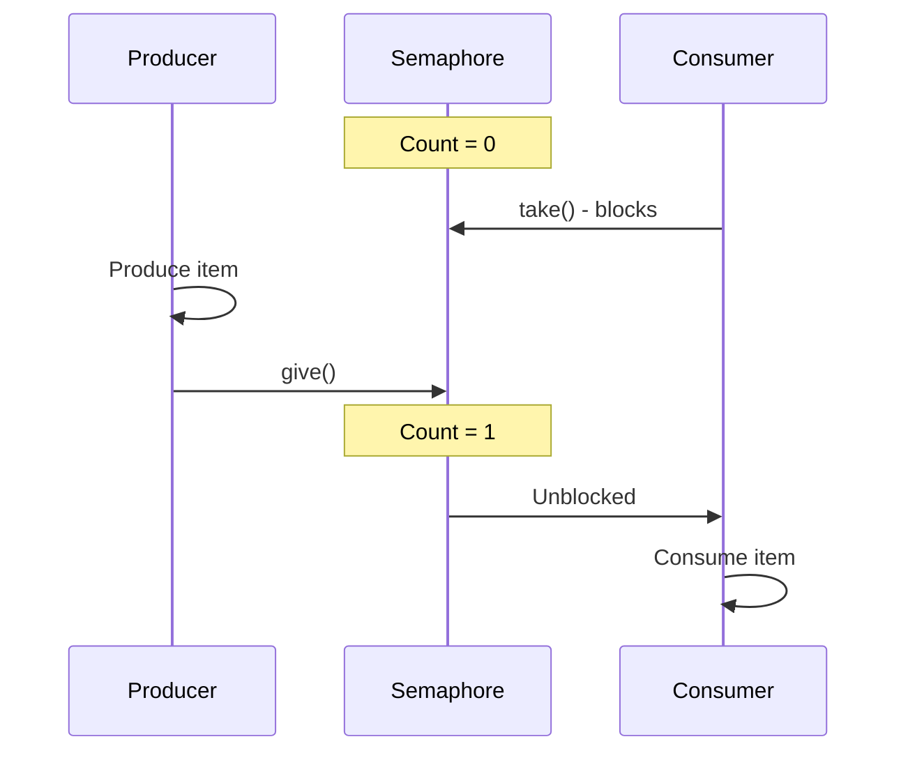
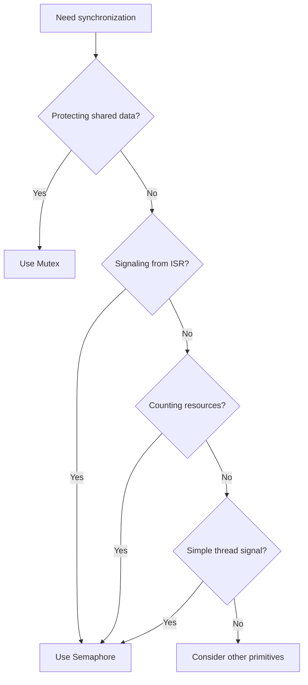

# Semaphores

Semaphores are counting primitives used for signaling between threads and ISRs, and for managing resource pools.

## Types of Semaphores

### Binary Semaphore (Signal)
Count limited to 0 or 1, used for signaling:
```c
K_SEM_DEFINE(signal_sem, 0, 1);
```

### Counting Semaphore (Resource Pool)
Count tracks available resources:
```c
K_SEM_DEFINE(resource_sem, 5, 5);  /* 5 resources available */
```

## Basic Usage

### Defining Semaphores

```c
#include <zephyr/kernel.h>

/* Static definition: initial count, max count */
K_SEM_DEFINE(my_sem, 0, 10);

/* Runtime initialization */
struct k_sem my_sem;

void init(void)
{
    k_sem_init(&my_sem, 0, 10);  /* initial=0, max=10 */
}
```

### Give and Take

```c
/* Give (increment) - ISR-safe */
k_sem_give(&my_sem);

/* Take (decrement) with timeout */
int ret = k_sem_take(&my_sem, K_MSEC(100));
if (ret == 0) {
    /* Got the semaphore */
} else {
    /* Timeout or error */
}

/* Take forever (blocking) */
k_sem_take(&my_sem, K_FOREVER);
```

## Producer-Consumer Pattern



### Implementation

```c
K_SEM_DEFINE(data_ready, 0, 1);
static int shared_data;

/* Producer (can be ISR) */
void producer(void)
{
    shared_data = get_new_data();
    k_sem_give(&data_ready);  /* Signal consumer */
}

/* Consumer thread */
void consumer_thread(void *p1, void *p2, void *p3)
{
    while (1) {
        k_sem_take(&data_ready, K_FOREVER);
        process_data(shared_data);
    }
}
```

## ISR to Thread Signaling

```c
K_SEM_DEFINE(isr_signal, 0, 1);

void my_isr(const void *arg)
{
    /* Quick ISR work */
    acknowledge_interrupt();

    /* Signal thread - ISR-safe! */
    k_sem_give(&isr_signal);
}

void handler_thread(void *p1, void *p2, void *p3)
{
    while (1) {
        k_sem_take(&isr_signal, K_FOREVER);
        /* Handle interrupt in thread context */
        process_interrupt();
    }
}
```

## Resource Pool Pattern

```c
#define NUM_BUFFERS 4
K_SEM_DEFINE(buffer_available, NUM_BUFFERS, NUM_BUFFERS);

static uint8_t buffers[NUM_BUFFERS][256];
static bool buffer_used[NUM_BUFFERS];

uint8_t *acquire_buffer(k_timeout_t timeout)
{
    if (k_sem_take(&buffer_available, timeout) != 0) {
        return NULL;  /* No buffer available */
    }

    /* Find free buffer */
    for (int i = 0; i < NUM_BUFFERS; i++) {
        if (!buffer_used[i]) {
            buffer_used[i] = true;
            return buffers[i];
        }
    }
    return NULL;  /* Shouldn't happen */
}

void release_buffer(uint8_t *buf)
{
    int idx = (buf - &buffers[0][0]) / 256;
    buffer_used[idx] = false;
    k_sem_give(&buffer_available);
}
```

## Semaphore vs Mutex

| Feature | Semaphore | Mutex |
|---------|-----------|-------|
| ISR-safe | Give: Yes | No |
| Ownership | No | Yes |
| Priority inheritance | No | Yes |
| Count | 0 to N | 0 or 1 (locked) |
| Use case | Signaling, counting | Mutual exclusion |

### When to Use Which



## API Reference

```c
/* Initialize */
int k_sem_init(struct k_sem *sem,
               unsigned int initial_count,
               unsigned int limit);

/* Give (increment) - ISR-safe */
void k_sem_give(struct k_sem *sem);

/* Take (decrement) with timeout */
int k_sem_take(struct k_sem *sem, k_timeout_t timeout);
/* Returns: 0 success, -EBUSY (K_NO_WAIT), -EAGAIN (timeout) */

/* Get current count */
unsigned int k_sem_count_get(struct k_sem *sem);

/* Reset count to zero */
void k_sem_reset(struct k_sem *sem);
```

## Advanced Patterns

### Multiple Producers, Single Consumer

```c
K_SEM_DEFINE(work_available, 0, 100);
K_MSGQ_DEFINE(work_queue, sizeof(struct work_item), 100, 4);

void producer_thread(void *p1, void *p2, void *p3)
{
    struct work_item item = create_work();
    k_msgq_put(&work_queue, &item, K_FOREVER);
    k_sem_give(&work_available);
}

void consumer_thread(void *p1, void *p2, void *p3)
{
    struct work_item item;
    while (1) {
        k_sem_take(&work_available, K_FOREVER);
        k_msgq_get(&work_queue, &item, K_NO_WAIT);
        process_work(&item);
    }
}
```

### Bounded Buffer with Two Semaphores

```c
#define BUFFER_SIZE 10
K_SEM_DEFINE(empty_slots, BUFFER_SIZE, BUFFER_SIZE);
K_SEM_DEFINE(filled_slots, 0, BUFFER_SIZE);

void producer(int data)
{
    k_sem_take(&empty_slots, K_FOREVER);  /* Wait for space */
    add_to_buffer(data);
    k_sem_give(&filled_slots);  /* Signal data available */
}

int consumer(void)
{
    k_sem_take(&filled_slots, K_FOREVER);  /* Wait for data */
    int data = remove_from_buffer();
    k_sem_give(&empty_slots);  /* Signal space available */
    return data;
}
```

## Best Practices

1. **Use binary semaphore for signals** - Initial count 0, max 1
2. **Match give/take** - Every give should have a corresponding take
3. **Don't use for mutual exclusion** - Use mutex instead
4. **Consider overflow** - Count won't exceed limit

## Common Pitfalls

### Counting Overflow

```c
/* If limit is 1 and you give multiple times... */
k_sem_give(&signal_sem);  /* Count = 1 */
k_sem_give(&signal_sem);  /* Count still = 1 (limited) */
/* Only one take will succeed */
```

### Priority Inversion

Semaphores don't have priority inheritance. If this is a concern, use mutex.

## Example Code

See the complete [Semaphore Example]() demonstrating signaling and resource counting patterns.

## Next Steps

Learn about [Condition Variables]() for complex synchronization.
