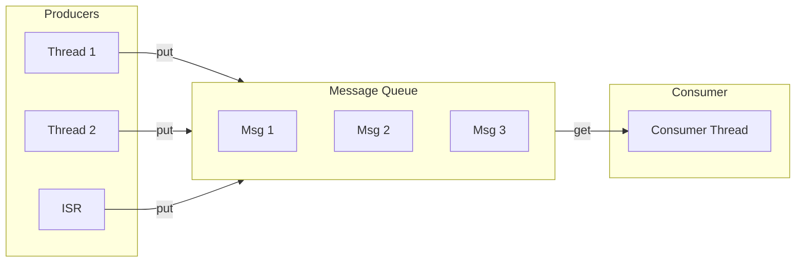

# Message Queues

Message queues pass fixed-size data between threads and from ISRs to threads.

## Message Queue Flow



## Basic Usage

```c
#include <zephyr/kernel.h>

struct sensor_data {
    uint32_t timestamp;
    int16_t value;
};

/* Define: message size, max messages, alignment */
K_MSGQ_DEFINE(sensor_queue, sizeof(struct sensor_data), 10, 4);

/* Producer */
void sensor_isr(const void *arg)
{
    struct sensor_data data = {
        .timestamp = k_uptime_get_32(),
        .value = read_sensor()
    };

    /* Non-blocking put from ISR */
    k_msgq_put(&sensor_queue, &data, K_NO_WAIT);
}

/* Consumer */
void processing_thread(void *p1, void *p2, void *p3)
{
    struct sensor_data data;

    while (1) {
        /* Blocking get */
        k_msgq_get(&sensor_queue, &data, K_FOREVER);
        process_sensor_reading(&data);
    }
}
```

## API Reference

```c
/* Put message (copies data into queue) */
int k_msgq_put(struct k_msgq *msgq, const void *data, k_timeout_t timeout);

/* Get message (copies data from queue) */
int k_msgq_get(struct k_msgq *msgq, void *data, k_timeout_t timeout);

/* Peek at front message without removing */
int k_msgq_peek(struct k_msgq *msgq, void *data);

/* Get number of messages in queue */
uint32_t k_msgq_num_used_get(struct k_msgq *msgq);

/* Get number of free slots */
uint32_t k_msgq_num_free_get(struct k_msgq *msgq);

/* Purge all messages */
void k_msgq_purge(struct k_msgq *msgq);
```

## Common Patterns

### Command Pattern

```c
enum command_type { CMD_START, CMD_STOP, CMD_CONFIG };

struct command {
    enum command_type type;
    uint32_t param;
};

K_MSGQ_DEFINE(cmd_queue, sizeof(struct command), 5, 4);

void send_command(enum command_type type, uint32_t param)
{
    struct command cmd = {.type = type, .param = param};
    k_msgq_put(&cmd_queue, &cmd, K_FOREVER);
}

void command_thread(void *p1, void *p2, void *p3)
{
    struct command cmd;

    while (1) {
        k_msgq_get(&cmd_queue, &cmd, K_FOREVER);

        switch (cmd.type) {
        case CMD_START:
            start_operation(cmd.param);
            break;
        case CMD_STOP:
            stop_operation();
            break;
        case CMD_CONFIG:
            configure(cmd.param);
            break;
        }
    }
}
```

### Handling Queue Full

```c
void producer(struct sensor_data *data)
{
    int ret = k_msgq_put(&sensor_queue, data, K_NO_WAIT);

    if (ret == -ENOMSG) {
        /* Queue full - handle overflow */
        overflow_count++;

        /* Option 1: Drop oldest */
        struct sensor_data old;
        k_msgq_get(&sensor_queue, &old, K_NO_WAIT);
        k_msgq_put(&sensor_queue, data, K_NO_WAIT);

        /* Option 2: Just drop new data (do nothing) */
    }
}
```

## Best Practices

1. **Size messages appropriately** - Larger messages = more memory
2. **Use K_NO_WAIT in ISR** - Never block in ISR
3. **Handle queue full** - Don't assume put always succeeds
4. **Match producers and consumers** - Avoid persistent overflow

## Example Code

See the complete [Message Queue Example]() demonstrating producer-consumer patterns with message queues.

## Next Steps

Learn about [FIFOs and LIFOs]() for variable-size data.
