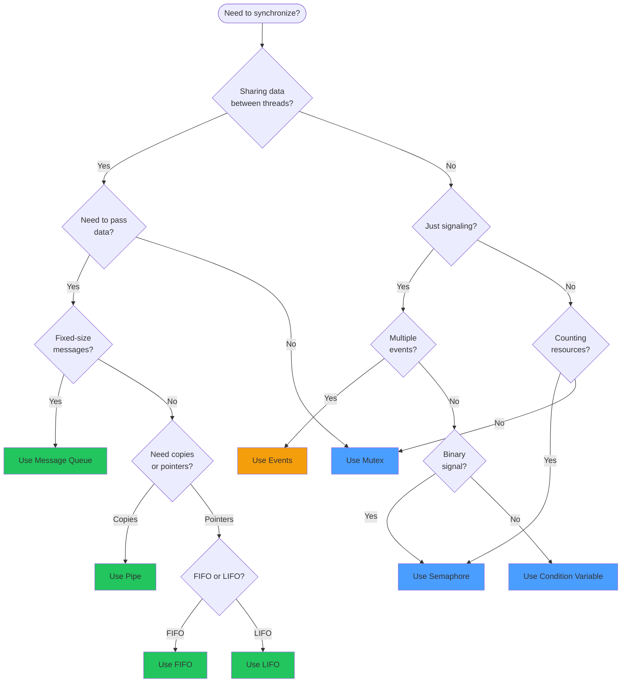

# IPC Selection Guide

Choosing the right synchronization primitive is crucial for system correctness and performance.

## Decision Flowchart



## Quick Reference Table

| Primitive | Data Transfer | ISR-Safe | Blocking | Use Case |
|-----------|--------------|----------|----------|----------|
| **Mutex** | No | No | Yes (sleep) | Protect shared data |
| **Semaphore** | No | Give only | Yes (sleep) | Resource counting, signaling |
| **Spinlock** | No | Yes | Yes (busy) | ISR-thread sync, very short |
| **Condition Variable** | No | No | Yes (sleep) | Complex conditions |
| **Message Queue** | Fixed-size copy | Yes | Yes (sleep) | ISR→thread data |
| **FIFO** | Pointer | Yes | Yes (sleep) | Variable-size, zero-copy |
| **LIFO** | Pointer | Yes | Yes (sleep) | Stack-like access |
| **Pipe** | Byte stream | No | Yes (sleep) | Streaming data |
| **Mailbox** | Variable copy | No | Yes (sleep) | Synchronous exchange |
| **Events** | Bitmask | Yes | Yes (sleep) | Multiple conditions |
| **Poll** | Multiple objects | No | Yes (sleep) | Wait on any of several |
| **Zbus** | Typed messages | No | Yes (sleep) | Publish-subscribe, decoupled modules |

## Common Patterns

### Pattern 1: ISR to Thread Communication

**Problem**: ISR needs to send data to a processing thread.

**Solution**: Message Queue or FIFO

```c
/* Best: Message Queue for fixed-size data */
K_MSGQ_DEFINE(sensor_q, sizeof(struct reading), 16, 4);

void sensor_isr(const void *arg)
{
    struct reading data = { .value = read_adc() };
    k_msgq_put(&sensor_q, &data, K_NO_WAIT);
}

void process_thread(void)
{
    struct reading data;
    while (1) {
        k_msgq_get(&sensor_q, &data, K_FOREVER);
        process(data);
    }
}
```

### Pattern 2: Producer-Consumer with Backpressure

**Problem**: Multiple producers, one consumer, need flow control.

**Solution**: Bounded Message Queue

```c
K_MSGQ_DEFINE(work_queue, sizeof(struct work), 8, 4);

void producer(struct work *w)
{
    /* Block if queue full - natural backpressure */
    k_msgq_put(&work_queue, w, K_FOREVER);
}

void consumer(void)
{
    struct work w;
    while (1) {
        k_msgq_get(&work_queue, &w, K_FOREVER);
        do_work(&w);
    }
}
```

### Pattern 3: Resource Pool

**Problem**: Manage a pool of reusable buffers.

**Solution**: Semaphore + FIFO

```c
#define POOL_SIZE 8
struct buffer { void *fifo_reserved; uint8_t data[128]; };

static struct buffer pool[POOL_SIZE];
K_FIFO_DEFINE(free_bufs);
K_SEM_DEFINE(pool_sem, POOL_SIZE, POOL_SIZE);

void init_pool(void)
{
    for (int i = 0; i < POOL_SIZE; i++) {
        k_fifo_put(&free_bufs, &pool[i]);
    }
}

struct buffer *alloc_buf(k_timeout_t timeout)
{
    if (k_sem_take(&pool_sem, timeout) == 0) {
        return k_fifo_get(&free_bufs, K_NO_WAIT);
    }
    return NULL;
}

void free_buf(struct buffer *buf)
{
    k_fifo_put(&free_bufs, buf);
    k_sem_give(&pool_sem);
}
```

### Pattern 4: State Machine Events

**Problem**: Thread needs to respond to multiple event types.

**Solution**: Kernel Events

```c
#define EVT_START    BIT(0)
#define EVT_STOP     BIT(1)
#define EVT_DATA     BIT(2)
#define EVT_ERROR    BIT(3)

K_EVENT_DEFINE(sm_events);

void state_machine_thread(void)
{
    while (1) {
        uint32_t events = k_event_wait(&sm_events,
            EVT_START | EVT_STOP | EVT_DATA | EVT_ERROR,
            false, K_FOREVER);

        if (events & EVT_ERROR) {
            handle_error();
        }
        if (events & EVT_STOP) {
            state = STOPPED;
        }
        if (events & EVT_START) {
            state = RUNNING;
        }
        if (events & EVT_DATA) {
            process_data();
        }
    }
}
```

### Pattern 5: Request-Response

**Problem**: Thread sends request, waits for response.

**Solution**: Mailbox (synchronous) or Message Queue pair

```c
/* Using Mailbox for synchronous exchange */
K_MBOX_DEFINE(request_mbox);

struct request { int cmd; int param; };
struct response { int status; int result; };

int send_request(struct request *req, struct response *resp)
{
    struct k_mbox_msg msg = {
        .size = sizeof(*req),
        .tx_data = req,
        .tx_target_thread = K_ANY
    };

    /* Send request and wait for ack */
    k_mbox_put(&request_mbox, &msg, K_FOREVER);

    /* Response comes back in same mailbox */
    msg.size = sizeof(*resp);
    msg.rx_source_thread = K_ANY;
    k_mbox_get(&request_mbox, &msg, resp, K_FOREVER);

    return resp->status;
}
```

### Pattern 6: Publish-Subscribe (Decoupled Modules)

**Problem**: Multiple modules need to react to events without tight coupling.

**Solution**: Zbus

```c
#include <zephyr/zbus/zbus.h>

/* Define message and channel */
struct sensor_data { int32_t temp; uint32_t ts; };
ZBUS_CHAN_DEFINE(sensor_chan, struct sensor_data, NULL, NULL,
                 ZBUS_OBSERVERS_EMPTY, ZBUS_MSG_INIT(0));

/* Publisher (sensor module) */
void sensor_publish(int32_t temp)
{
    struct sensor_data msg = { .temp = temp, .ts = k_uptime_get_32() };
    zbus_chan_pub(&sensor_chan, &msg, K_MSEC(100));
}

/* Subscriber (display module - doesn't know about sensor) */
ZBUS_SUBSCRIBER_DEFINE(display_sub, 4);
ZBUS_CHAN_ADD_OBS(sensor_chan, display_sub, 0);

void display_thread(void)
{
    const struct zbus_channel *chan;
    while (1) {
        zbus_sub_wait(&display_sub, &chan, K_FOREVER);
        struct sensor_data msg;
        zbus_chan_read(chan, &msg, K_NO_WAIT);
        update_display(msg.temp);
    }
}
```

### Pattern 7: Multiple Source Waiting

**Problem**: Thread needs to wait on multiple different objects.

**Solution**: Polling

```c
K_SEM_DEFINE(uart_ready, 0, 1);
K_MSGQ_DEFINE(cmd_queue, 4, 8, 4);
K_FIFO_DEFINE(data_fifo);

struct k_poll_event events[3];

void multi_wait_thread(void)
{
    k_poll_event_init(&events[0], K_POLL_TYPE_SEM_AVAILABLE,
                      K_POLL_MODE_NOTIFY_ONLY, &uart_ready);
    k_poll_event_init(&events[1], K_POLL_TYPE_MSGQ_DATA_AVAILABLE,
                      K_POLL_MODE_NOTIFY_ONLY, &cmd_queue);
    k_poll_event_init(&events[2], K_POLL_TYPE_FIFO_DATA_AVAILABLE,
                      K_POLL_MODE_NOTIFY_ONLY, &data_fifo);

    while (1) {
        k_poll(events, 3, K_FOREVER);

        if (events[0].state == K_POLL_STATE_SEM_AVAILABLE) {
            k_sem_take(&uart_ready, K_NO_WAIT);
            handle_uart();
        }
        /* ... handle other events ... */

        /* Reset states */
        for (int i = 0; i < 3; i++) {
            events[i].state = K_POLL_STATE_NOT_READY;
        }
    }
}
```

## Anti-Patterns to Avoid

### Don't: Use Spinlocks for Long Operations

```c
/* BAD - spinlock held too long */
k_spinlock_key_t key = k_spin_lock(&lock);
process_large_buffer();  /* Could take milliseconds! */
k_spin_unlock(&lock, key);

/* GOOD - use mutex instead */
k_mutex_lock(&mutex, K_FOREVER);
process_large_buffer();
k_mutex_unlock(&mutex);
```

### Don't: Block in ISR

```c
/* BAD - will crash or hang */
void my_isr(const void *arg)
{
    k_mutex_lock(&mutex, K_FOREVER);  /* NO! */
    k_msgq_put(&queue, &data, K_FOREVER);  /* NO! */
}

/* GOOD - use non-blocking operations */
void my_isr(const void *arg)
{
    k_msgq_put(&queue, &data, K_NO_WAIT);  /* OK */
    k_sem_give(&sem);  /* OK */
}
```

### Don't: Nest Mutexes Inconsistently

```c
/* BAD - deadlock risk */
void thread_a(void) {
    k_mutex_lock(&mutex1, K_FOREVER);
    k_mutex_lock(&mutex2, K_FOREVER);  /* A holds 1, wants 2 */
}

void thread_b(void) {
    k_mutex_lock(&mutex2, K_FOREVER);
    k_mutex_lock(&mutex1, K_FOREVER);  /* B holds 2, wants 1 = DEADLOCK */
}

/* GOOD - consistent ordering */
void thread_a(void) {
    k_mutex_lock(&mutex1, K_FOREVER);
    k_mutex_lock(&mutex2, K_FOREVER);
}

void thread_b(void) {
    k_mutex_lock(&mutex1, K_FOREVER);  /* Same order */
    k_mutex_lock(&mutex2, K_FOREVER);
}
```

## Performance Considerations

| Operation | Typical Cost | Notes |
|-----------|-------------|-------|
| Mutex lock (uncontended) | ~100 cycles | Fast path optimized |
| Mutex lock (contended) | Context switch | Thread sleeps |
| Semaphore give/take | ~50-100 cycles | Very lightweight |
| Spinlock | ~10-50 cycles | Disables interrupts |
| Message queue put/get | ~200-500 cycles | Involves copy |
| FIFO put/get | ~100 cycles | Pointer only |
| Event post/wait | ~100-200 cycles | Bitmask operations |

## Memory Usage

| Primitive | Approximate Size | Per-Item Cost |
|-----------|-----------------|---------------|
| Mutex | 24-32 bytes | N/A |
| Semaphore | 16-24 bytes | N/A |
| Message Queue | 32 bytes + buffer | msg_size × count |
| FIFO/LIFO | 8-16 bytes | 0 (user provides) |
| Event | 16-24 bytes | N/A |
| Pipe | 32 bytes + buffer | buffer_size |

## Summary Checklist

Before choosing a primitive, ask:

1. **Is ISR involved?** → Use ISR-safe primitives (semaphore give, msgq, fifo, events)
2. **Passing data or just signaling?** → Data: msgq/fifo/pipe; Signal: sem/events
3. **Fixed or variable size?** → Fixed: msgq; Variable: fifo/pipe
4. **Need copies or zero-copy?** → Copies: msgq/pipe; Zero-copy: fifo
5. **Multiple conditions?** → Events or polling
6. **Need priority inheritance?** → Mutex only
7. **Synchronous exchange?** → Mailbox
8. **Decoupled modules?** → Zbus (publish-subscribe pattern)

## Next Steps

Learn about [Zbus]() for publish-subscribe messaging, or continue to [Part 5: Device Drivers]() to learn about hardware interaction.
