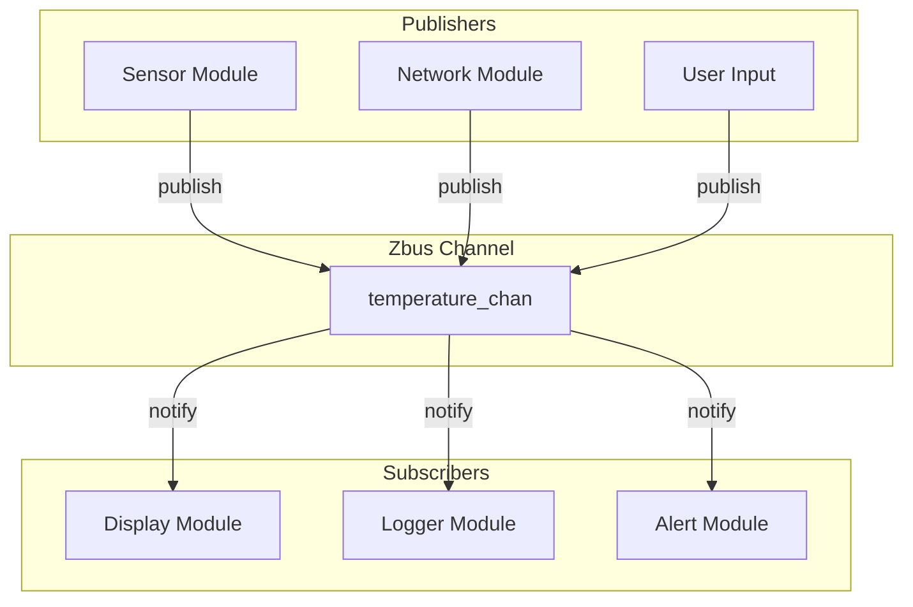

# Zbus - Message Bus

Zbus is Zephyr's publish-subscribe message bus providing decoupled communication between system components.

## Zbus Architecture



## Kconfig

```kconfig
CONFIG_ZBUS=y

# Optional features
CONFIG_ZBUS_CHANNEL_NAME=y      # Include channel names
CONFIG_ZBUS_OBSERVER_NAME=y     # Include observer names
CONFIG_ZBUS_RUNTIME_OBSERVERS=y # Runtime observer management
CONFIG_ZBUS_PRIORITY_BOOST=y    # Priority inheritance
```

## Defining Channels

```c
#include <zephyr/zbus/zbus.h>

/* Message structure */
struct sensor_data {
    int32_t temperature;  /* milli-Celsius */
    int32_t humidity;     /* milli-percent */
    uint32_t timestamp;
};

/* Define channel */
ZBUS_CHAN_DEFINE(sensor_chan,           /* Channel name */
                 struct sensor_data,     /* Message type */
                 NULL,                   /* User data */
                 NULL,                   /* Validator */
                 ZBUS_OBSERVERS_EMPTY,   /* Static observers */
                 ZBUS_MSG_INIT(.temperature = 0,
                               .humidity = 0,
                               .timestamp = 0));
```

## Publishing Messages

```c
void sensor_thread(void)
{
    struct sensor_data msg;

    while (1) {
        /* Read sensors */
        msg.temperature = read_temperature();
        msg.humidity = read_humidity();
        msg.timestamp = k_uptime_get_32();

        /* Publish to channel */
        int ret = zbus_chan_pub(&sensor_chan, &msg, K_MSEC(100));
        if (ret != 0) {
            LOG_ERR("Publish failed: %d", ret);
        }

        k_sleep(K_SECONDS(1));
    }
}
```

## Subscribing - Listener Pattern

Listeners are called in publisher's context (synchronous):

```c
/* Listener callback */
void display_listener(const struct zbus_channel *chan)
{
    const struct sensor_data *msg = zbus_chan_const_msg(chan);

    printk("Temp: %d.%03d C, Humidity: %d.%01d%%\n",
           msg->temperature / 1000, abs(msg->temperature % 1000),
           msg->humidity / 1000, abs(msg->humidity % 100));
}

/* Define listener */
ZBUS_LISTENER_DEFINE(display_lis, display_listener);

/* Add to channel */
ZBUS_CHAN_DEFINE(sensor_chan,
                 struct sensor_data,
                 NULL, NULL,
                 ZBUS_OBSERVERS(display_lis),  /* Static observers */
                 ZBUS_MSG_INIT(0));
```

## Subscribing - Subscriber Pattern

Subscribers have their own thread (asynchronous):

```c
/* Define subscriber */
ZBUS_SUBSCRIBER_DEFINE(logger_sub, 8);  /* Queue size = 8 */

/* Subscriber thread */
void logger_thread(void)
{
    const struct zbus_channel *chan;

    while (1) {
        /* Wait for notification */
        if (zbus_sub_wait(&logger_sub, &chan, K_FOREVER) == 0) {
            /* Read message */
            struct sensor_data msg;
            zbus_chan_read(chan, &msg, K_NO_WAIT);

            LOG_INF("Sensor: temp=%d, humidity=%d, ts=%u",
                    msg.temperature, msg.humidity, msg.timestamp);
        }
    }
}

K_THREAD_DEFINE(logger_tid, 1024, logger_thread, NULL, NULL, NULL, 7, 0, 0);

/* Add subscriber to channel */
ZBUS_CHAN_ADD_OBS(sensor_chan, logger_sub, 0);
```

## Subscribing - Message Subscriber

Direct message queue delivery:

```c
/* Define message subscriber */
ZBUS_MSG_SUBSCRIBER_DEFINE(alert_msub);

void alert_thread(void)
{
    struct sensor_data msg;

    while (1) {
        /* Wait for message directly */
        if (zbus_sub_wait_msg(&alert_msub, &sensor_chan, &msg, K_FOREVER) == 0) {
            if (msg.temperature > 50000) {  /* > 50°C */
                trigger_alert(ALERT_HIGH_TEMP);
            }
        }
    }
}
```

## Reading Channel Data

```c
/* Read current value (doesn't wait for new data) */
struct sensor_data current;
zbus_chan_read(&sensor_chan, &current, K_NO_WAIT);

/* Read with timeout */
zbus_chan_read(&sensor_chan, &current, K_MSEC(100));

/* Get const pointer to message (faster, no copy) */
const struct sensor_data *ptr = zbus_chan_const_msg(&sensor_chan);
```

## Channel Claims

For atomic read-modify-write:

```c
void update_config(void)
{
    struct config_data *cfg;

    /* Claim exclusive access */
    zbus_chan_claim(&config_chan, K_FOREVER);

    /* Get mutable pointer */
    cfg = zbus_chan_msg(&config_chan);

    /* Modify in place */
    cfg->threshold += 10;
    cfg->enabled = true;

    /* Notify observers and release */
    zbus_chan_finish(&config_chan);
}
```

## Channel Validation

```c
/* Validator function */
bool validate_sensor(const void *msg, size_t msg_size)
{
    const struct sensor_data *data = msg;

    /* Sanity checks */
    if (data->temperature < -50000 || data->temperature > 150000) {
        return false;  /* Reject invalid temperature */
    }
    if (data->humidity < 0 || data->humidity > 100000) {
        return false;
    }

    return true;
}

/* Channel with validator */
ZBUS_CHAN_DEFINE(validated_chan,
                 struct sensor_data,
                 NULL,
                 validate_sensor,  /* Validator */
                 ZBUS_OBSERVERS_EMPTY,
                 ZBUS_MSG_INIT(0));
```

## Runtime Observers

```c
/* CONFIG_ZBUS_RUNTIME_OBSERVERS=y */

/* Add observer at runtime */
zbus_chan_add_obs(&sensor_chan, &my_listener, K_FOREVER);

/* Remove observer */
zbus_chan_rm_obs(&sensor_chan, &my_listener, K_FOREVER);
```

## Multiple Channels

```c
/* Subscriber waiting on multiple channels */
ZBUS_SUBSCRIBER_DEFINE(multi_sub, 16);

/* Add to multiple channels */
ZBUS_CHAN_ADD_OBS(temperature_chan, multi_sub, 0);
ZBUS_CHAN_ADD_OBS(pressure_chan, multi_sub, 0);
ZBUS_CHAN_ADD_OBS(humidity_chan, multi_sub, 0);

void multi_handler_thread(void)
{
    const struct zbus_channel *chan;

    while (1) {
        if (zbus_sub_wait(&multi_sub, &chan, K_FOREVER) == 0) {
            if (chan == &temperature_chan) {
                handle_temperature(chan);
            } else if (chan == &pressure_chan) {
                handle_pressure(chan);
            } else if (chan == &humidity_chan) {
                handle_humidity(chan);
            }
        }
    }
}
```

## Complete Example

```c
#include <zephyr/kernel.h>
#include <zephyr/zbus/zbus.h>

/* Message types */
struct sensor_msg {
    int32_t value;
    uint32_t timestamp;
};

struct command_msg {
    uint8_t cmd;
    uint8_t param;
};

/* Channels */
ZBUS_CHAN_DEFINE(sensor_chan, struct sensor_msg,
                 NULL, NULL, ZBUS_OBSERVERS_EMPTY,
                 ZBUS_MSG_INIT(.value = 0, .timestamp = 0));

ZBUS_CHAN_DEFINE(command_chan, struct command_msg,
                 NULL, NULL, ZBUS_OBSERVERS_EMPTY,
                 ZBUS_MSG_INIT(.cmd = 0, .param = 0));

/* Display listener (synchronous) */
void display_cb(const struct zbus_channel *chan)
{
    const struct sensor_msg *msg = zbus_chan_const_msg(chan);
    printk("[%u] Value: %d\n", msg->timestamp, msg->value);
}

ZBUS_LISTENER_DEFINE(display_lis, display_cb);
ZBUS_CHAN_ADD_OBS(sensor_chan, display_lis, 0);

/* Logger subscriber (asynchronous) */
ZBUS_SUBSCRIBER_DEFINE(logger_sub, 4);
ZBUS_CHAN_ADD_OBS(sensor_chan, logger_sub, 1);
ZBUS_CHAN_ADD_OBS(command_chan, logger_sub, 1);

void logger_thread_entry(void)
{
    const struct zbus_channel *chan;

    while (1) {
        zbus_sub_wait(&logger_sub, &chan, K_FOREVER);

        if (chan == &sensor_chan) {
            struct sensor_msg msg;
            zbus_chan_read(chan, &msg, K_NO_WAIT);
            LOG_INF("Sensor: %d @ %u", msg.value, msg.timestamp);
        } else if (chan == &command_chan) {
            struct command_msg msg;
            zbus_chan_read(chan, &msg, K_NO_WAIT);
            LOG_INF("Command: %d, param: %d", msg.cmd, msg.param);
        }
    }
}

K_THREAD_DEFINE(logger_tid, 1024, logger_thread_entry, NULL, NULL, NULL, 7, 0, 0);

/* Publisher */
void main(void)
{
    struct sensor_msg sensor = { .value = 0 };
    struct command_msg cmd = { .cmd = 1, .param = 100 };

    /* Publish command */
    zbus_chan_pub(&command_chan, &cmd, K_FOREVER);

    /* Periodic sensor publishing */
    while (1) {
        sensor.value = read_sensor();
        sensor.timestamp = k_uptime_get_32();

        zbus_chan_pub(&sensor_chan, &sensor, K_MSEC(100));

        k_sleep(K_SECONDS(1));
    }
}
```

## Observer Types Comparison

| Type | Context | Blocking | Queue | Use Case |
|------|---------|----------|-------|----------|
| Listener | Publisher | No | No | Fast, simple notifications |
| Subscriber | Own thread | Yes | Yes | Async processing |
| Msg Subscriber | Own thread | Yes | Messages | Direct message access |

## Best Practices

1. **Use listeners for fast handlers** - No blocking operations
2. **Use subscribers for slow processing** - Has own thread context
3. **Define message structures carefully** - Avoid pointers in messages
4. **Use validators** - Catch invalid data early
5. **Size subscriber queues appropriately** - Avoid overflow
6. **Use const_msg when possible** - Avoid unnecessary copies

## API Reference

```c
/* Channel operations */
int zbus_chan_pub(const struct zbus_channel *chan, const void *msg,
                  k_timeout_t timeout);
int zbus_chan_read(const struct zbus_channel *chan, void *msg,
                   k_timeout_t timeout);
int zbus_chan_claim(const struct zbus_channel *chan, k_timeout_t timeout);
int zbus_chan_finish(const struct zbus_channel *chan);

/* Message access */
void *zbus_chan_msg(const struct zbus_channel *chan);
const void *zbus_chan_const_msg(const struct zbus_channel *chan);

/* Subscriber operations */
int zbus_sub_wait(const struct zbus_observer *sub,
                  const struct zbus_channel **chan, k_timeout_t timeout);
int zbus_sub_wait_msg(const struct zbus_observer *sub,
                      const struct zbus_channel *chan, void *msg,
                      k_timeout_t timeout);

/* Runtime observer management */
int zbus_chan_add_obs(const struct zbus_channel *chan,
                      const struct zbus_observer *obs, k_timeout_t timeout);
int zbus_chan_rm_obs(const struct zbus_channel *chan,
                     const struct zbus_observer *obs, k_timeout_t timeout);
```

## Next Steps

Return to the [IPC Selection Guide]() to understand when to use Zbus vs other IPC mechanisms.
