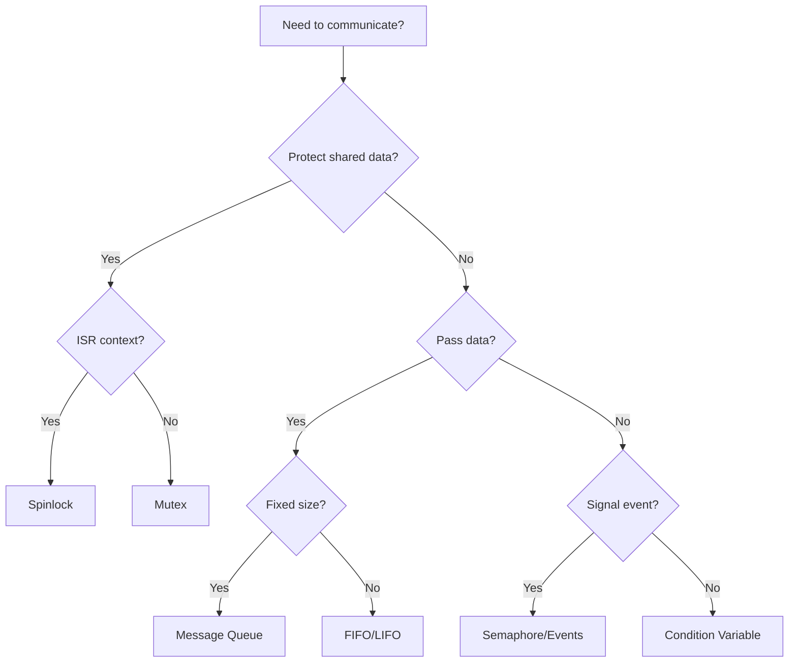

# Part 4: Synchronization and Inter-Thread Communication

This section covers kernel objects for thread synchronization and data passing in detail.

## What You'll Learn

- Mutexes for mutual exclusion
- Semaphores for signaling and counting
- Condition variables for complex synchronization
- Spinlocks and atomic operations
- Message queues, FIFOs, LIFOs
- Pipes and mailboxes
- Events and polling

## Chapters

| Chapter | Description |
|---------|-------------|
| [Mutexes]() | Mutual exclusion and priority inheritance |
| [Semaphores]() | Counting and binary semaphores |
| [Condition Variables]() | Wait with predicate pattern |
| [Spinlocks]() | ISR-safe locking and atomics |
| [Message Queues]() | Fixed-size message passing |
| [FIFOs and LIFOs]() | Variable-size data passing |
| [Pipes and Mailboxes]() | Byte streams and sync messaging |
| [Events and Polling]() | Multi-event waiting |
| [IPC Selection Guide]() | Decision flowcharts |

## When to Use What

{: .note }
Choosing the right synchronization primitive is crucial for correctness and performance.
