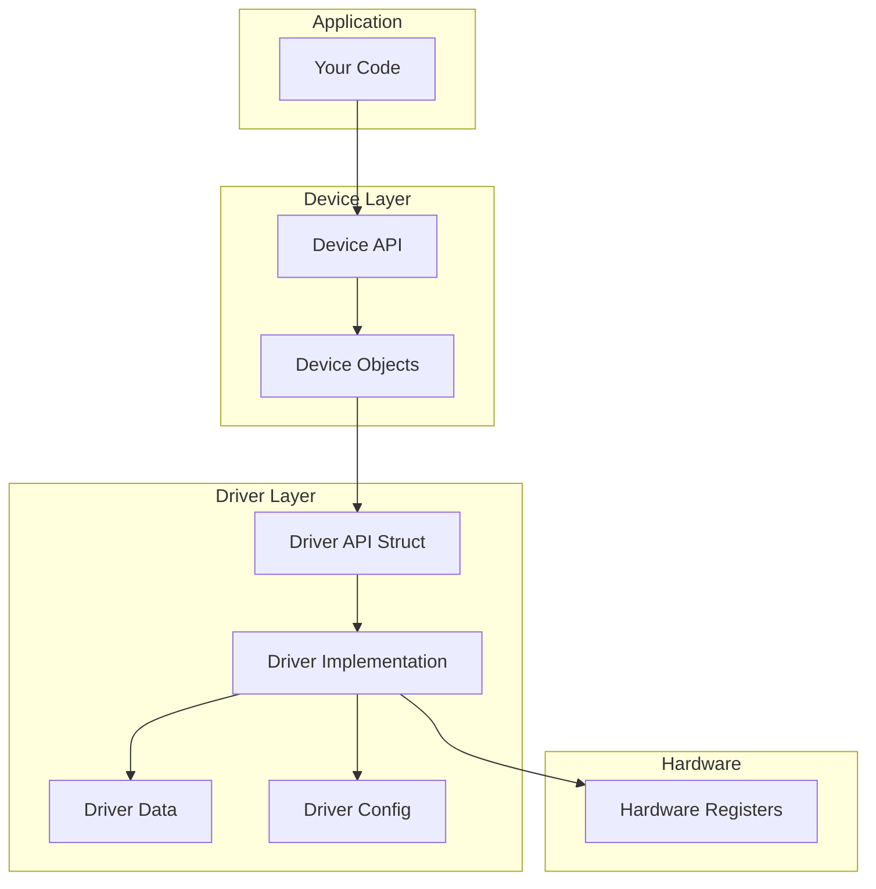
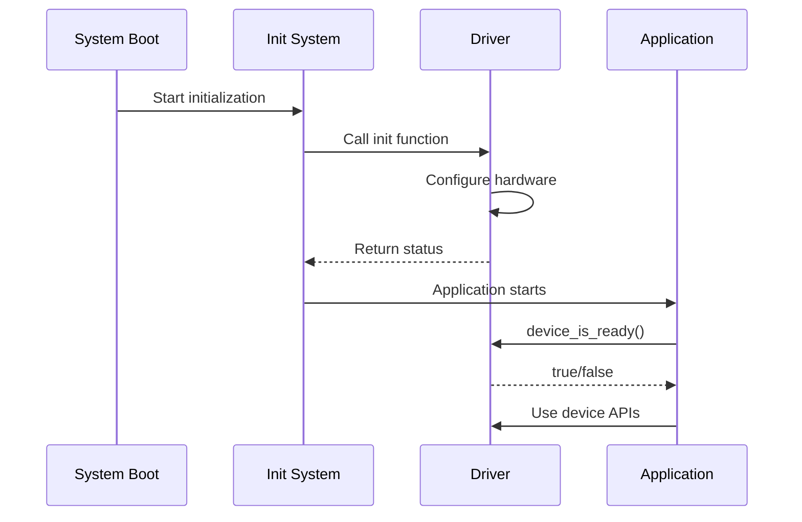

# Zephyr Device Driver Model

Zephyr provides a unified device driver model that abstracts hardware access behind consistent APIs.

## Architecture Overview



## Getting a Device Reference

### Compile-Time (Preferred)

```c
#include <zephyr/device.h>

/* Get device from devicetree node */
const struct device *gpio_dev = DEVICE_DT_GET(DT_NODELABEL(gpio0));

/* Check if device is ready */
if (!device_is_ready(gpio_dev)) {
    printk("GPIO device not ready\n");
    return -ENODEV;
}
```

### Runtime (Legacy)

```c
/* Get device by name (deprecated, use DT macros) */
const struct device *dev = device_get_binding("GPIO_0");
if (dev == NULL) {
    printk("Device not found\n");
    return -ENODEV;
}
```

## Device Structure

Every device in Zephyr is represented by a `struct device`:

```c
struct device {
    const char *name;           /* Device name */
    const void *config;         /* Device configuration (ROM) */
    const void *api;            /* Driver API functions */
    void *data;                 /* Driver runtime data (RAM) */
    /* ... internal fields ... */
};
```

## Device Lifecycle



## Initialization Levels

Drivers initialize at different stages:

```c
/* Initialization levels (early to late) */
#define PRE_KERNEL_1    /* Before kernel, no services */
#define PRE_KERNEL_2    /* Before kernel, basic services */
#define POST_KERNEL     /* After kernel starts */
#define APPLICATION     /* After threads start */
```

Example driver initialization:

```c
static int my_driver_init(const struct device *dev)
{
    /* Initialize hardware */
    return 0;
}

/* Initialize at POST_KERNEL level, priority 50 */
DEVICE_DT_DEFINE(DT_NODELABEL(my_device),
                 my_driver_init,
                 NULL,                    /* PM device */
                 &my_data,                /* Driver data */
                 &my_config,              /* Driver config */
                 POST_KERNEL,             /* Init level */
                 50,                      /* Priority */
                 &my_api);                /* API struct */
```

## Using Device APIs

Each device type has a specific API. Here's the pattern:

```c
#include <zephyr/drivers/gpio.h>

/* Get the device */
const struct device *gpio = DEVICE_DT_GET(DT_NODELABEL(gpio0));

/* Check readiness */
if (!device_is_ready(gpio)) {
    return -ENODEV;
}

/* Use type-specific API */
gpio_pin_configure(gpio, 13, GPIO_OUTPUT_ACTIVE);
gpio_pin_set(gpio, 13, 1);
```

## Devicetree Integration

Devices are defined in devicetree and automatically instantiated:

```dts
/* In board DTS file */
/ {
    aliases {
        led0 = &led0;
    };

    leds {
        compatible = "gpio-leds";
        led0: led_0 {
            gpios = <&gpio0 13 GPIO_ACTIVE_LOW>;
            label = "Green LED";
        };
    };
};
```

Access in code:

```c
/* Use alias */
#define LED0_NODE DT_ALIAS(led0)

/* Get GPIO spec from devicetree */
static const struct gpio_dt_spec led = GPIO_DT_SPEC_GET(LED0_NODE, gpios);

void main(void)
{
    if (!gpio_is_ready_dt(&led)) {
        return;
    }

    gpio_pin_configure_dt(&led, GPIO_OUTPUT_ACTIVE);
    gpio_pin_set_dt(&led, 1);
}
```

## Common Patterns

### Checking Multiple Devices

```c
const struct device *devices[] = {
    DEVICE_DT_GET(DT_NODELABEL(gpio0)),
    DEVICE_DT_GET(DT_NODELABEL(i2c0)),
    DEVICE_DT_GET(DT_NODELABEL(spi1)),
};

int init_devices(void)
{
    for (int i = 0; i < ARRAY_SIZE(devices); i++) {
        if (!device_is_ready(devices[i])) {
            printk("Device %d not ready\n", i);
            return -ENODEV;
        }
    }
    return 0;
}
```

### Using DT Spec Structures

Many subsystems provide "spec" structures for convenient devicetree access:

```c
/* GPIO spec includes device + pin + flags */
struct gpio_dt_spec {
    const struct device *port;
    gpio_pin_t pin;
    gpio_dt_flags_t dt_flags;
};

/* I2C spec includes bus device + address */
struct i2c_dt_spec {
    const struct device *bus;
    uint16_t addr;
};

/* SPI spec includes bus + config */
struct spi_dt_spec {
    const struct device *bus;
    struct spi_config config;
};
```

Usage:

```c
/* Define at file scope */
static const struct gpio_dt_spec button =
    GPIO_DT_SPEC_GET(DT_ALIAS(sw0), gpios);

static const struct i2c_dt_spec sensor =
    I2C_DT_SPEC_GET(DT_NODELABEL(temp_sensor));

/* Use in code */
gpio_pin_configure_dt(&button, GPIO_INPUT);
i2c_write_dt(&sensor, data, sizeof(data));
```

## Error Handling

Always check device readiness:

```c
int sensor_init(void)
{
    const struct device *i2c = DEVICE_DT_GET(DT_NODELABEL(i2c0));

    if (!device_is_ready(i2c)) {
        LOG_ERR("I2C device not ready");
        return -ENODEV;
    }

    /* Device is ready, proceed with initialization */
    return 0;
}
```

## Best Practices

1. **Use compile-time device access** - `DEVICE_DT_GET()` over `device_get_binding()`
2. **Always check device_is_ready()** - Devices may fail to initialize
3. **Use DT spec structures** - They encapsulate device + configuration
4. **Check return values** - Driver APIs can fail
5. **Use devicetree aliases** - For board-portable code

## Next Steps

Learn about [Devicetree Bindings]() to understand how hardware is described.
