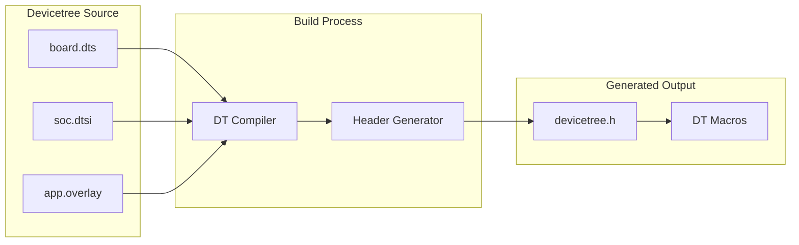

# Devicetree Bindings

Devicetree bindings connect hardware descriptions to driver code, enabling portable hardware abstraction.

## What is Devicetree?



## Devicetree Syntax

### Basic Node Structure

```dts
/ {
    /* Root node */

    node_label: node-name@address {
        compatible = "vendor,device";
        reg = <address size>;
        status = "okay";

        child-node {
            /* Child properties */
        };
    };
};
```

### Common Properties

```dts
&i2c0 {
    status = "okay";                    /* Enable device */
    clock-frequency = <I2C_BITRATE_FAST>;

    temp_sensor: tmp102@48 {
        compatible = "ti,tmp102";       /* Driver binding */
        reg = <0x48>;                   /* I2C address */
        label = "TMP102";
    };
};

&gpio0 {
    status = "okay";
};

/ {
    leds {
        compatible = "gpio-leds";

        led0: led_0 {
            gpios = <&gpio0 13 GPIO_ACTIVE_LOW>;
            label = "Green LED";
        };
    };

    buttons {
        compatible = "gpio-keys";

        button0: button_0 {
            gpios = <&gpio0 11 (GPIO_PULL_UP | GPIO_ACTIVE_LOW)>;
            label = "Button 0";
        };
    };
};
```

## Accessing Devicetree in Code

### Node Identifiers

```c
#include <zephyr/devicetree.h>

/* By node label */
#define MY_NODE DT_NODELABEL(temp_sensor)

/* By alias */
#define LED_NODE DT_ALIAS(led0)

/* By path */
#define ROOT_NODE DT_PATH(leds)

/* By compatible */
#define TMP_NODE DT_INST(0, ti_tmp102)  /* First instance */
```

### Reading Properties

```c
/* String property */
const char *label = DT_PROP(MY_NODE, label);

/* Integer property */
uint32_t reg = DT_REG_ADDR(MY_NODE);

/* Array property */
#define GPIO_PIN DT_GPIO_PIN(LED_NODE, gpios)
#define GPIO_FLAGS DT_GPIO_FLAGS(LED_NODE, gpios)

/* Phandle (reference to another node) */
#define GPIO_CTLR DT_GPIO_CTLR(LED_NODE, gpios)
```

### Checking Node Existence

```c
/* Check if node exists */
#if DT_NODE_EXISTS(DT_NODELABEL(my_sensor))
    /* Node exists */
#endif

/* Check if node is enabled (status = "okay") */
#if DT_NODE_HAS_STATUS(DT_NODELABEL(i2c0), okay)
    /* I2C0 is enabled */
#endif

/* Check if property exists */
#if DT_NODE_HAS_PROP(MY_NODE, label)
    const char *name = DT_PROP(MY_NODE, label);
#endif
```

## Working with GPIO

### GPIO Spec from Devicetree

```c
#include <zephyr/drivers/gpio.h>

/* LED definition in DTS:
 * gpios = <&gpio0 13 GPIO_ACTIVE_LOW>;
 */

#define LED_NODE DT_ALIAS(led0)

/* Get full GPIO spec */
static const struct gpio_dt_spec led = GPIO_DT_SPEC_GET(LED_NODE, gpios);

void main(void)
{
    if (!gpio_is_ready_dt(&led)) {
        return;
    }

    gpio_pin_configure_dt(&led, GPIO_OUTPUT_ACTIVE);

    while (1) {
        gpio_pin_toggle_dt(&led);
        k_msleep(1000);
    }
}
```

### Button with Interrupt

```dts
/* DTS */
buttons {
    compatible = "gpio-keys";
    button0: button_0 {
        gpios = <&gpio0 11 (GPIO_PULL_UP | GPIO_ACTIVE_LOW)>;
    };
};
```

```c
/* C code */
#define BUTTON_NODE DT_ALIAS(sw0)

static const struct gpio_dt_spec button = GPIO_DT_SPEC_GET(BUTTON_NODE, gpios);
static struct gpio_callback button_cb_data;

void button_pressed(const struct device *dev, struct gpio_callback *cb,
                    uint32_t pins)
{
    printk("Button pressed!\n");
}

void main(void)
{
    gpio_pin_configure_dt(&button, GPIO_INPUT);
    gpio_pin_interrupt_configure_dt(&button, GPIO_INT_EDGE_TO_ACTIVE);

    gpio_init_callback(&button_cb_data, button_pressed, BIT(button.pin));
    gpio_add_callback(button.port, &button_cb_data);
}
```

## Working with I2C

### I2C Device in Devicetree

```dts
&i2c0 {
    status = "okay";

    accel: lis2dh@18 {
        compatible = "st,lis2dh";
        reg = <0x18>;
        irq-gpios = <&gpio0 25 GPIO_ACTIVE_HIGH>;
    };
};
```

```c
#include <zephyr/drivers/i2c.h>

#define ACCEL_NODE DT_NODELABEL(accel)

/* I2C spec includes bus and address */
static const struct i2c_dt_spec accel = I2C_DT_SPEC_GET(ACCEL_NODE);

int read_accel(uint8_t reg, uint8_t *data, size_t len)
{
    if (!device_is_ready(accel.bus)) {
        return -ENODEV;
    }

    return i2c_write_read_dt(&accel, &reg, 1, data, len);
}
```

## Working with SPI

### SPI Device in Devicetree

```dts
&spi1 {
    status = "okay";
    cs-gpios = <&gpio0 4 GPIO_ACTIVE_LOW>;

    flash: w25q128@0 {
        compatible = "jedec,spi-nor";
        reg = <0>;  /* CS index */
        spi-max-frequency = <40000000>;
    };
};
```

```c
#include <zephyr/drivers/spi.h>

#define FLASH_NODE DT_NODELABEL(flash)

/* SPI spec includes bus, CS, and config */
static const struct spi_dt_spec flash = SPI_DT_SPEC_GET(
    FLASH_NODE,
    SPI_WORD_SET(8) | SPI_TRANSFER_MSB,
    0  /* Delay */
);

int flash_read_id(uint8_t *id)
{
    uint8_t cmd = 0x9F;
    struct spi_buf tx_buf = { .buf = &cmd, .len = 1 };
    struct spi_buf rx_buf = { .buf = id, .len = 3 };
    struct spi_buf_set tx = { .buffers = &tx_buf, .count = 1 };
    struct spi_buf_set rx = { .buffers = &rx_buf, .count = 1 };

    return spi_transceive_dt(&flash, &tx, &rx);
}
```

## Application Overlays

Override board defaults in your application:

```dts
/* app.overlay */

/* Enable a peripheral */
&i2c0 {
    status = "okay";
    clock-frequency = <I2C_BITRATE_FAST>;
};

/* Add a device */
&i2c0 {
    my_sensor: bme280@76 {
        compatible = "bosch,bme280";
        reg = <0x76>;
    };
};

/* Change pin assignment */
&uart0 {
    current-speed = <115200>;
};

/* Disable unused peripheral */
&spi0 {
    status = "disabled";
};
```

Place in your application's `boards/` directory:

```
my_app/
├── CMakeLists.txt
├── prj.conf
├── boards/
│   ├── nrf52840dk_nrf52840.overlay
│   └── nucleo_f401re.overlay
└── src/
    └── main.c
```

## Bindings Files

Bindings define valid properties for a compatible string:

```yaml
# dts/bindings/sensor/my,sensor.yaml
description: My custom sensor

compatible: "my,sensor"

include: i2c-device.yaml

properties:
  int-gpios:
    type: phandle-array
    required: false
    description: Interrupt GPIO

  sample-rate:
    type: int
    default: 100
    description: Sample rate in Hz
```

## Foreach Macros

Process all instances of a device type:

```c
/* For each enabled instance of ti,tmp102 */
#define CREATE_SENSOR(inst) \
    static const struct sensor_config config_##inst = { \
        .i2c = I2C_DT_SPEC_INST_GET(inst), \
    };

DT_INST_FOREACH_STATUS_OKAY(CREATE_SENSOR)

/* Count instances */
#define NUM_SENSORS DT_NUM_INST_STATUS_OKAY(ti_tmp102)
```

## Common Macros Reference

| Macro | Purpose |
|-------|---------|
| `DT_NODELABEL(label)` | Get node by label |
| `DT_ALIAS(alias)` | Get node by alias |
| `DT_INST(n, compat)` | Get nth instance of compatible |
| `DT_PROP(node, prop)` | Get property value |
| `DT_REG_ADDR(node)` | Get register address |
| `DT_NODE_EXISTS(node)` | Check if node exists |
| `DT_NODE_HAS_STATUS(node, status)` | Check status |
| `GPIO_DT_SPEC_GET(node, prop)` | Get GPIO spec |
| `I2C_DT_SPEC_GET(node)` | Get I2C spec |
| `SPI_DT_SPEC_GET(node, ...)` | Get SPI spec |

## Best Practices

1. **Use overlays for application hardware** - Don't modify board files
2. **Define aliases for portability** - `led0`, `sw0`, etc.
3. **Use DT spec structures** - Cleaner than manual property extraction
4. **Check node existence at compile time** - Use `#if DT_NODE_EXISTS()`
5. **Use foreach for multi-instance drivers** - Automatic instantiation

## Next Steps

Learn about [GPIO]() for digital I/O operations.
