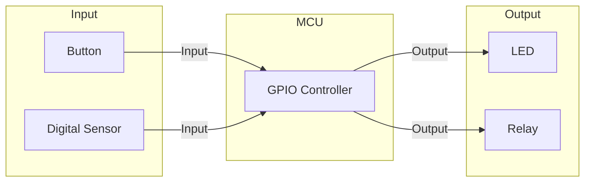
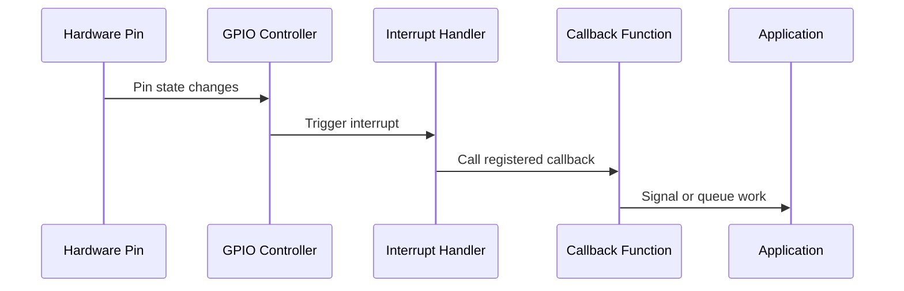

# GPIO (General Purpose I/O)

GPIO allows you to control digital pins for input, output, and interrupt-driven operations.

## GPIO Concepts



## Basic Setup

### Using Devicetree Spec (Recommended)

```c
#include <zephyr/kernel.h>
#include <zephyr/drivers/gpio.h>

/* Get GPIO spec from devicetree alias */
#define LED_NODE DT_ALIAS(led0)

static const struct gpio_dt_spec led = GPIO_DT_SPEC_GET(LED_NODE, gpios);

void main(void)
{
    int ret;

    /* Check device ready */
    if (!gpio_is_ready_dt(&led)) {
        printk("LED device not ready\n");
        return;
    }

    /* Configure as output */
    ret = gpio_pin_configure_dt(&led, GPIO_OUTPUT_ACTIVE);
    if (ret < 0) {
        printk("Failed to configure LED: %d\n", ret);
        return;
    }

    /* Blink forever */
    while (1) {
        gpio_pin_toggle_dt(&led);
        k_msleep(500);
    }
}
```

### Manual Configuration

```c
#include <zephyr/drivers/gpio.h>

const struct device *gpio = DEVICE_DT_GET(DT_NODELABEL(gpio0));

void main(void)
{
    if (!device_is_ready(gpio)) {
        return;
    }

    /* Configure pin 13 as output, initial low */
    gpio_pin_configure(gpio, 13, GPIO_OUTPUT_INACTIVE);

    /* Set high */
    gpio_pin_set(gpio, 13, 1);

    /* Set low */
    gpio_pin_set(gpio, 13, 0);

    /* Toggle */
    gpio_pin_toggle(gpio, 13);
}
```

## Output Modes

### Configuration Flags

```c
/* Basic output */
gpio_pin_configure_dt(&pin, GPIO_OUTPUT);

/* Output with initial state */
gpio_pin_configure_dt(&pin, GPIO_OUTPUT_ACTIVE);    /* Initially on */
gpio_pin_configure_dt(&pin, GPIO_OUTPUT_INACTIVE);  /* Initially off */

/* Open-drain (needs external pull-up) */
gpio_pin_configure_dt(&pin, GPIO_OUTPUT | GPIO_OPEN_DRAIN);

/* Open-source (needs external pull-down) */
gpio_pin_configure_dt(&pin, GPIO_OUTPUT | GPIO_OPEN_SOURCE);
```

### Setting Output Values

```c
/* Set to logical 1 (respects ACTIVE_LOW flag) */
gpio_pin_set_dt(&led, 1);

/* Set to logical 0 */
gpio_pin_set_dt(&led, 0);

/* Toggle current state */
gpio_pin_toggle_dt(&led);

/* Set raw value (ignores ACTIVE_LOW) */
gpio_pin_set_raw(gpio, pin, 1);
```

## Input Modes

### Configuration

```c
/* Basic input */
gpio_pin_configure_dt(&button, GPIO_INPUT);

/* Input with pull-up */
gpio_pin_configure_dt(&button, GPIO_INPUT | GPIO_PULL_UP);

/* Input with pull-down */
gpio_pin_configure_dt(&button, GPIO_INPUT | GPIO_PULL_DOWN);
```

### Reading Input

```c
/* Read logical value (respects ACTIVE_LOW) */
int state = gpio_pin_get_dt(&button);
if (state > 0) {
    printk("Button pressed\n");
} else if (state == 0) {
    printk("Button released\n");
} else {
    printk("Error: %d\n", state);
}

/* Read raw value (ignores ACTIVE_LOW) */
int raw = gpio_pin_get_raw(gpio, pin);
```

## GPIO Interrupts

### Interrupt Flow



### Setting Up Interrupts

```c
#include <zephyr/drivers/gpio.h>

#define BUTTON_NODE DT_ALIAS(sw0)

static const struct gpio_dt_spec button = GPIO_DT_SPEC_GET(BUTTON_NODE, gpios);
static struct gpio_callback button_cb;

/* Callback runs in ISR context! */
void button_handler(const struct device *port, struct gpio_callback *cb,
                    gpio_port_pins_t pins)
{
    printk("Button interrupt on pins: 0x%08x\n", pins);

    /* Don't do heavy processing here - use work queue instead */
}

void setup_button_interrupt(void)
{
    int ret;

    if (!gpio_is_ready_dt(&button)) {
        return;
    }

    /* Configure as input */
    ret = gpio_pin_configure_dt(&button, GPIO_INPUT);
    if (ret < 0) {
        return;
    }

    /* Configure interrupt trigger */
    ret = gpio_pin_interrupt_configure_dt(&button, GPIO_INT_EDGE_TO_ACTIVE);
    if (ret < 0) {
        return;
    }

    /* Initialize and add callback */
    gpio_init_callback(&button_cb, button_handler, BIT(button.pin));
    gpio_add_callback(button.port, &button_cb);
}
```

### Interrupt Trigger Modes

```c
/* Edge triggers */
GPIO_INT_EDGE_RISING      /* Low to high transition */
GPIO_INT_EDGE_FALLING     /* High to low transition */
GPIO_INT_EDGE_BOTH        /* Any transition */
GPIO_INT_EDGE_TO_ACTIVE   /* To active state (respects ACTIVE_LOW) */
GPIO_INT_EDGE_TO_INACTIVE /* To inactive state */

/* Level triggers */
GPIO_INT_LEVEL_LOW        /* While low */
GPIO_INT_LEVEL_HIGH       /* While high */
GPIO_INT_LEVEL_ACTIVE     /* While active (respects ACTIVE_LOW) */
GPIO_INT_LEVEL_INACTIVE   /* While inactive */

/* Disable */
GPIO_INT_DISABLE          /* No interrupt */
```

### Interrupt with Work Queue

```c
static K_WORK_DEFINE(button_work, button_work_handler);

void button_isr(const struct device *port, struct gpio_callback *cb,
                gpio_port_pins_t pins)
{
    /* Submit work to system workqueue */
    k_work_submit(&button_work);
}

void button_work_handler(struct k_work *work)
{
    /* Safe to do heavy processing here */
    printk("Processing button press in thread context\n");
    /* Read sensors, update state, etc. */
}
```

## Port Operations

Operate on multiple pins simultaneously:

```c
/* Read entire port */
gpio_port_value_t value;
gpio_port_get(gpio, &value);

/* Set multiple pins */
gpio_port_set_masked(gpio, 0xFF, 0x55);  /* Mask, value */

/* Set bits (OR with current) */
gpio_port_set_bits(gpio, BIT(0) | BIT(2));

/* Clear bits (AND with ~mask) */
gpio_port_clear_bits(gpio, BIT(1) | BIT(3));

/* Toggle bits */
gpio_port_toggle_bits(gpio, BIT(4) | BIT(5));
```

## Multiple LEDs Example

```c
#define LED0_NODE DT_ALIAS(led0)
#define LED1_NODE DT_ALIAS(led1)
#define LED2_NODE DT_ALIAS(led2)

static const struct gpio_dt_spec leds[] = {
    GPIO_DT_SPEC_GET(LED0_NODE, gpios),
    GPIO_DT_SPEC_GET(LED1_NODE, gpios),
    GPIO_DT_SPEC_GET(LED2_NODE, gpios),
};

void init_leds(void)
{
    for (int i = 0; i < ARRAY_SIZE(leds); i++) {
        if (!gpio_is_ready_dt(&leds[i])) {
            printk("LED %d not ready\n", i);
            continue;
        }
        gpio_pin_configure_dt(&leds[i], GPIO_OUTPUT_INACTIVE);
    }
}

void set_led(int index, bool on)
{
    if (index < ARRAY_SIZE(leds)) {
        gpio_pin_set_dt(&leds[index], on ? 1 : 0);
    }
}

void led_pattern(uint8_t pattern)
{
    for (int i = 0; i < ARRAY_SIZE(leds); i++) {
        gpio_pin_set_dt(&leds[i], (pattern >> i) & 1);
    }
}
```

## Debouncing

Hardware doesn't debounce - implement in software:

```c
static int64_t last_press_time;
#define DEBOUNCE_MS 50

void button_handler(const struct device *port, struct gpio_callback *cb,
                    gpio_port_pins_t pins)
{
    int64_t now = k_uptime_get();

    if ((now - last_press_time) > DEBOUNCE_MS) {
        last_press_time = now;
        k_work_submit(&button_work);
    }
}
```

Or use a timer:

```c
static struct k_timer debounce_timer;
static bool button_stable = true;

void debounce_expired(struct k_timer *timer)
{
    button_stable = true;
}

void button_handler(const struct device *port, struct gpio_callback *cb,
                    gpio_port_pins_t pins)
{
    if (button_stable) {
        button_stable = false;
        k_timer_start(&debounce_timer, K_MSEC(50), K_NO_WAIT);
        k_work_submit(&button_work);
    }
}

void init(void)
{
    k_timer_init(&debounce_timer, debounce_expired, NULL);
}
```

## API Reference

```c
/* Configuration */
int gpio_pin_configure(const struct device *port, gpio_pin_t pin,
                       gpio_flags_t flags);
int gpio_pin_configure_dt(const struct gpio_dt_spec *spec,
                          gpio_flags_t extra_flags);

/* Output */
int gpio_pin_set(const struct device *port, gpio_pin_t pin, int value);
int gpio_pin_set_dt(const struct gpio_dt_spec *spec, int value);
int gpio_pin_toggle(const struct device *port, gpio_pin_t pin);
int gpio_pin_toggle_dt(const struct gpio_dt_spec *spec);

/* Input */
int gpio_pin_get(const struct device *port, gpio_pin_t pin);
int gpio_pin_get_dt(const struct gpio_dt_spec *spec);

/* Interrupts */
int gpio_pin_interrupt_configure(const struct device *port, gpio_pin_t pin,
                                 gpio_flags_t flags);
int gpio_pin_interrupt_configure_dt(const struct gpio_dt_spec *spec,
                                    gpio_flags_t flags);
void gpio_init_callback(struct gpio_callback *callback,
                        gpio_callback_handler_t handler,
                        gpio_port_pins_t pin_mask);
int gpio_add_callback(const struct device *port, struct gpio_callback *callback);
int gpio_remove_callback(const struct device *port,
                         struct gpio_callback *callback);
```

## Best Practices

1. **Use DT spec structures** - `GPIO_DT_SPEC_GET()` for cleaner code
2. **Check device_is_ready()** - Before any GPIO operations
3. **Use ACTIVE_LOW in devicetree** - Let the framework handle inversion
4. **Keep ISR callbacks short** - Use work queues for processing
5. **Implement debouncing** - For mechanical switches
6. **Use port operations** - When setting multiple pins simultaneously

## Next Steps

Learn about [I2C]() for communicating with peripherals.
