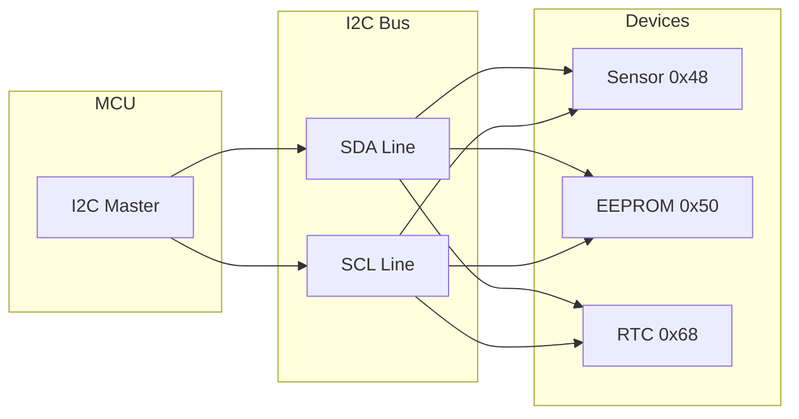
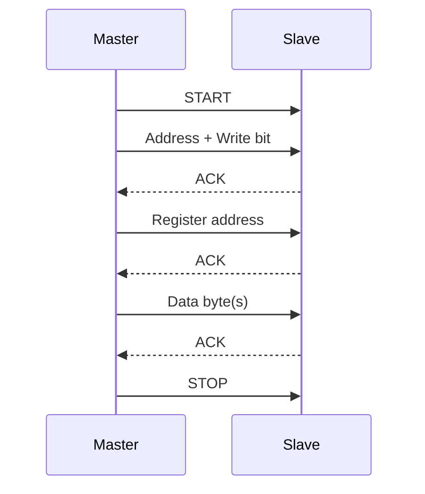
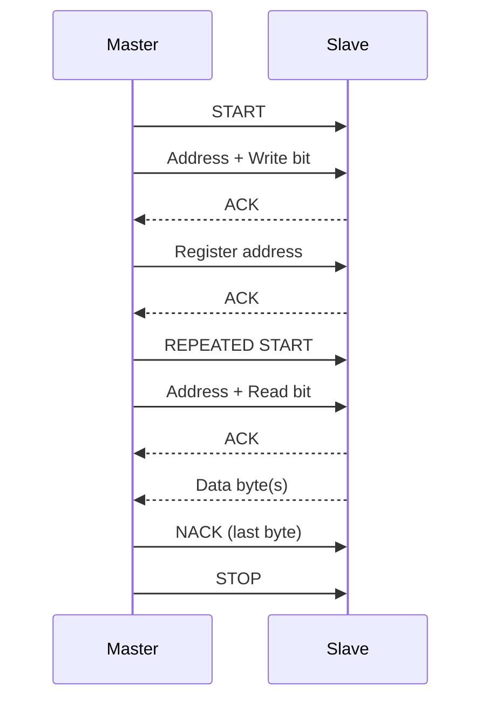

# I2C Communication

I2C (Inter-Integrated Circuit) is a two-wire serial protocol for communicating with sensors, EEPROMs, and other peripherals.

## I2C Overview



## Basic Setup

### Devicetree Configuration

```dts
&i2c0 {
    status = "okay";
    clock-frequency = <I2C_BITRATE_FAST>;  /* 400 kHz */

    temp_sensor: tmp102@48 {
        compatible = "ti,tmp102";
        reg = <0x48>;
    };

    eeprom: at24c32@50 {
        compatible = "atmel,at24";
        reg = <0x50>;
        size = <4096>;
        pagesize = <32>;
    };
};
```

### Using I2C DT Spec

```c
#include <zephyr/kernel.h>
#include <zephyr/drivers/i2c.h>

#define SENSOR_NODE DT_NODELABEL(temp_sensor)

static const struct i2c_dt_spec sensor = I2C_DT_SPEC_GET(SENSOR_NODE);

void main(void)
{
    if (!device_is_ready(sensor.bus)) {
        printk("I2C bus not ready\n");
        return;
    }

    /* Now use sensor.bus and sensor.addr */
}
```

## I2C Operations

### Write Operation



```c
/* Write single byte to register */
int write_reg(const struct i2c_dt_spec *dev, uint8_t reg, uint8_t value)
{
    uint8_t buf[2] = { reg, value };
    return i2c_write_dt(dev, buf, sizeof(buf));
}

/* Write multiple bytes */
int write_data(const struct i2c_dt_spec *dev, uint8_t reg,
               const uint8_t *data, size_t len)
{
    uint8_t buf[1 + len];
    buf[0] = reg;
    memcpy(&buf[1], data, len);
    return i2c_write_dt(dev, buf, sizeof(buf));
}
```

### Read Operation



```c
/* Read single register */
int read_reg(const struct i2c_dt_spec *dev, uint8_t reg, uint8_t *value)
{
    return i2c_write_read_dt(dev, &reg, 1, value, 1);
}

/* Read multiple registers */
int read_data(const struct i2c_dt_spec *dev, uint8_t reg,
              uint8_t *data, size_t len)
{
    return i2c_write_read_dt(dev, &reg, 1, data, len);
}
```

### Combined Write-Read

```c
/* Write register address, then read data (most common pattern) */
uint8_t reg = 0x00;
uint8_t data[6];

int ret = i2c_write_read_dt(&sensor, &reg, sizeof(reg), data, sizeof(data));
if (ret < 0) {
    printk("I2C error: %d\n", ret);
}
```

## Example: Temperature Sensor (TMP102)

```c
#include <zephyr/kernel.h>
#include <zephyr/drivers/i2c.h>

#define TMP102_NODE DT_NODELABEL(temp_sensor)

static const struct i2c_dt_spec tmp102 = I2C_DT_SPEC_GET(TMP102_NODE);

/* TMP102 registers */
#define TMP102_REG_TEMP    0x00
#define TMP102_REG_CONFIG  0x01

int tmp102_read_temp(int16_t *temp_mC)
{
    uint8_t reg = TMP102_REG_TEMP;
    uint8_t data[2];
    int ret;

    ret = i2c_write_read_dt(&tmp102, &reg, 1, data, 2);
    if (ret < 0) {
        return ret;
    }

    /* Convert to milli-Celsius
     * TMP102: 12-bit value, 0.0625°C resolution
     */
    int16_t raw = (data[0] << 4) | (data[1] >> 4);
    if (raw & 0x800) {  /* Sign extend */
        raw |= 0xF000;
    }
    *temp_mC = (raw * 625) / 10;  /* Convert to milli-Celsius */

    return 0;
}

void main(void)
{
    if (!device_is_ready(tmp102.bus)) {
        printk("I2C not ready\n");
        return;
    }

    while (1) {
        int16_t temp;
        if (tmp102_read_temp(&temp) == 0) {
            printk("Temperature: %d.%03d C\n",
                   temp / 1000, abs(temp % 1000));
        }
        k_sleep(K_SECONDS(1));
    }
}
```

## Example: EEPROM Access

```c
#define EEPROM_NODE DT_NODELABEL(eeprom)
#define EEPROM_PAGE_SIZE 32

static const struct i2c_dt_spec eeprom = I2C_DT_SPEC_GET(EEPROM_NODE);

/* Write to EEPROM (respects page boundaries) */
int eeprom_write(uint16_t addr, const uint8_t *data, size_t len)
{
    uint8_t buf[2 + EEPROM_PAGE_SIZE];
    size_t written = 0;

    while (written < len) {
        /* Calculate bytes to write (up to page boundary) */
        size_t page_offset = (addr + written) % EEPROM_PAGE_SIZE;
        size_t chunk = MIN(len - written, EEPROM_PAGE_SIZE - page_offset);

        /* Build write buffer: address + data */
        uint16_t write_addr = addr + written;
        buf[0] = write_addr >> 8;
        buf[1] = write_addr & 0xFF;
        memcpy(&buf[2], &data[written], chunk);

        int ret = i2c_write_dt(&eeprom, buf, 2 + chunk);
        if (ret < 0) {
            return ret;
        }

        /* Wait for write cycle (typically 5ms) */
        k_msleep(5);
        written += chunk;
    }

    return 0;
}

/* Read from EEPROM */
int eeprom_read(uint16_t addr, uint8_t *data, size_t len)
{
    uint8_t addr_buf[2] = { addr >> 8, addr & 0xFF };
    return i2c_write_read_dt(&eeprom, addr_buf, 2, data, len);
}
```

## I2C Transfers (Advanced)

For complex operations, use the transfer API:

```c
struct i2c_msg msgs[2];
uint8_t reg = 0x00;
uint8_t data[10];

/* First message: write register address */
msgs[0].buf = &reg;
msgs[0].len = 1;
msgs[0].flags = I2C_MSG_WRITE;

/* Second message: read data */
msgs[1].buf = data;
msgs[1].len = sizeof(data);
msgs[1].flags = I2C_MSG_READ | I2C_MSG_STOP;

int ret = i2c_transfer_dt(&sensor, msgs, 2);
```

### Transfer Flags

```c
I2C_MSG_WRITE      /* Write operation */
I2C_MSG_READ       /* Read operation */
I2C_MSG_STOP       /* Send STOP after this message */
I2C_MSG_RESTART    /* Send RESTART before this message */
```

## Bus Configuration

### Speed Settings

```c
/* Available speeds (defined in devicetree) */
I2C_BITRATE_STANDARD   /* 100 kHz */
I2C_BITRATE_FAST       /* 400 kHz */
I2C_BITRATE_FAST_PLUS  /* 1 MHz */
I2C_BITRATE_HIGH       /* 3.4 MHz */
```

### Runtime Configuration

```c
/* Change bus speed at runtime */
int ret = i2c_configure(i2c_dev, I2C_SPEED_SET(I2C_SPEED_FAST) | I2C_MODE_CONTROLLER);
```

## Scanning for Devices

```c
void i2c_scan(const struct device *i2c_dev)
{
    printk("Scanning I2C bus...\n");

    for (uint8_t addr = 0x08; addr < 0x78; addr++) {
        struct i2c_msg msg;
        uint8_t data;

        msg.buf = &data;
        msg.len = 0;
        msg.flags = I2C_MSG_WRITE | I2C_MSG_STOP;

        if (i2c_transfer(i2c_dev, &msg, 1, addr) == 0) {
            printk("Found device at 0x%02x\n", addr);
        }
    }
}
```

## Error Handling

```c
int read_sensor(void)
{
    uint8_t data[2];
    int ret = i2c_write_read_dt(&sensor, &(uint8_t){0x00}, 1, data, 2);

    switch (ret) {
    case 0:
        return (data[0] << 8) | data[1];

    case -EIO:
        printk("I2C bus error\n");
        break;

    case -ENODEV:
        printk("Device not responding (NACK)\n");
        break;

    case -ETIMEDOUT:
        printk("I2C timeout\n");
        break;

    default:
        printk("Unknown error: %d\n", ret);
    }

    return ret;
}
```

## API Reference

```c
/* Simple operations */
int i2c_write_dt(const struct i2c_dt_spec *spec,
                 const uint8_t *buf, uint32_t num_bytes);

int i2c_read_dt(const struct i2c_dt_spec *spec,
                uint8_t *buf, uint32_t num_bytes);

int i2c_write_read_dt(const struct i2c_dt_spec *spec,
                      const void *write_buf, size_t num_write,
                      void *read_buf, size_t num_read);

/* Transfer API */
int i2c_transfer_dt(const struct i2c_dt_spec *spec,
                    struct i2c_msg *msgs, uint8_t num_msgs);

/* Register operations (for 8-bit registers) */
int i2c_reg_read_byte_dt(const struct i2c_dt_spec *spec,
                         uint8_t reg_addr, uint8_t *value);

int i2c_reg_write_byte_dt(const struct i2c_dt_spec *spec,
                          uint8_t reg_addr, uint8_t value);

int i2c_reg_update_byte_dt(const struct i2c_dt_spec *spec,
                           uint8_t reg_addr, uint8_t mask, uint8_t value);
```

## Best Practices

1. **Use I2C_DT_SPEC_GET()** - Cleaner than manual device/address handling
2. **Check bus readiness** - `device_is_ready()` before operations
3. **Handle errors** - I2C can fail (NACK, bus error, timeout)
4. **Respect timing** - Some devices need delays between operations
5. **Page-aligned EEPROM writes** - Write within page boundaries
6. **Use appropriate speed** - Higher speeds may cause issues with long wires

## Example Code

See the complete [I2C Sensor Example]() demonstrating temperature sensor communication over I2C.

## Next Steps

Learn about [SPI]() for high-speed serial communication.
