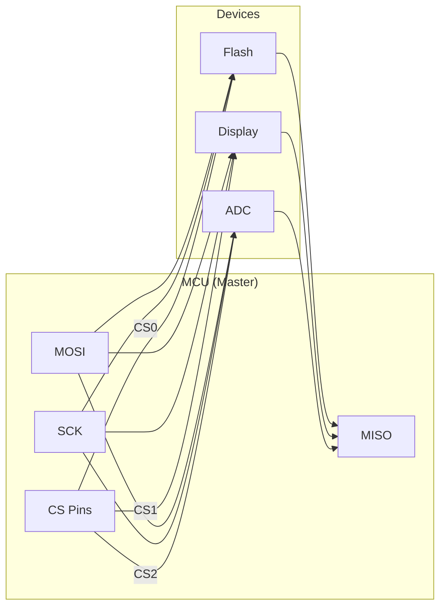
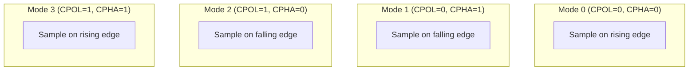

# SPI Communication

SPI (Serial Peripheral Interface) provides high-speed, full-duplex communication with peripherals like displays, flash memory, and sensors.

## SPI Overview



## SPI Signals

| Signal | Direction | Description |
|--------|-----------|-------------|
| MOSI | Master → Slave | Master Out, Slave In |
| MISO | Slave → Master | Master In, Slave Out |
| SCK | Master → Slave | Serial Clock |
| CS/SS | Master → Slave | Chip Select (active low) |

## Devicetree Configuration

```dts
&spi1 {
    status = "okay";
    cs-gpios = <&gpio0 4 GPIO_ACTIVE_LOW>,
               <&gpio0 5 GPIO_ACTIVE_LOW>;

    flash: w25q128@0 {
        compatible = "jedec,spi-nor";
        reg = <0>;  /* CS index */
        spi-max-frequency = <40000000>;
    };

    display: ili9341@1 {
        compatible = "ilitek,ili9341";
        reg = <1>;  /* CS index */
        spi-max-frequency = <20000000>;
        cmd-data-gpios = <&gpio0 6 GPIO_ACTIVE_LOW>;
    };
};
```

## Basic Setup

### Using SPI DT Spec

```c
#include <zephyr/kernel.h>
#include <zephyr/drivers/spi.h>

#define FLASH_NODE DT_NODELABEL(flash)

/* Get SPI spec from devicetree */
static const struct spi_dt_spec flash = SPI_DT_SPEC_GET(
    FLASH_NODE,
    SPI_WORD_SET(8) | SPI_TRANSFER_MSB,  /* 8-bit words, MSB first */
    0  /* Hold time after CS (us) */
);

void main(void)
{
    if (!spi_is_ready_dt(&flash)) {
        printk("SPI device not ready\n");
        return;
    }

    /* Ready to use */
}
```

### Manual Configuration

```c
const struct device *spi = DEVICE_DT_GET(DT_NODELABEL(spi1));

struct spi_config spi_cfg = {
    .frequency = 4000000,  /* 4 MHz */
    .operation = SPI_WORD_SET(8) | SPI_TRANSFER_MSB | SPI_OP_MODE_MASTER,
    .slave = 0,
    .cs = {
        .gpio = GPIO_DT_SPEC_GET(DT_NODELABEL(gpio0), 4),
        .delay = 0,
    },
};
```

## SPI Modes

SPI has 4 modes based on clock polarity (CPOL) and phase (CPHA):



```c
/* Mode selection in operation flags */
SPI_MODE_CPOL    /* Clock polarity: idle high */
SPI_MODE_CPHA    /* Clock phase: sample on second edge */

/* Common mode configurations */
#define SPI_MODE_0 (0)                           /* CPOL=0, CPHA=0 */
#define SPI_MODE_1 (SPI_MODE_CPHA)               /* CPOL=0, CPHA=1 */
#define SPI_MODE_2 (SPI_MODE_CPOL)               /* CPOL=1, CPHA=0 */
#define SPI_MODE_3 (SPI_MODE_CPOL | SPI_MODE_CPHA) /* CPOL=1, CPHA=1 */
```

## SPI Operations

### Buffer Setup

```c
/* TX and RX buffers */
uint8_t tx_data[] = {0x9F, 0x00, 0x00, 0x00};  /* Command + dummy bytes */
uint8_t rx_data[4];

/* Buffer descriptors */
struct spi_buf tx_buf = {
    .buf = tx_data,
    .len = sizeof(tx_data)
};

struct spi_buf rx_buf = {
    .buf = rx_data,
    .len = sizeof(rx_data)
};

/* Buffer sets */
struct spi_buf_set tx = {
    .buffers = &tx_buf,
    .count = 1
};

struct spi_buf_set rx = {
    .buffers = &rx_buf,
    .count = 1
};
```

### Transceive (Full Duplex)

```c
/* Simultaneous TX and RX */
int ret = spi_transceive_dt(&flash, &tx, &rx);
if (ret < 0) {
    printk("SPI error: %d\n", ret);
}
```

### Write Only

```c
/* TX only, ignore RX */
int ret = spi_write_dt(&flash, &tx);
```

### Read Only

```c
/* RX only (sends zeros) */
int ret = spi_read_dt(&flash, &rx);
```

## Example: SPI Flash

```c
#include <zephyr/kernel.h>
#include <zephyr/drivers/spi.h>

#define FLASH_NODE DT_NODELABEL(flash)

static const struct spi_dt_spec flash = SPI_DT_SPEC_GET(
    FLASH_NODE, SPI_WORD_SET(8) | SPI_TRANSFER_MSB, 0);

/* Flash commands */
#define FLASH_CMD_READ_ID      0x9F
#define FLASH_CMD_READ         0x03
#define FLASH_CMD_WRITE_ENABLE 0x06
#define FLASH_CMD_PAGE_PROGRAM 0x02
#define FLASH_CMD_SECTOR_ERASE 0x20
#define FLASH_CMD_READ_STATUS  0x05

/* Read JEDEC ID */
int flash_read_id(uint8_t *id)
{
    uint8_t cmd = FLASH_CMD_READ_ID;

    struct spi_buf tx_bufs[] = {
        { .buf = &cmd, .len = 1 },
    };
    struct spi_buf rx_bufs[] = {
        { .buf = NULL, .len = 1 },  /* Skip command byte */
        { .buf = id, .len = 3 },     /* Read 3-byte ID */
    };

    struct spi_buf_set tx = { .buffers = tx_bufs, .count = 1 };
    struct spi_buf_set rx = { .buffers = rx_bufs, .count = 2 };

    return spi_transceive_dt(&flash, &tx, &rx);
}

/* Read data from flash */
int flash_read(uint32_t addr, uint8_t *data, size_t len)
{
    uint8_t cmd[4] = {
        FLASH_CMD_READ,
        (addr >> 16) & 0xFF,
        (addr >> 8) & 0xFF,
        addr & 0xFF
    };

    struct spi_buf tx_bufs[] = {
        { .buf = cmd, .len = sizeof(cmd) },
    };
    struct spi_buf rx_bufs[] = {
        { .buf = NULL, .len = sizeof(cmd) },  /* Skip command */
        { .buf = data, .len = len },
    };

    struct spi_buf_set tx = { .buffers = tx_bufs, .count = 1 };
    struct spi_buf_set rx = { .buffers = rx_bufs, .count = 2 };

    return spi_transceive_dt(&flash, &tx, &rx);
}

/* Write enable */
int flash_write_enable(void)
{
    uint8_t cmd = FLASH_CMD_WRITE_ENABLE;
    struct spi_buf buf = { .buf = &cmd, .len = 1 };
    struct spi_buf_set tx = { .buffers = &buf, .count = 1 };

    return spi_write_dt(&flash, &tx);
}

/* Read status register */
int flash_read_status(uint8_t *status)
{
    uint8_t cmd = FLASH_CMD_READ_STATUS;

    struct spi_buf tx_buf = { .buf = &cmd, .len = 1 };
    struct spi_buf rx_bufs[] = {
        { .buf = NULL, .len = 1 },
        { .buf = status, .len = 1 },
    };

    struct spi_buf_set tx = { .buffers = &tx_buf, .count = 1 };
    struct spi_buf_set rx = { .buffers = rx_bufs, .count = 2 };

    return spi_transceive_dt(&flash, &tx, &rx);
}

/* Wait for write/erase to complete */
int flash_wait_ready(k_timeout_t timeout)
{
    int64_t end = k_uptime_get() + k_ticks_to_ms_ceil64(timeout.ticks);

    while (k_uptime_get() < end) {
        uint8_t status;
        int ret = flash_read_status(&status);
        if (ret < 0) {
            return ret;
        }
        if (!(status & 0x01)) {  /* WIP bit clear */
            return 0;
        }
        k_msleep(1);
    }

    return -ETIMEDOUT;
}

void main(void)
{
    if (!spi_is_ready_dt(&flash)) {
        printk("SPI flash not ready\n");
        return;
    }

    /* Read JEDEC ID */
    uint8_t id[3];
    if (flash_read_id(id) == 0) {
        printk("Flash ID: %02x %02x %02x\n", id[0], id[1], id[2]);
    }

    /* Read first 16 bytes */
    uint8_t data[16];
    if (flash_read(0, data, sizeof(data)) == 0) {
        printk("Data: ");
        for (int i = 0; i < sizeof(data); i++) {
            printk("%02x ", data[i]);
        }
        printk("\n");
    }
}
```

## Multiple Buffers

Chain multiple buffers in a single transaction:

```c
uint8_t cmd[4];
uint8_t addr[3];
uint8_t data[256];

struct spi_buf tx_bufs[] = {
    { .buf = cmd, .len = sizeof(cmd) },
    { .buf = addr, .len = sizeof(addr) },
    { .buf = data, .len = sizeof(data) },
};

struct spi_buf_set tx = {
    .buffers = tx_bufs,
    .count = ARRAY_SIZE(tx_bufs)
};

spi_write_dt(&device, &tx);
```

## Operation Flags

```c
/* Word size */
SPI_WORD_SET(8)      /* 8-bit words */
SPI_WORD_SET(16)     /* 16-bit words */

/* Bit order */
SPI_TRANSFER_MSB     /* MSB first (default) */
SPI_TRANSFER_LSB     /* LSB first */

/* Mode flags */
SPI_MODE_CPOL        /* Clock idle high */
SPI_MODE_CPHA        /* Sample on second edge */
SPI_MODE_LOOP        /* Loopback mode */

/* Chip select control */
SPI_HOLD_ON_CS       /* Keep CS active between transfers */
SPI_LOCK_ON          /* Lock the bus */

/* Full duplex control */
SPI_HALF_DUPLEX      /* Use 3-wire SPI */
```

## Async SPI (Optional)

For non-blocking operations:

```c
struct k_poll_signal spi_done;
struct spi_buf_set tx, rx;

void spi_callback(const struct device *dev, int result, void *data)
{
    k_poll_signal_raise(&spi_done, result);
}

void async_transfer(void)
{
    k_poll_signal_init(&spi_done);

    int ret = spi_transceive_signal(spi_dev, &spi_cfg, &tx, &rx, &spi_done);
    if (ret < 0) {
        return;
    }

    /* Do other work... */

    /* Wait for completion */
    struct k_poll_event events[] = {
        K_POLL_EVENT_INITIALIZER(K_POLL_TYPE_SIGNAL,
                                 K_POLL_MODE_NOTIFY_ONLY,
                                 &spi_done),
    };
    k_poll(events, 1, K_FOREVER);
}
```

## API Reference

```c
/* Check readiness */
bool spi_is_ready_dt(const struct spi_dt_spec *spec);

/* Synchronous transfers */
int spi_transceive_dt(const struct spi_dt_spec *spec,
                      const struct spi_buf_set *tx_bufs,
                      const struct spi_buf_set *rx_bufs);

int spi_write_dt(const struct spi_dt_spec *spec,
                 const struct spi_buf_set *tx_bufs);

int spi_read_dt(const struct spi_dt_spec *spec,
                const struct spi_buf_set *rx_bufs);

/* Release bus (if SPI_LOCK_ON was used) */
int spi_release_dt(const struct spi_dt_spec *spec);
```

## Best Practices

1. **Use SPI_DT_SPEC_GET()** - Encapsulates bus, CS, and configuration
2. **Check spi_is_ready_dt()** - Before any operations
3. **Match device requirements** - Mode, frequency, word size
4. **Use appropriate CS timing** - Some devices need setup/hold time
5. **Chain buffers** - Instead of multiple transactions
6. **Handle errors** - SPI can fail (bus busy, hardware error)

## Next Steps

Learn about [UART]() for serial communication.
