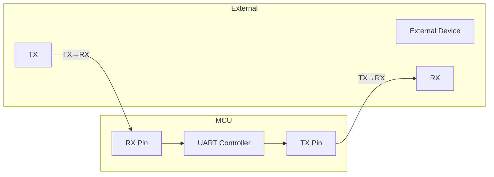

# UART Communication

UART (Universal Asynchronous Receiver/Transmitter) provides serial communication for debugging, console I/O, and peripheral communication.

## UART Overview



## UART APIs

Zephyr provides three UART API styles:

| API | Use Case | Blocking? |
|-----|----------|-----------|
| Poll | Simple, low throughput | Yes |
| Interrupt | Moderate throughput | No |
| Async | High throughput, DMA | No |

## Devicetree Configuration

```dts
&uart0 {
    status = "okay";
    current-speed = <115200>;
    /* Pin configuration often in board-specific pinctrl */
};

&uart1 {
    status = "okay";
    current-speed = <9600>;
    /* For external peripheral */
};
```

## Poll API (Simple)

Best for simple output and debugging.

### Basic Output

```c
#include <zephyr/kernel.h>
#include <zephyr/drivers/uart.h>

const struct device *uart = DEVICE_DT_GET(DT_NODELABEL(uart0));

void main(void)
{
    if (!device_is_ready(uart)) {
        return;
    }

    /* Send string */
    const char *msg = "Hello, UART!\r\n";
    for (int i = 0; msg[i]; i++) {
        uart_poll_out(uart, msg[i]);
    }
}
```

### Basic Input

```c
void uart_read_line(char *buf, size_t max_len)
{
    size_t pos = 0;

    while (pos < max_len - 1) {
        unsigned char c;

        /* Poll for character (blocks!) */
        while (uart_poll_in(uart, &c) < 0) {
            k_msleep(10);
        }

        if (c == '\r' || c == '\n') {
            break;
        }

        buf[pos++] = c;
        uart_poll_out(uart, c);  /* Echo */
    }

    buf[pos] = '\0';
}
```

## Interrupt API

Better performance for bidirectional communication.

### Interrupt Setup

```c
#include <zephyr/drivers/uart.h>

const struct device *uart = DEVICE_DT_GET(DT_NODELABEL(uart1));

/* Ring buffer for received data */
#define RX_BUF_SIZE 64
static uint8_t rx_buffer[RX_BUF_SIZE];
static volatile size_t rx_head, rx_tail;

void uart_isr(const struct device *dev, void *user_data)
{
    while (uart_irq_update(dev) && uart_irq_is_pending(dev)) {
        if (uart_irq_rx_ready(dev)) {
            uint8_t c;
            while (uart_fifo_read(dev, &c, 1) > 0) {
                size_t next = (rx_head + 1) % RX_BUF_SIZE;
                if (next != rx_tail) {  /* Buffer not full */
                    rx_buffer[rx_head] = c;
                    rx_head = next;
                }
            }
        }

        if (uart_irq_tx_ready(dev)) {
            /* Handle TX if needed */
        }
    }
}

void uart_init(void)
{
    if (!device_is_ready(uart)) {
        return;
    }

    /* Set up interrupt callback */
    uart_irq_callback_set(uart, uart_isr);

    /* Enable RX interrupt */
    uart_irq_rx_enable(uart);
}

/* Non-blocking read from ring buffer */
int uart_getchar(uint8_t *c)
{
    if (rx_head == rx_tail) {
        return -1;  /* Buffer empty */
    }

    *c = rx_buffer[rx_tail];
    rx_tail = (rx_tail + 1) % RX_BUF_SIZE;
    return 0;
}
```

### Interrupt-Driven TX

```c
static const uint8_t *tx_data;
static size_t tx_len;
static size_t tx_pos;
static K_SEM_DEFINE(tx_done, 1, 1);

void uart_isr(const struct device *dev, void *user_data)
{
    while (uart_irq_update(dev) && uart_irq_is_pending(dev)) {
        if (uart_irq_tx_ready(dev)) {
            if (tx_pos < tx_len) {
                uart_fifo_fill(dev, &tx_data[tx_pos], 1);
                tx_pos++;
            } else {
                uart_irq_tx_disable(dev);
                k_sem_give(&tx_done);
            }
        }
        /* ... RX handling ... */
    }
}

int uart_write_async(const uint8_t *data, size_t len)
{
    k_sem_take(&tx_done, K_FOREVER);

    tx_data = data;
    tx_len = len;
    tx_pos = 0;

    uart_irq_tx_enable(uart);

    return 0;
}

void uart_write_sync(const uint8_t *data, size_t len)
{
    uart_write_async(data, len);
    k_sem_take(&tx_done, K_FOREVER);
    k_sem_give(&tx_done);  /* Ready for next */
}
```

## Async API (DMA)

Highest performance for large transfers.

### Async Setup

```c
#include <zephyr/drivers/uart.h>

const struct device *uart = DEVICE_DT_GET(DT_NODELABEL(uart1));

#define RX_BUF_SIZE 256
static uint8_t rx_buf[2][RX_BUF_SIZE];  /* Double buffer */
static uint8_t *current_rx_buf = rx_buf[0];

K_MSGQ_DEFINE(uart_msgq, sizeof(struct uart_event_rx), 10, 4);

void uart_callback(const struct device *dev, struct uart_event *evt,
                   void *user_data)
{
    switch (evt->type) {
    case UART_RX_RDY:
        /* Data available at evt->data.rx.buf + evt->data.rx.offset */
        /* Length: evt->data.rx.len */
        k_msgq_put(&uart_msgq, &evt->data.rx, K_NO_WAIT);
        break;

    case UART_RX_BUF_REQUEST:
        /* Provide next buffer */
        current_rx_buf = (current_rx_buf == rx_buf[0]) ? rx_buf[1] : rx_buf[0];
        uart_rx_buf_rsp(dev, current_rx_buf, RX_BUF_SIZE);
        break;

    case UART_RX_DISABLED:
        /* RX stopped */
        break;

    case UART_TX_DONE:
        /* TX complete */
        break;

    case UART_TX_ABORTED:
        /* TX aborted */
        break;

    default:
        break;
    }
}

void uart_async_init(void)
{
    if (!device_is_ready(uart)) {
        return;
    }

    uart_callback_set(uart, uart_callback, NULL);

    /* Start receiving (timeout = when to flush partial buffer) */
    uart_rx_enable(uart, rx_buf[0], RX_BUF_SIZE, 100);
}
```

### Async TX

```c
static K_SEM_DEFINE(tx_sem, 1, 1);

void uart_callback(const struct device *dev, struct uart_event *evt,
                   void *user_data)
{
    if (evt->type == UART_TX_DONE || evt->type == UART_TX_ABORTED) {
        k_sem_give(&tx_sem);
    }
    /* ... other handling ... */
}

int uart_async_send(const uint8_t *data, size_t len, k_timeout_t timeout)
{
    int ret;

    ret = k_sem_take(&tx_sem, timeout);
    if (ret < 0) {
        return ret;
    }

    ret = uart_tx(uart, data, len, SYS_FOREVER_US);
    if (ret < 0) {
        k_sem_give(&tx_sem);
    }

    return ret;
}
```

## Example: Command Parser

```c
#include <zephyr/kernel.h>
#include <zephyr/drivers/uart.h>
#include <string.h>

const struct device *uart = DEVICE_DT_GET(DT_CHOSEN(zephyr_console));

#define CMD_BUF_SIZE 128
static char cmd_buf[CMD_BUF_SIZE];
static size_t cmd_pos;

static K_SEM_DEFINE(cmd_ready, 0, 1);

void uart_isr(const struct device *dev, void *user_data)
{
    while (uart_irq_update(dev) && uart_irq_is_pending(dev)) {
        if (uart_irq_rx_ready(dev)) {
            uint8_t c;
            while (uart_fifo_read(dev, &c, 1) > 0) {
                /* Echo */
                uart_poll_out(dev, c);

                if (c == '\r' || c == '\n') {
                    cmd_buf[cmd_pos] = '\0';
                    if (cmd_pos > 0) {
                        k_sem_give(&cmd_ready);
                    }
                    cmd_pos = 0;
                    uart_poll_out(dev, '\n');
                } else if (c == '\b' || c == 0x7F) {
                    /* Backspace */
                    if (cmd_pos > 0) {
                        cmd_pos--;
                        uart_poll_out(dev, ' ');
                        uart_poll_out(dev, '\b');
                    }
                } else if (cmd_pos < CMD_BUF_SIZE - 1) {
                    cmd_buf[cmd_pos++] = c;
                }
            }
        }
    }
}

void process_command(const char *cmd)
{
    if (strcmp(cmd, "help") == 0) {
        printk("Commands: help, status, reset\n");
    } else if (strcmp(cmd, "status") == 0) {
        printk("System OK\n");
    } else if (strcmp(cmd, "reset") == 0) {
        printk("Resetting...\n");
        /* sys_reboot(SYS_REBOOT_COLD); */
    } else {
        printk("Unknown command: %s\n", cmd);
    }
}

void command_thread(void)
{
    uart_irq_callback_set(uart, uart_isr);
    uart_irq_rx_enable(uart);

    printk("Ready> ");

    while (1) {
        k_sem_take(&cmd_ready, K_FOREVER);
        process_command(cmd_buf);
        printk("Ready> ");
    }
}
```

## Configuration Options

### Runtime Configuration

```c
struct uart_config cfg = {
    .baudrate = 115200,
    .parity = UART_CFG_PARITY_NONE,
    .stop_bits = UART_CFG_STOP_BITS_1,
    .data_bits = UART_CFG_DATA_BITS_8,
    .flow_ctrl = UART_CFG_FLOW_CTRL_NONE,
};

int ret = uart_configure(uart, &cfg);
if (ret < 0) {
    printk("UART configure failed: %d\n", ret);
}
```

### Get Current Configuration

```c
struct uart_config cfg;
uart_config_get(uart, &cfg);
printk("Baud: %d\n", cfg.baudrate);
```

## Flow Control

### Hardware Flow Control (RTS/CTS)

```dts
&uart1 {
    status = "okay";
    current-speed = <115200>;
    hw-flow-control;  /* Enable RTS/CTS */
};
```

```c
struct uart_config cfg;
uart_config_get(uart, &cfg);
cfg.flow_ctrl = UART_CFG_FLOW_CTRL_RTS_CTS;
uart_configure(uart, &cfg);
```

## API Reference

### Poll API

```c
void uart_poll_out(const struct device *dev, unsigned char out_char);
int uart_poll_in(const struct device *dev, unsigned char *p_char);
```

### Interrupt API

```c
void uart_irq_callback_set(const struct device *dev,
                           uart_irq_callback_user_data_t cb,
                           void *user_data);

void uart_irq_rx_enable(const struct device *dev);
void uart_irq_rx_disable(const struct device *dev);
void uart_irq_tx_enable(const struct device *dev);
void uart_irq_tx_disable(const struct device *dev);

int uart_irq_update(const struct device *dev);
int uart_irq_is_pending(const struct device *dev);
int uart_irq_rx_ready(const struct device *dev);
int uart_irq_tx_ready(const struct device *dev);

int uart_fifo_read(const struct device *dev, uint8_t *data, int size);
int uart_fifo_fill(const struct device *dev, const uint8_t *data, int size);
```

### Async API

```c
int uart_callback_set(const struct device *dev, uart_callback_t callback,
                      void *user_data);

int uart_tx(const struct device *dev, const uint8_t *buf, size_t len,
            int32_t timeout);
int uart_tx_abort(const struct device *dev);

int uart_rx_enable(const struct device *dev, uint8_t *buf, size_t len,
                   int32_t timeout);
int uart_rx_buf_rsp(const struct device *dev, uint8_t *buf, size_t len);
int uart_rx_disable(const struct device *dev);
```

### Configuration

```c
int uart_configure(const struct device *dev, const struct uart_config *cfg);
int uart_config_get(const struct device *dev, struct uart_config *cfg);
```

## Kconfig Options

```kconfig
# Enable UART console
CONFIG_SERIAL=y
CONFIG_CONSOLE=y
CONFIG_UART_CONSOLE=y

# Enable interrupt-driven UART
CONFIG_UART_INTERRUPT_DRIVEN=y

# Enable async UART
CONFIG_UART_ASYNC_API=y
```

## Best Practices

1. **Match API to use case** - Poll for debug, interrupt for moderate I/O, async for high throughput
2. **Use ring buffers** - For interrupt-driven RX
3. **Check device_is_ready()** - Before any operations
4. **Handle buffer overflow** - In ISR callback
5. **Use double buffering** - For async API continuous reception
6. **Configure appropriate timeout** - For async RX partial buffer flush

## Example Code

See the complete [UART Example]() demonstrating serial communication with interrupt-driven I/O.

## Next Steps

Learn about [Custom Drivers]() to write your own device drivers.
