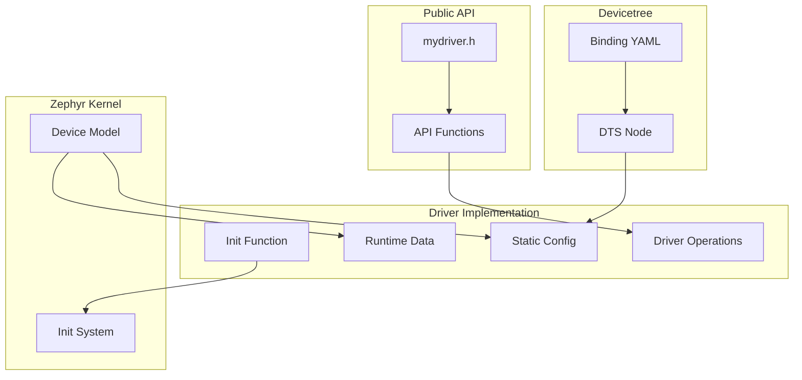

# Writing Custom Drivers

Learn how to create device drivers that integrate with Zephyr's device model.

## Driver Architecture



## Driver Components

A complete driver needs:

1. **API Header** - Public interface
2. **Binding File** - Devicetree schema
3. **Driver Source** - Implementation
4. **Kconfig** - Build configuration

## Example: LED Controller Driver

Let's create a driver for a hypothetical I2C LED controller.

### 1. API Header

```c
/* include/drivers/led_ctrl.h */
#ifndef ZEPHYR_INCLUDE_DRIVERS_LED_CTRL_H_
#define ZEPHYR_INCLUDE_DRIVERS_LED_CTRL_H_

#include <zephyr/device.h>
#include <zephyr/types.h>

#ifdef __cplusplus
extern "C" {
#endif

/**
 * @brief LED Controller API
 */

typedef int (*led_ctrl_set_brightness_t)(const struct device *dev,
                                          uint8_t led, uint8_t brightness);
typedef int (*led_ctrl_set_color_t)(const struct device *dev,
                                     uint8_t led, uint8_t r, uint8_t g, uint8_t b);

__subsystem struct led_ctrl_driver_api {
    led_ctrl_set_brightness_t set_brightness;
    led_ctrl_set_color_t set_color;
};

/**
 * @brief Set LED brightness
 *
 * @param dev LED controller device
 * @param led LED index (0-based)
 * @param brightness Brightness level (0-255)
 * @return 0 on success, negative errno on failure
 */
static inline int led_ctrl_set_brightness(const struct device *dev,
                                          uint8_t led, uint8_t brightness)
{
    const struct led_ctrl_driver_api *api =
        (const struct led_ctrl_driver_api *)dev->api;

    return api->set_brightness(dev, led, brightness);
}

/**
 * @brief Set LED color
 *
 * @param dev LED controller device
 * @param led LED index (0-based)
 * @param r Red component (0-255)
 * @param g Green component (0-255)
 * @param b Blue component (0-255)
 * @return 0 on success, negative errno on failure
 */
static inline int led_ctrl_set_color(const struct device *dev,
                                     uint8_t led, uint8_t r, uint8_t g, uint8_t b)
{
    const struct led_ctrl_driver_api *api =
        (const struct led_ctrl_driver_api *)dev->api;

    return api->set_color(dev, led, r, g, b);
}

#ifdef __cplusplus
}
#endif

#endif /* ZEPHYR_INCLUDE_DRIVERS_LED_CTRL_H_ */
```

### 2. Devicetree Binding

```yaml
# dts/bindings/led/mycompany,led-ctrl.yaml
description: MyCompany I2C LED Controller

compatible: "mycompany,led-ctrl"

include: i2c-device.yaml

properties:
  num-leds:
    type: int
    required: true
    description: Number of LEDs controlled by this device

  max-brightness:
    type: int
    default: 255
    description: Maximum brightness value
```

### 3. Driver Implementation

```c
/* drivers/led/led_ctrl_mycompany.c */
#define DT_DRV_COMPAT mycompany_led_ctrl

#include <zephyr/kernel.h>
#include <zephyr/device.h>
#include <zephyr/drivers/i2c.h>
#include <zephyr/logging/log.h>

#include <drivers/led_ctrl.h>

LOG_MODULE_REGISTER(led_ctrl_mycompany, CONFIG_LED_CTRL_LOG_LEVEL);

/* Register addresses */
#define REG_BRIGHTNESS_BASE  0x10
#define REG_COLOR_BASE       0x20

/* Driver configuration (from devicetree, stored in ROM) */
struct led_ctrl_config {
    struct i2c_dt_spec i2c;
    uint8_t num_leds;
    uint8_t max_brightness;
};

/* Driver runtime data (stored in RAM) */
struct led_ctrl_data {
    uint8_t current_brightness[8];  /* Cache current values */
};

/* Write a register */
static int led_ctrl_write_reg(const struct device *dev, uint8_t reg, uint8_t value)
{
    const struct led_ctrl_config *config = dev->config;
    uint8_t buf[2] = { reg, value };

    return i2c_write_dt(&config->i2c, buf, sizeof(buf));
}

/* API: Set brightness */
static int led_ctrl_set_brightness_impl(const struct device *dev,
                                        uint8_t led, uint8_t brightness)
{
    const struct led_ctrl_config *config = dev->config;
    struct led_ctrl_data *data = dev->data;

    if (led >= config->num_leds) {
        return -EINVAL;
    }

    if (brightness > config->max_brightness) {
        brightness = config->max_brightness;
    }

    int ret = led_ctrl_write_reg(dev, REG_BRIGHTNESS_BASE + led, brightness);
    if (ret == 0) {
        data->current_brightness[led] = brightness;
    }

    return ret;
}

/* API: Set color */
static int led_ctrl_set_color_impl(const struct device *dev,
                                   uint8_t led, uint8_t r, uint8_t g, uint8_t b)
{
    const struct led_ctrl_config *config = dev->config;

    if (led >= config->num_leds) {
        return -EINVAL;
    }

    uint8_t buf[4] = { REG_COLOR_BASE + (led * 3), r, g, b };

    return i2c_write_dt(&config->i2c, buf, sizeof(buf));
}

/* Driver API structure */
static const struct led_ctrl_driver_api led_ctrl_api = {
    .set_brightness = led_ctrl_set_brightness_impl,
    .set_color = led_ctrl_set_color_impl,
};

/* Initialization function */
static int led_ctrl_init(const struct device *dev)
{
    const struct led_ctrl_config *config = dev->config;
    struct led_ctrl_data *data = dev->data;

    if (!device_is_ready(config->i2c.bus)) {
        LOG_ERR("I2C bus not ready");
        return -ENODEV;
    }

    /* Initialize all LEDs to off */
    for (int i = 0; i < config->num_leds; i++) {
        led_ctrl_write_reg(dev, REG_BRIGHTNESS_BASE + i, 0);
        data->current_brightness[i] = 0;
    }

    LOG_INF("LED controller initialized with %d LEDs", config->num_leds);

    return 0;
}

/* Macro to instantiate driver for each devicetree node */
#define LED_CTRL_INIT(inst)                                                 \
    static struct led_ctrl_data led_ctrl_data_##inst;                       \
                                                                            \
    static const struct led_ctrl_config led_ctrl_config_##inst = {          \
        .i2c = I2C_DT_SPEC_INST_GET(inst),                                  \
        .num_leds = DT_INST_PROP(inst, num_leds),                           \
        .max_brightness = DT_INST_PROP(inst, max_brightness),               \
    };                                                                      \
                                                                            \
    DEVICE_DT_INST_DEFINE(inst,                                             \
                          led_ctrl_init,                                    \
                          NULL,  /* PM device */                            \
                          &led_ctrl_data_##inst,                            \
                          &led_ctrl_config_##inst,                          \
                          POST_KERNEL,                                      \
                          CONFIG_LED_CTRL_INIT_PRIORITY,                    \
                          &led_ctrl_api);

/* Create instance for each enabled node */
DT_INST_FOREACH_STATUS_OKAY(LED_CTRL_INIT)
```

### 4. Kconfig

```kconfig
# drivers/led/Kconfig.led_ctrl
config LED_CTRL
    bool "LED Controller driver"
    depends on I2C
    help
      Enable LED controller driver.

if LED_CTRL

config LED_CTRL_INIT_PRIORITY
    int "Init priority"
    default 90
    help
      Device driver initialization priority.

config LED_CTRL_LOG_LEVEL
    int "Log level"
    default 3
    range 0 4
    help
      Log level for LED controller driver.

endif # LED_CTRL
```

### 5. CMakeLists.txt

```cmake
# drivers/led/CMakeLists.txt
zephyr_library()

zephyr_library_sources_ifdef(CONFIG_LED_CTRL led_ctrl_mycompany.c)
```

### 6. Devicetree Usage

```dts
&i2c0 {
    status = "okay";

    led_controller: led-ctrl@40 {
        compatible = "mycompany,led-ctrl";
        reg = <0x40>;
        num-leds = <4>;
        max-brightness = <200>;
    };
};
```

### 7. Application Code

```c
#include <zephyr/kernel.h>
#include <drivers/led_ctrl.h>

#define LED_CTRL_NODE DT_NODELABEL(led_controller)

void main(void)
{
    const struct device *leds = DEVICE_DT_GET(LED_CTRL_NODE);

    if (!device_is_ready(leds)) {
        printk("LED controller not ready\n");
        return;
    }

    /* Set LED 0 to red at half brightness */
    led_ctrl_set_color(leds, 0, 255, 0, 0);
    led_ctrl_set_brightness(leds, 0, 128);

    /* Animate LEDs */
    while (1) {
        for (int i = 0; i < 4; i++) {
            led_ctrl_set_brightness(leds, i, 255);
            k_msleep(200);
            led_ctrl_set_brightness(leds, i, 0);
        }
    }
}
```

## Key Macros Explained

### DT_DRV_COMPAT

```c
#define DT_DRV_COMPAT mycompany_led_ctrl
```

Defines the compatible string (with underscores). Enables `DT_INST_*` macros.

### DEVICE_DT_INST_DEFINE

```c
DEVICE_DT_INST_DEFINE(inst,       /* Instance number */
                      init_fn,     /* Init function */
                      pm_device,   /* Power management (or NULL) */
                      data,        /* Runtime data pointer */
                      config,      /* Config pointer */
                      level,       /* Init level */
                      prio,        /* Init priority */
                      api);        /* API structure */
```

### DT_INST_FOREACH_STATUS_OKAY

```c
DT_INST_FOREACH_STATUS_OKAY(MACRO)
```

Calls `MACRO(n)` for each enabled instance (n = 0, 1, 2...).

## Initialization Levels and Priorities

```c
/* Levels (earlier to later) */
PRE_KERNEL_1    /* Before kernel, essential hw */
PRE_KERNEL_2    /* Before kernel, depends on PRE_KERNEL_1 */
POST_KERNEL     /* After kernel starts */
APPLICATION     /* After threads start */

/* Priority within level: 0-99 (lower = earlier) */
```

Example dependency:

```c
/* I2C bus must init before I2C devices */
/* I2C driver: POST_KERNEL, priority 50 */
/* LED controller: POST_KERNEL, priority 90 */
```

## Driver Data vs Config

| Aspect | Config | Data |
|--------|--------|------|
| Memory | ROM (flash) | RAM |
| Contents | Devicetree properties | Runtime state |
| Lifetime | Constant | Changes at runtime |
| Per-instance | Yes | Yes |

```c
/* Config: from devicetree, read-only */
struct my_config {
    struct i2c_dt_spec i2c;    /* Bus + address */
    uint32_t some_property;     /* DT property */
};

/* Data: runtime state, read-write */
struct my_data {
    uint32_t counter;           /* Runtime counter */
    bool initialized;           /* State flag */
    struct k_mutex lock;        /* Sync primitive */
};
```

## Testing Your Driver

### Shell Commands

```c
#include <zephyr/shell/shell.h>

static int cmd_led_set(const struct shell *sh, size_t argc, char **argv)
{
    const struct device *dev = DEVICE_DT_GET(DT_NODELABEL(led_controller));
    uint8_t led = atoi(argv[1]);
    uint8_t brightness = atoi(argv[2]);

    int ret = led_ctrl_set_brightness(dev, led, brightness);
    if (ret < 0) {
        shell_error(sh, "Failed: %d", ret);
        return ret;
    }

    shell_print(sh, "LED %d set to %d", led, brightness);
    return 0;
}

SHELL_STATIC_SUBCMD_SET_CREATE(led_cmds,
    SHELL_CMD_ARG(set, NULL, "Set LED <led> <brightness>", cmd_led_set, 3, 0),
    SHELL_SUBCMD_SET_END
);

SHELL_CMD_REGISTER(led, &led_cmds, "LED commands", NULL);
```

### Unit Tests

```c
#include <zephyr/ztest.h>
#include <drivers/led_ctrl.h>

static const struct device *leds;

static void *led_setup(void)
{
    leds = DEVICE_DT_GET(DT_NODELABEL(led_controller));
    zassert_true(device_is_ready(leds), "Device not ready");
    return NULL;
}

ZTEST(led_ctrl, test_brightness_valid)
{
    int ret = led_ctrl_set_brightness(leds, 0, 128);
    zassert_equal(ret, 0, "Expected success");
}

ZTEST(led_ctrl, test_brightness_invalid_led)
{
    int ret = led_ctrl_set_brightness(leds, 99, 128);
    zassert_equal(ret, -EINVAL, "Expected EINVAL");
}

ZTEST_SUITE(led_ctrl, NULL, led_setup, NULL, NULL, NULL);
```

## Best Practices

1. **Use DT_INST macros** - For multi-instance support
2. **Separate config and data** - ROM vs RAM
3. **Check dependencies** - Use `device_is_ready()` in init
4. **Log appropriately** - Use LOG_MODULE_REGISTER
5. **Handle errors** - Return negative errno values
6. **Document API** - Doxygen comments in header
7. **Validate inputs** - Check parameters in API functions
8. **Use inline wrappers** - For API functions in header

## Next Steps

Continue to [Part 6: Advanced Topics]() for networking, power management, and more.
