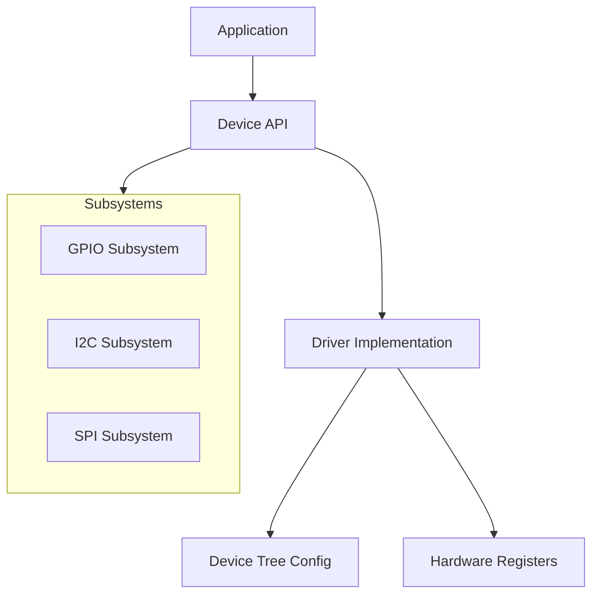

# Part 5: Device Drivers

This section covers Zephyr's device driver model and common peripheral interfaces.

## What You'll Learn

- Zephyr's device driver architecture
- Device tree bindings for drivers
- GPIO, I2C, SPI, and UART APIs
- Writing custom device drivers

## Chapters

| Chapter | Description |
|---------|-------------|
| [Driver Model]() | Device architecture and APIs |
| [Device Tree Bindings]() | Connecting DTS to drivers |
| [GPIO]() | Digital I/O and interrupts |
| [I2C]() | I2C bus communication |
| [SPI]() | SPI bus communication |
| [UART]() | Serial communication |
| [Custom Drivers]() | Writing your own drivers |

## Driver Architecture

{: .note }
Understanding the driver model is essential for working with hardware in Zephyr.
