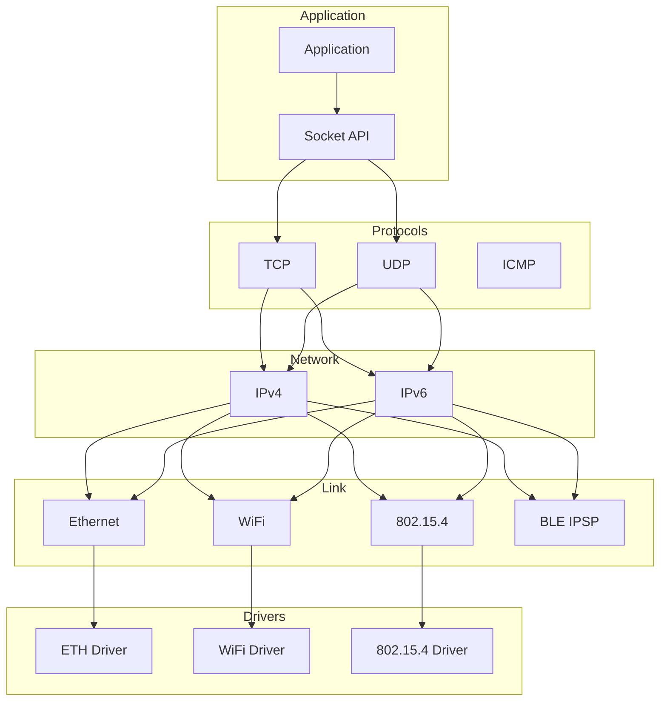

# Networking Overview

Zephyr provides a comprehensive network stack supporting IPv4, IPv6, and various protocols.

## Network Stack Architecture



## Supported Protocols

| Layer | Protocols |
|-------|-----------|
| Application | MQTT, CoAP, HTTP, DNS, SNTP |
| Transport | TCP, UDP |
| Network | IPv4, IPv6, ICMPv4, ICMPv6 |
| Link | Ethernet, WiFi, 802.15.4, BLE IPSP |

## Kconfig Setup

### Basic Networking

```kconfig
# prj.conf
CONFIG_NETWORKING=y
CONFIG_NET_IPV4=y
CONFIG_NET_IPV6=y
CONFIG_NET_TCP=y
CONFIG_NET_UDP=y
CONFIG_NET_SOCKETS=y
```

### DHCP Client

```kconfig
CONFIG_NET_DHCPV4=y
```

### Static IP

```kconfig
CONFIG_NET_CONFIG_SETTINGS=y
CONFIG_NET_CONFIG_MY_IPV4_ADDR="192.168.1.100"
CONFIG_NET_CONFIG_MY_IPV4_NETMASK="255.255.255.0"
CONFIG_NET_CONFIG_MY_IPV4_GW="192.168.1.1"
```

## Network Interface Management

### Getting Interface

```c
#include <zephyr/net/net_if.h>

void list_interfaces(void)
{
    struct net_if *iface;

    /* Get default interface */
    iface = net_if_get_default();

    /* Iterate all interfaces */
    for (iface = net_if_get_first_up(); iface != NULL;
         iface = net_if_get_next(iface)) {
        char name[32];
        net_if_get_name(iface, name, sizeof(name));
        printk("Interface: %s\n", name);
    }
}
```

### IP Address Management

```c
#include <zephyr/net/net_if.h>
#include <zephyr/net/net_mgmt.h>

void print_ip_addresses(void)
{
    struct net_if *iface = net_if_get_default();

    /* IPv4 addresses */
    for (int i = 0; i < NET_IF_MAX_IPV4_ADDR; i++) {
        struct net_if_addr *addr = &iface->config.ip.ipv4->unicast[i];
        if (addr->is_used) {
            char buf[NET_IPV4_ADDR_LEN];
            net_addr_ntop(AF_INET, &addr->address.in_addr, buf, sizeof(buf));
            printk("IPv4: %s\n", buf);
        }
    }

    /* IPv6 addresses */
    for (int i = 0; i < NET_IF_MAX_IPV6_ADDR; i++) {
        struct net_if_addr *addr = &iface->config.ip.ipv6->unicast[i];
        if (addr->is_used) {
            char buf[NET_IPV6_ADDR_LEN];
            net_addr_ntop(AF_INET6, &addr->address.in6_addr, buf, sizeof(buf));
            printk("IPv6: %s\n", buf);
        }
    }
}
```

## Network Events

```c
#include <zephyr/net/net_mgmt.h>
#include <zephyr/net/net_event.h>

static struct net_mgmt_event_callback net_cb;

void net_event_handler(struct net_mgmt_event_callback *cb,
                       uint32_t mgmt_event, struct net_if *iface)
{
    switch (mgmt_event) {
    case NET_EVENT_IPV4_ADDR_ADD:
        printk("IPv4 address added\n");
        break;

    case NET_EVENT_IPV4_DHCP_BOUND:
        printk("DHCP bound\n");
        break;

    case NET_EVENT_IF_UP:
        printk("Interface up\n");
        break;

    case NET_EVENT_IF_DOWN:
        printk("Interface down\n");
        break;
    }
}

void setup_net_events(void)
{
    net_mgmt_init_event_callback(&net_cb, net_event_handler,
        NET_EVENT_IPV4_ADDR_ADD |
        NET_EVENT_IPV4_DHCP_BOUND |
        NET_EVENT_IF_UP |
        NET_EVENT_IF_DOWN);

    net_mgmt_add_event_callback(&net_cb);
}
```

## Waiting for Network

```c
#include <zephyr/net/net_if.h>
#include <zephyr/net/net_mgmt.h>

K_SEM_DEFINE(net_ready, 0, 1);

static struct net_mgmt_event_callback net_cb;

void net_handler(struct net_mgmt_event_callback *cb,
                 uint32_t event, struct net_if *iface)
{
    if (event == NET_EVENT_IPV4_ADDR_ADD ||
        event == NET_EVENT_IPV6_ADDR_ADD) {
        k_sem_give(&net_ready);
    }
}

void wait_for_network(void)
{
    struct net_if *iface = net_if_get_default();

    /* Check if already connected */
    if (net_if_is_up(iface)) {
        return;
    }

    /* Set up event handler */
    net_mgmt_init_event_callback(&net_cb, net_handler,
        NET_EVENT_IPV4_ADDR_ADD | NET_EVENT_IPV6_ADDR_ADD);
    net_mgmt_add_event_callback(&net_cb);

    /* Start DHCP */
    net_dhcpv4_start(iface);

    /* Wait for address */
    k_sem_take(&net_ready, K_FOREVER);

    printk("Network ready\n");
}
```

## DNS Resolution

```c
#include <zephyr/net/dns_resolve.h>
#include <zephyr/net/socket.h>

void resolve_hostname(const char *hostname)
{
    struct zsock_addrinfo hints = {
        .ai_family = AF_INET,
        .ai_socktype = SOCK_STREAM,
    };
    struct zsock_addrinfo *res;

    int ret = zsock_getaddrinfo(hostname, "80", &hints, &res);
    if (ret == 0) {
        char buf[NET_IPV4_ADDR_LEN];
        struct sockaddr_in *addr = (struct sockaddr_in *)res->ai_addr;
        inet_ntop(AF_INET, &addr->sin_addr, buf, sizeof(buf));
        printk("%s resolved to %s\n", hostname, buf);
        zsock_freeaddrinfo(res);
    } else {
        printk("DNS resolution failed: %d\n", ret);
    }
}
```

## Network Statistics

```c
#include <zephyr/net/net_stats.h>

void print_net_stats(void)
{
    struct net_if *iface = net_if_get_default();
    struct net_stats *stats = &iface->stats;

    printk("TX packets: %u\n", stats->ipv4.sent);
    printk("RX packets: %u\n", stats->ipv4.recv);
    printk("TX errors: %u\n", stats->ipv4.drop);
}
```

## Devicetree for Networking

```dts
/* Ethernet MAC */
&eth0 {
    status = "okay";
    local-mac-address = [00 11 22 33 44 55];
};

/* WiFi */
&wifi {
    status = "okay";
};
```

## Shell Commands

Enable network shell for debugging:

```kconfig
CONFIG_NET_SHELL=y
```

```
uart:~$ net iface
uart:~$ net ping 192.168.1.1
uart:~$ net dns resolve example.com
uart:~$ net stats
```

## Best Practices

1. **Wait for network** - Don't assume immediate connectivity
2. **Handle events** - React to interface up/down
3. **Use DHCP** - When possible for address management
4. **Check return values** - Network operations can fail
5. **Enable statistics** - For debugging connectivity issues

## Next Steps

Learn about [Sockets]() for TCP/UDP communication.
