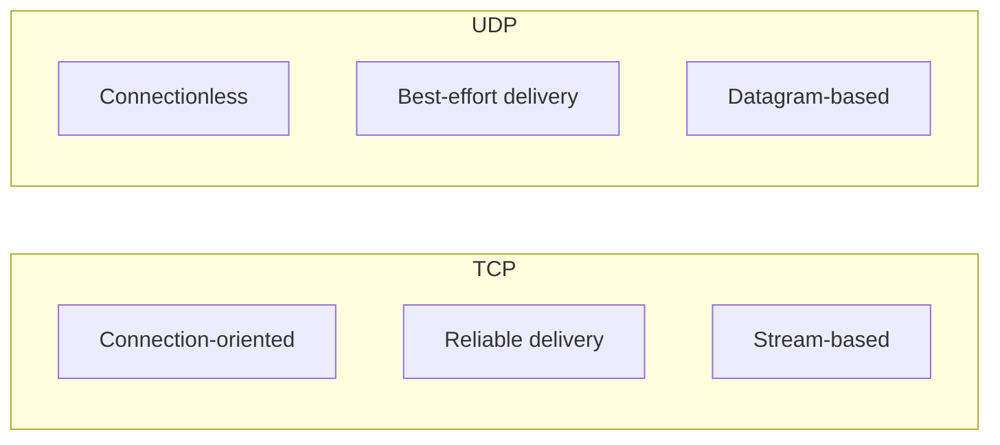

# Socket Programming

Zephyr provides BSD-compatible socket API for TCP and UDP communication.

## Socket Types



## Kconfig

```kconfig
CONFIG_NETWORKING=y
CONFIG_NET_SOCKETS=y
CONFIG_NET_TCP=y
CONFIG_NET_UDP=y

# For TLS
CONFIG_NET_SOCKETS_SOCKOPT_TLS=y
```

## TCP Client

```c
#include <zephyr/net/socket.h>

int tcp_connect(const char *server, uint16_t port)
{
    struct sockaddr_in addr;
    int sock;
    int ret;

    /* Create socket */
    sock = zsock_socket(AF_INET, SOCK_STREAM, IPPROTO_TCP);
    if (sock < 0) {
        printk("Socket creation failed: %d\n", errno);
        return -1;
    }

    /* Set up address */
    addr.sin_family = AF_INET;
    addr.sin_port = htons(port);
    zsock_inet_pton(AF_INET, server, &addr.sin_addr);

    /* Connect */
    ret = zsock_connect(sock, (struct sockaddr *)&addr, sizeof(addr));
    if (ret < 0) {
        printk("Connect failed: %d\n", errno);
        zsock_close(sock);
        return -1;
    }

    printk("Connected to %s:%d\n", server, port);
    return sock;
}

void tcp_send_receive(int sock)
{
    char tx_buf[] = "GET / HTTP/1.1\r\nHost: example.com\r\n\r\n";
    char rx_buf[512];
    int ret;

    /* Send data */
    ret = zsock_send(sock, tx_buf, strlen(tx_buf), 0);
    if (ret < 0) {
        printk("Send failed: %d\n", errno);
        return;
    }

    /* Receive response */
    ret = zsock_recv(sock, rx_buf, sizeof(rx_buf) - 1, 0);
    if (ret > 0) {
        rx_buf[ret] = '\0';
        printk("Received %d bytes:\n%s\n", ret, rx_buf);
    }

    zsock_close(sock);
}
```

## TCP Server

```c
#include <zephyr/net/socket.h>

#define SERVER_PORT 8080
#define MAX_CLIENTS 3

void tcp_server(void)
{
    int server_sock, client_sock;
    struct sockaddr_in addr, client_addr;
    socklen_t client_len;
    int ret;

    /* Create socket */
    server_sock = zsock_socket(AF_INET, SOCK_STREAM, IPPROTO_TCP);
    if (server_sock < 0) {
        printk("Socket failed: %d\n", errno);
        return;
    }

    /* Allow address reuse */
    int opt = 1;
    zsock_setsockopt(server_sock, SOL_SOCKET, SO_REUSEADDR, &opt, sizeof(opt));

    /* Bind to port */
    addr.sin_family = AF_INET;
    addr.sin_addr.s_addr = INADDR_ANY;
    addr.sin_port = htons(SERVER_PORT);

    ret = zsock_bind(server_sock, (struct sockaddr *)&addr, sizeof(addr));
    if (ret < 0) {
        printk("Bind failed: %d\n", errno);
        zsock_close(server_sock);
        return;
    }

    /* Listen */
    ret = zsock_listen(server_sock, MAX_CLIENTS);
    if (ret < 0) {
        printk("Listen failed: %d\n", errno);
        zsock_close(server_sock);
        return;
    }

    printk("Server listening on port %d\n", SERVER_PORT);

    while (1) {
        client_len = sizeof(client_addr);
        client_sock = zsock_accept(server_sock,
                                   (struct sockaddr *)&client_addr,
                                   &client_len);
        if (client_sock < 0) {
            printk("Accept failed: %d\n", errno);
            continue;
        }

        char client_ip[NET_IPV4_ADDR_LEN];
        inet_ntop(AF_INET, &client_addr.sin_addr, client_ip, sizeof(client_ip));
        printk("Client connected: %s\n", client_ip);

        /* Handle client */
        handle_client(client_sock);
    }
}

void handle_client(int sock)
{
    char buf[256];
    int ret;

    while (1) {
        ret = zsock_recv(sock, buf, sizeof(buf) - 1, 0);
        if (ret <= 0) {
            break;
        }

        buf[ret] = '\0';
        printk("Received: %s\n", buf);

        /* Echo back */
        zsock_send(sock, buf, ret, 0);
    }

    zsock_close(sock);
    printk("Client disconnected\n");
}
```

## UDP Communication

```c
#include <zephyr/net/socket.h>

#define UDP_PORT 5000

/* UDP Client */
void udp_send(const char *server, uint16_t port, const char *msg)
{
    int sock;
    struct sockaddr_in addr;

    sock = zsock_socket(AF_INET, SOCK_DGRAM, IPPROTO_UDP);
    if (sock < 0) {
        return;
    }

    addr.sin_family = AF_INET;
    addr.sin_port = htons(port);
    zsock_inet_pton(AF_INET, server, &addr.sin_addr);

    zsock_sendto(sock, msg, strlen(msg), 0,
                 (struct sockaddr *)&addr, sizeof(addr));

    zsock_close(sock);
}

/* UDP Server */
void udp_server(void)
{
    int sock;
    struct sockaddr_in addr, client_addr;
    socklen_t client_len;
    char buf[256];

    sock = zsock_socket(AF_INET, SOCK_DGRAM, IPPROTO_UDP);

    addr.sin_family = AF_INET;
    addr.sin_addr.s_addr = INADDR_ANY;
    addr.sin_port = htons(UDP_PORT);

    zsock_bind(sock, (struct sockaddr *)&addr, sizeof(addr));

    printk("UDP server listening on port %d\n", UDP_PORT);

    while (1) {
        client_len = sizeof(client_addr);
        int len = zsock_recvfrom(sock, buf, sizeof(buf) - 1, 0,
                                 (struct sockaddr *)&client_addr,
                                 &client_len);
        if (len > 0) {
            buf[len] = '\0';
            printk("Received: %s\n", buf);

            /* Send response */
            zsock_sendto(sock, "ACK", 3, 0,
                        (struct sockaddr *)&client_addr, client_len);
        }
    }
}
```

## Non-Blocking and Polling

### Non-Blocking Sockets

```c
/* Set non-blocking mode */
int flags = zsock_fcntl(sock, F_GETFL, 0);
zsock_fcntl(sock, F_SETFL, flags | O_NONBLOCK);

/* Or use MSG_DONTWAIT flag */
ret = zsock_recv(sock, buf, sizeof(buf), MSG_DONTWAIT);
if (ret < 0 && errno == EAGAIN) {
    /* No data available */
}
```

### Polling Multiple Sockets

```c
#include <zephyr/net/socket.h>

void poll_sockets(int *sockets, int count)
{
    struct zsock_pollfd fds[MAX_SOCKETS];

    for (int i = 0; i < count; i++) {
        fds[i].fd = sockets[i];
        fds[i].events = ZSOCK_POLLIN;
    }

    while (1) {
        int ret = zsock_poll(fds, count, 1000);  /* 1s timeout */

        if (ret < 0) {
            printk("Poll error: %d\n", errno);
            break;
        }

        if (ret == 0) {
            /* Timeout, no events */
            continue;
        }

        for (int i = 0; i < count; i++) {
            if (fds[i].revents & ZSOCK_POLLIN) {
                handle_socket_data(fds[i].fd);
            }
            if (fds[i].revents & ZSOCK_POLLERR) {
                handle_socket_error(fds[i].fd);
            }
        }
    }
}
```

## Socket Options

```c
/* Receive timeout */
struct timeval tv = { .tv_sec = 5, .tv_usec = 0 };
zsock_setsockopt(sock, SOL_SOCKET, SO_RCVTIMEO, &tv, sizeof(tv));

/* Send timeout */
zsock_setsockopt(sock, SOL_SOCKET, SO_SNDTIMEO, &tv, sizeof(tv));

/* TCP keepalive */
int optval = 1;
zsock_setsockopt(sock, SOL_SOCKET, SO_KEEPALIVE, &optval, sizeof(optval));

/* TCP no delay (disable Nagle) */
zsock_setsockopt(sock, IPPROTO_TCP, TCP_NODELAY, &optval, sizeof(optval));

/* Receive buffer size */
int bufsize = 4096;
zsock_setsockopt(sock, SOL_SOCKET, SO_RCVBUF, &bufsize, sizeof(bufsize));
```

## IPv6 Support

```c
void tcp_connect_ipv6(const char *server, uint16_t port)
{
    struct sockaddr_in6 addr;
    int sock;

    sock = zsock_socket(AF_INET6, SOCK_STREAM, IPPROTO_TCP);

    addr.sin6_family = AF_INET6;
    addr.sin6_port = htons(port);
    zsock_inet_pton(AF_INET6, server, &addr.sin6_addr);

    zsock_connect(sock, (struct sockaddr *)&addr, sizeof(addr));
}

/* Dual-stack (IPv4 and IPv6) */
void dual_stack_server(void)
{
    int sock;
    struct sockaddr_in6 addr;

    sock = zsock_socket(AF_INET6, SOCK_STREAM, IPPROTO_TCP);

    /* Allow IPv4 connections on IPv6 socket */
    int opt = 0;
    zsock_setsockopt(sock, IPPROTO_IPV6, IPV6_V6ONLY, &opt, sizeof(opt));

    memset(&addr, 0, sizeof(addr));
    addr.sin6_family = AF_INET6;
    addr.sin6_addr = in6addr_any;
    addr.sin6_port = htons(8080);

    zsock_bind(sock, (struct sockaddr *)&addr, sizeof(addr));
    zsock_listen(sock, 5);
}
```

## Error Handling

```c
int safe_send(int sock, const void *data, size_t len)
{
    size_t sent = 0;

    while (sent < len) {
        int ret = zsock_send(sock, (const char *)data + sent, len - sent, 0);

        if (ret < 0) {
            if (errno == EAGAIN || errno == EWOULDBLOCK) {
                /* Would block, try again */
                k_msleep(10);
                continue;
            }
            if (errno == EINTR) {
                /* Interrupted, retry */
                continue;
            }
            /* Real error */
            return -errno;
        }

        sent += ret;
    }

    return sent;
}

int safe_recv(int sock, void *buf, size_t len, k_timeout_t timeout)
{
    struct zsock_pollfd pfd = {
        .fd = sock,
        .events = ZSOCK_POLLIN,
    };

    int ret = zsock_poll(&pfd, 1, k_ticks_to_ms_ceil32(timeout.ticks));

    if (ret < 0) {
        return -errno;
    }
    if (ret == 0) {
        return -ETIMEDOUT;
    }

    return zsock_recv(sock, buf, len, 0);
}
```

## API Reference

```c
/* Socket creation */
int zsock_socket(int family, int type, int proto);
int zsock_close(int sock);

/* Connection */
int zsock_connect(int sock, const struct sockaddr *addr, socklen_t addrlen);
int zsock_bind(int sock, const struct sockaddr *addr, socklen_t addrlen);
int zsock_listen(int sock, int backlog);
int zsock_accept(int sock, struct sockaddr *addr, socklen_t *addrlen);

/* Data transfer */
ssize_t zsock_send(int sock, const void *buf, size_t len, int flags);
ssize_t zsock_recv(int sock, void *buf, size_t len, int flags);
ssize_t zsock_sendto(int sock, const void *buf, size_t len, int flags,
                     const struct sockaddr *addr, socklen_t addrlen);
ssize_t zsock_recvfrom(int sock, void *buf, size_t len, int flags,
                       struct sockaddr *addr, socklen_t *addrlen);

/* Polling */
int zsock_poll(struct zsock_pollfd *fds, int nfds, int timeout);

/* Options */
int zsock_setsockopt(int sock, int level, int optname,
                     const void *optval, socklen_t optlen);
int zsock_getsockopt(int sock, int level, int optname,
                     void *optval, socklen_t *optlen);
```

## Best Practices

1. **Check return values** - All socket operations can fail
2. **Handle partial sends** - Loop until all data sent
3. **Use timeouts** - Prevent indefinite blocking
4. **Close sockets** - Free resources when done
5. **Poll for multiple sockets** - Don't create thread per connection
6. **Enable keepalive** - Detect dead connections

## Next Steps

Learn about [MQTT]() for IoT messaging.
