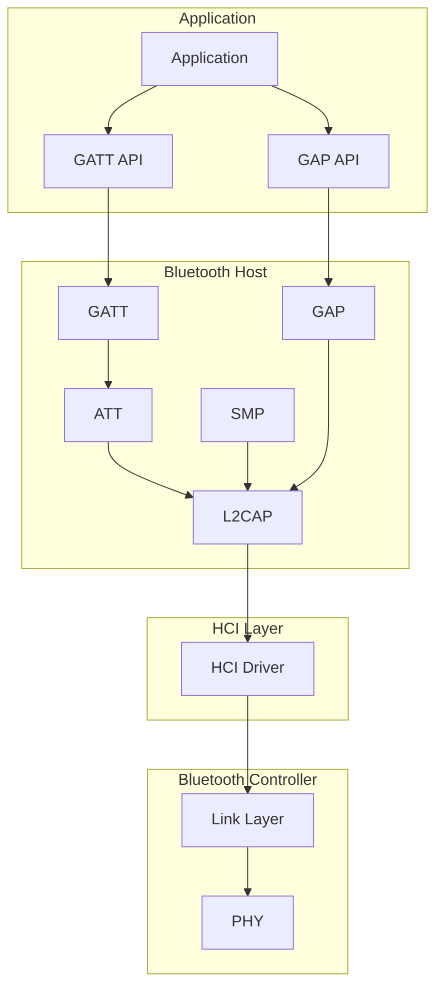

# Bluetooth Low Energy Overview

Zephyr provides a comprehensive Bluetooth stack supporting BLE peripheral, central, and mesh roles.

## BLE Architecture



## Kconfig

```kconfig
# Basic Bluetooth
CONFIG_BT=y
CONFIG_BT_PERIPHERAL=y    # For advertising/peripheral role
CONFIG_BT_CENTRAL=y       # For scanning/central role

# GATT features
CONFIG_BT_GATT_CLIENT=y   # For reading remote services
CONFIG_BT_GATT_DYNAMIC_DB=y  # For runtime service changes

# Security
CONFIG_BT_SMP=y           # Security Manager Protocol
CONFIG_BT_SETTINGS=y      # Persistent bonding
CONFIG_SETTINGS=y
CONFIG_FLASH=y
CONFIG_FLASH_MAP=y
CONFIG_NVS=y

# Debug
CONFIG_BT_DEBUG_LOG=y
```

## Initialization

```c
#include <zephyr/bluetooth/bluetooth.h>
#include <zephyr/bluetooth/conn.h>
#include <zephyr/bluetooth/gatt.h>

static void bt_ready(int err)
{
    if (err) {
        printk("Bluetooth init failed: %d\n", err);
        return;
    }

    printk("Bluetooth initialized\n");

    /* Start advertising or scanning */
}

void main(void)
{
    int err;

    /* Initialize Bluetooth */
    err = bt_enable(bt_ready);
    if (err) {
        printk("Bluetooth enable failed: %d\n", err);
        return;
    }

    /* Main loop or other initialization */
}
```

## Connection Callbacks

```c
static void connected(struct bt_conn *conn, uint8_t err)
{
    char addr[BT_ADDR_LE_STR_LEN];

    bt_addr_le_to_str(bt_conn_get_dst(conn), addr, sizeof(addr));

    if (err) {
        printk("Failed to connect to %s (%u)\n", addr, err);
        return;
    }

    printk("Connected: %s\n", addr);
}

static void disconnected(struct bt_conn *conn, uint8_t reason)
{
    char addr[BT_ADDR_LE_STR_LEN];

    bt_addr_le_to_str(bt_conn_get_dst(conn), addr, sizeof(addr));
    printk("Disconnected: %s (reason %u)\n", addr, reason);
}

BT_CONN_CB_DEFINE(conn_callbacks) = {
    .connected = connected,
    .disconnected = disconnected,
};
```

## BLE Roles

### Peripheral (Advertiser)

- Broadcasts advertisements
- Accepts connections
- Acts as GATT server
- Example: Heart rate sensor, temperature beacon

### Central (Scanner)

- Scans for advertisements
- Initiates connections
- Acts as GATT client
- Example: Phone, gateway device

## Device Address

```c
/* Get device address */
bt_addr_le_t addr;
size_t count = 1;

bt_id_get(&addr, &count);

char addr_str[BT_ADDR_LE_STR_LEN];
bt_addr_le_to_str(&addr, addr_str, sizeof(addr_str));
printk("Device address: %s\n", addr_str);
```

## Connection Parameters

```c
/* Request connection parameter update */
struct bt_le_conn_param param = {
    .interval_min = 24,  /* 30ms (24 * 1.25ms) */
    .interval_max = 40,  /* 50ms */
    .latency = 0,
    .timeout = 400,      /* 4s (400 * 10ms) */
};

int err = bt_conn_le_param_update(conn, &param);
```

## Security and Bonding

```c
#include <zephyr/bluetooth/conn.h>

/* Request pairing */
int err = bt_conn_set_security(conn, BT_SECURITY_L2);

/* Security levels */
BT_SECURITY_L1  /* No encryption */
BT_SECURITY_L2  /* Unauthenticated encryption */
BT_SECURITY_L3  /* Authenticated encryption */
BT_SECURITY_L4  /* Authenticated LE Secure Connections */

/* Pairing callbacks */
static void auth_passkey_display(struct bt_conn *conn, unsigned int passkey)
{
    printk("Passkey: %06u\n", passkey);
}

static void auth_cancel(struct bt_conn *conn)
{
    printk("Pairing cancelled\n");
}

static struct bt_conn_auth_cb auth_callbacks = {
    .passkey_display = auth_passkey_display,
    .cancel = auth_cancel,
};

/* Register callbacks */
bt_conn_auth_cb_register(&auth_callbacks);
```

## BLE vs Classic Bluetooth

| Feature | BLE | Classic Bluetooth |
|---------|-----|-------------------|
| Power | Very low | Higher |
| Data rate | 1-2 Mbps | Up to 3 Mbps |
| Range | ~100m | ~100m |
| Latency | Low | Higher |
| Use case | Sensors, beacons | Audio, file transfer |

## Shell Commands

```kconfig
CONFIG_BT_SHELL=y
```

```
uart:~$ bt init
uart:~$ bt advertise on
uart:~$ bt scan on
uart:~$ bt connect <addr>
uart:~$ bt disconnect
uart:~$ bt security 2
```

## Best Practices

1. **Initialize early** - `bt_enable()` takes time
2. **Handle connection events** - Track connection state
3. **Implement reconnection** - For reliability
4. **Use appropriate security** - Based on data sensitivity
5. **Optimize parameters** - Balance power and latency

## Next Steps

Learn about [BLE Advertising]() for broadcasting data.
