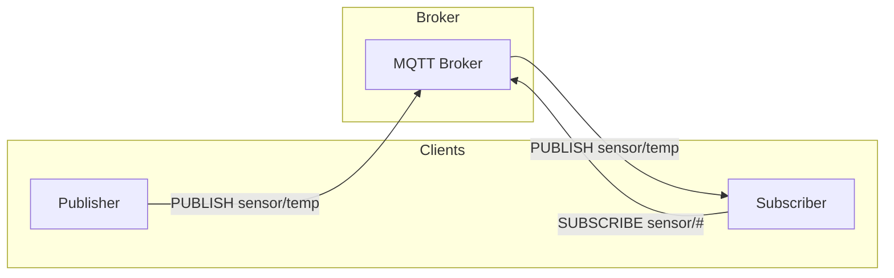

# MQTT Protocol

MQTT (Message Queuing Telemetry Transport) is a lightweight publish-subscribe messaging protocol ideal for IoT.

## MQTT Concepts



## Kconfig

```kconfig
CONFIG_NETWORKING=y
CONFIG_NET_SOCKETS=y
CONFIG_NET_TCP=y
CONFIG_MQTT_LIB=y

# For TLS
CONFIG_MQTT_LIB_TLS=y
CONFIG_NET_SOCKETS_SOCKOPT_TLS=y
```

## Basic MQTT Client

```c
#include <zephyr/net/mqtt.h>
#include <zephyr/net/socket.h>

#define MQTT_BROKER "192.168.1.100"
#define MQTT_PORT   1883

static struct mqtt_client client;
static struct sockaddr_storage broker;
static uint8_t rx_buffer[256];
static uint8_t tx_buffer[256];

/* Connection callback */
void mqtt_evt_handler(struct mqtt_client *client,
                      const struct mqtt_evt *evt)
{
    switch (evt->type) {
    case MQTT_EVT_CONNACK:
        if (evt->result == 0) {
            printk("MQTT connected\n");
        } else {
            printk("MQTT connect failed: %d\n", evt->result);
        }
        break;

    case MQTT_EVT_DISCONNECT:
        printk("MQTT disconnected: %d\n", evt->result);
        break;

    case MQTT_EVT_PUBLISH:
        handle_publish(client, evt);
        break;

    case MQTT_EVT_PUBACK:
        printk("PUBACK received: id=%d\n", evt->param.puback.message_id);
        break;

    case MQTT_EVT_SUBACK:
        printk("SUBACK received: id=%d\n", evt->param.suback.message_id);
        break;

    default:
        break;
    }
}

void handle_publish(struct mqtt_client *client,
                    const struct mqtt_evt *evt)
{
    const struct mqtt_publish_param *pub = &evt->param.publish;
    uint8_t payload[128];
    size_t len = MIN(pub->message.payload.len, sizeof(payload) - 1);

    /* Read payload */
    mqtt_read_publish_payload(client, payload, len);
    payload[len] = '\0';

    printk("Received on %.*s: %s\n",
           pub->message.topic.topic.size,
           pub->message.topic.topic.utf8,
           payload);

    /* Acknowledge if QoS > 0 */
    if (pub->message.topic.qos == MQTT_QOS_1_AT_LEAST_ONCE) {
        struct mqtt_puback_param ack = {
            .message_id = pub->message_id
        };
        mqtt_publish_qos1_ack(client, &ack);
    }
}

int mqtt_connect(void)
{
    struct sockaddr_in *broker4 = (struct sockaddr_in *)&broker;
    int ret;

    /* Set up broker address */
    broker4->sin_family = AF_INET;
    broker4->sin_port = htons(MQTT_PORT);
    zsock_inet_pton(AF_INET, MQTT_BROKER, &broker4->sin_addr);

    /* Initialize client */
    mqtt_client_init(&client);

    client.broker = &broker;
    client.evt_cb = mqtt_evt_handler;
    client.client_id.utf8 = "zephyr_client";
    client.client_id.size = strlen("zephyr_client");
    client.protocol_version = MQTT_VERSION_3_1_1;

    client.rx_buf = rx_buffer;
    client.rx_buf_size = sizeof(rx_buffer);
    client.tx_buf = tx_buffer;
    client.tx_buf_size = sizeof(tx_buffer);

    /* Connect */
    ret = mqtt_connect(&client);
    if (ret != 0) {
        printk("MQTT connect error: %d\n", ret);
        return ret;
    }

    return 0;
}
```

## Processing Loop

MQTT requires periodic polling:

```c
void mqtt_loop(void)
{
    struct zsock_pollfd fds[1];

    fds[0].fd = client.transport.tcp.sock;
    fds[0].events = ZSOCK_POLLIN;

    while (mqtt_connected) {
        int ret = zsock_poll(fds, 1, mqtt_keepalive_time_left(&client));

        if (ret > 0 && (fds[0].revents & ZSOCK_POLLIN)) {
            mqtt_input(&client);
        }

        /* Send keepalive if needed */
        mqtt_live(&client);
    }
}

/* Or use a simpler approach */
void mqtt_thread(void)
{
    while (1) {
        mqtt_input(&client);
        mqtt_live(&client);
        k_msleep(100);
    }
}
```

## Subscribe to Topics

```c
int mqtt_subscribe_topics(void)
{
    struct mqtt_topic topics[] = {
        {
            .topic = { .utf8 = "sensor/+/temperature", .size = 21 },
            .qos = MQTT_QOS_1_AT_LEAST_ONCE
        },
        {
            .topic = { .utf8 = "command/#", .size = 9 },
            .qos = MQTT_QOS_0_AT_MOST_ONCE
        }
    };

    struct mqtt_subscription_list sub_list = {
        .list = topics,
        .list_count = ARRAY_SIZE(topics),
        .message_id = 1
    };

    return mqtt_subscribe(&client, &sub_list);
}
```

## Publish Messages

```c
int mqtt_publish_message(const char *topic, const char *payload, bool retain)
{
    struct mqtt_publish_param param;

    param.message.topic.qos = MQTT_QOS_1_AT_LEAST_ONCE;
    param.message.topic.topic.utf8 = topic;
    param.message.topic.topic.size = strlen(topic);
    param.message.payload.data = payload;
    param.message.payload.len = strlen(payload);
    param.message_id = sys_rand32_get() & 0xFFFF;
    param.dup_flag = 0;
    param.retain_flag = retain ? 1 : 0;

    return mqtt_publish(&client, &param);
}

/* Usage */
mqtt_publish_message("sensor/1/temperature", "23.5", false);
mqtt_publish_message("device/status", "online", true);  /* Retained */
```

## MQTT with TLS

```c
#include <zephyr/net/tls_credentials.h>

/* CA certificate */
static const char ca_cert[] = "-----BEGIN CERTIFICATE-----\n"
    "MIIDxTCCAq2gAwIBAgIQAqxcJmoLQ...\n"
    "-----END CERTIFICATE-----\n";

#define TLS_SEC_TAG 1

int mqtt_tls_connect(void)
{
    struct sockaddr_in *broker4 = (struct sockaddr_in *)&broker;

    /* Add CA certificate */
    tls_credential_add(TLS_SEC_TAG, TLS_CREDENTIAL_CA_CERTIFICATE,
                       ca_cert, sizeof(ca_cert));

    /* Set up broker address (port 8883 for MQTTS) */
    broker4->sin_family = AF_INET;
    broker4->sin_port = htons(8883);
    zsock_inet_pton(AF_INET, MQTT_BROKER, &broker4->sin_addr);

    /* Initialize client */
    mqtt_client_init(&client);

    /* TLS configuration */
    client.transport.type = MQTT_TRANSPORT_SECURE;
    client.transport.tls.config.peer_verify = TLS_PEER_VERIFY_REQUIRED;
    client.transport.tls.config.cipher_list = NULL;  /* Use defaults */
    client.transport.tls.config.sec_tag_list = (sec_tag_t[]){ TLS_SEC_TAG };
    client.transport.tls.config.sec_tag_count = 1;
    client.transport.tls.config.hostname = MQTT_BROKER;

    /* Rest of client setup... */
    client.broker = &broker;
    client.evt_cb = mqtt_evt_handler;
    /* ... */

    return mqtt_connect(&client);
}
```

## Last Will and Testament

```c
void mqtt_connect_with_lwt(void)
{
    mqtt_client_init(&client);

    /* Set up last will */
    static struct mqtt_utf8 will_topic = {
        .utf8 = "device/status",
        .size = 13
    };
    static struct mqtt_utf8 will_message = {
        .utf8 = "offline",
        .size = 7
    };

    client.will_topic = &will_topic;
    client.will_message = &will_message;
    client.will_retain = 1;  /* Retain the LWT message */

    /* Rest of setup... */
}
```

## Authentication

```c
void mqtt_connect_with_auth(void)
{
    mqtt_client_init(&client);

    static struct mqtt_utf8 username = {
        .utf8 = "my_user",
        .size = 7
    };
    static struct mqtt_utf8 password = {
        .utf8 = "my_password",
        .size = 11
    };

    client.user_name = &username;
    client.password = &password;

    /* Rest of setup... */
}
```

## Complete Example

```c
#include <zephyr/kernel.h>
#include <zephyr/net/mqtt.h>

K_SEM_DEFINE(mqtt_connected_sem, 0, 1);
static bool connected;

void mqtt_evt_handler(struct mqtt_client *client,
                      const struct mqtt_evt *evt)
{
    switch (evt->type) {
    case MQTT_EVT_CONNACK:
        if (evt->result == 0) {
            connected = true;
            k_sem_give(&mqtt_connected_sem);
        }
        break;

    case MQTT_EVT_DISCONNECT:
        connected = false;
        break;

    case MQTT_EVT_PUBLISH:
        /* Handle incoming message */
        break;

    default:
        break;
    }
}

void mqtt_thread_entry(void)
{
    int ret;

    /* Wait for network */
    wait_for_network();

    /* Connect to broker */
    ret = mqtt_setup_and_connect();
    if (ret != 0) {
        printk("MQTT connection failed\n");
        return;
    }

    /* Wait for CONNACK */
    k_sem_take(&mqtt_connected_sem, K_SECONDS(10));

    if (!connected) {
        printk("MQTT connect timeout\n");
        return;
    }

    /* Subscribe */
    mqtt_subscribe_topics();

    /* Main loop */
    while (connected) {
        mqtt_input(&client);
        mqtt_live(&client);

        /* Publish periodically */
        static int64_t last_publish;
        if (k_uptime_get() - last_publish > 10000) {
            char buf[32];
            snprintf(buf, sizeof(buf), "%d", read_temperature());
            mqtt_publish_message("sensor/temp", buf, false);
            last_publish = k_uptime_get();
        }

        k_msleep(100);
    }

    mqtt_disconnect(&client);
}

K_THREAD_DEFINE(mqtt_thread, 2048, mqtt_thread_entry, NULL, NULL, NULL, 7, 0, 0);
```

## Best Practices

1. **Handle reconnection** - Networks are unreliable
2. **Use appropriate QoS** - QoS 0 for frequent, lossy data; QoS 1 for important messages
3. **Use retained messages** - For device status
4. **Set keepalive** - Detect broken connections
5. **Use LWT** - Notify others of unexpected disconnect
6. **Implement backoff** - For reconnection attempts

## Example Code

See the complete [MQTT Example]() demonstrating MQTT publish-subscribe communication.

## Next Steps

Learn about [CoAP]() for constrained networks.
