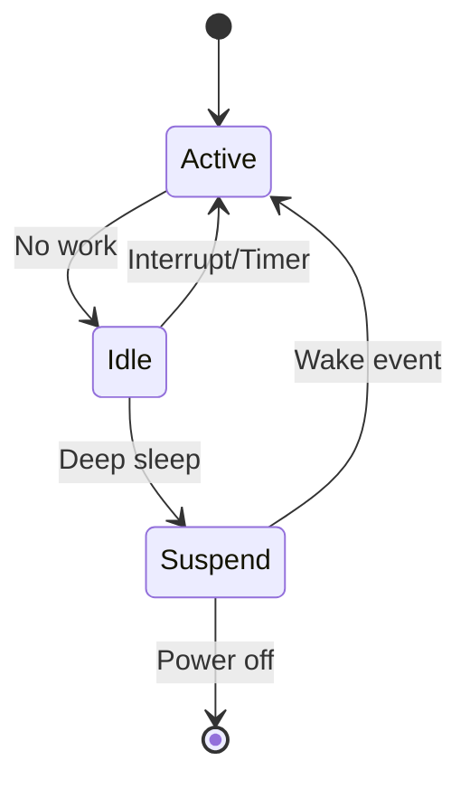

# Power Management

Zephyr's power management subsystem enables low-power operation for battery-powered devices.

## Power States



## Kconfig

```kconfig
# Enable power management
CONFIG_PM=y

# Device power management
CONFIG_PM_DEVICE=y
CONFIG_PM_DEVICE_RUNTIME=y

# System power states
CONFIG_PM_POLICY_DEFAULT=y
# Or custom policy
# CONFIG_PM_POLICY_APP=y
```

## System Power States

### Querying Power State

```c
#include <zephyr/pm/pm.h>
#include <zephyr/pm/policy.h>

void check_power_state(void)
{
    enum pm_state state = pm_state_get_current();

    switch (state) {
    case PM_STATE_ACTIVE:
        printk("Active\n");
        break;
    case PM_STATE_RUNTIME_IDLE:
        printk("Runtime idle\n");
        break;
    case PM_STATE_SUSPEND_TO_IDLE:
        printk("Suspend to idle\n");
        break;
    case PM_STATE_STANDBY:
        printk("Standby\n");
        break;
    case PM_STATE_SUSPEND_TO_RAM:
        printk("Suspend to RAM\n");
        break;
    case PM_STATE_SUSPEND_TO_DISK:
        printk("Suspend to disk\n");
        break;
    case PM_STATE_SOFT_OFF:
        printk("Soft off\n");
        break;
    }
}
```

### Preventing Low Power States

```c
#include <zephyr/pm/policy.h>

/* Prevent system from entering low power states */
void keep_system_awake(void)
{
    pm_policy_state_lock_get(PM_STATE_SUSPEND_TO_IDLE, PM_ALL_SUBSTATES);
}

void allow_system_sleep(void)
{
    pm_policy_state_lock_put(PM_STATE_SUSPEND_TO_IDLE, PM_ALL_SUBSTATES);
}
```

### Power Management Hooks

```c
#include <zephyr/pm/pm.h>

/* Called when entering low power state */
void pm_state_set(enum pm_state state, uint8_t substate_id)
{
    switch (state) {
    case PM_STATE_SUSPEND_TO_IDLE:
        /* Prepare for idle */
        break;
    case PM_STATE_SUSPEND_TO_RAM:
        /* Save state before deep sleep */
        break;
    default:
        break;
    }

    /* Let SoC enter the power state */
    /* SoC-specific implementation */
}

/* Called when exiting low power state */
void pm_state_exit_post_ops(enum pm_state state, uint8_t substate_id)
{
    switch (state) {
    case PM_STATE_SUSPEND_TO_IDLE:
        /* Restore from idle */
        break;
    case PM_STATE_SUSPEND_TO_RAM:
        /* Restore state after deep sleep */
        break;
    default:
        break;
    }

    /* Re-enable interrupts */
    irq_unlock(0);
}
```

## Custom Power Policy

```c
#include <zephyr/pm/policy.h>

/* CONFIG_PM_POLICY_APP=y */

const struct pm_state_info *pm_policy_next_state(uint8_t cpu, int32_t ticks)
{
    static struct pm_state_info info;

    if (ticks == K_TICKS_FOREVER) {
        /* No timeout, can enter deepest sleep */
        info.state = PM_STATE_SUSPEND_TO_RAM;
        info.substate_id = 0;
        info.min_residency_us = 0;
        return &info;
    }

    uint32_t time_us = k_ticks_to_us_ceil32(ticks);

    if (time_us > 10000) {  /* > 10ms */
        info.state = PM_STATE_SUSPEND_TO_IDLE;
    } else if (time_us > 1000) {  /* > 1ms */
        info.state = PM_STATE_RUNTIME_IDLE;
    } else {
        return NULL;  /* Stay active */
    }

    info.substate_id = 0;
    info.min_residency_us = 0;
    return &info;
}
```

## Wake Sources

```c
#include <zephyr/pm/pm.h>

/* Configure GPIO as wake source */
void configure_wake_gpio(void)
{
    /* Configure button as interrupt */
    gpio_pin_configure_dt(&button, GPIO_INPUT);
    gpio_pin_interrupt_configure_dt(&button, GPIO_INT_EDGE_TO_ACTIVE);

    /* Enable as wake source (platform-specific) */
    /* For nRF: */
    /* nrf_gpio_cfg_sense_set(button.pin, NRF_GPIO_PIN_SENSE_LOW); */
}

/* Configure RTC as wake source */
void configure_rtc_wake(uint32_t seconds)
{
    /* Platform-specific RTC configuration */
}
```

## Tickless Kernel

```kconfig
# Enable tickless operation for better power savings
CONFIG_TICKLESS_KERNEL=y
CONFIG_TICKLESS_IDLE=y
```

```c
/* With tickless kernel, system sleeps until next scheduled event */
void efficient_delay(void)
{
    /* This allows system to sleep efficiently */
    k_sleep(K_SECONDS(10));
}
```

## Power Measurement Tips

1. **Use current meter** - Measure actual consumption
2. **Check state transitions** - Log PM events
3. **Optimize peripherals** - Disable unused peripherals
4. **Use appropriate modes** - Match sleep depth to wake requirements
5. **Profile wake time** - Deep sleep has longer wake latency

## Example: Battery-Powered Sensor

```c
#include <zephyr/kernel.h>
#include <zephyr/pm/pm.h>
#include <zephyr/pm/policy.h>

static struct k_timer sensor_timer;
static K_SEM_DEFINE(sensor_sem, 0, 1);

void sensor_timer_handler(struct k_timer *timer)
{
    k_sem_give(&sensor_sem);
}

void sensor_thread(void)
{
    k_timer_init(&sensor_timer, sensor_timer_handler, NULL);
    k_timer_start(&sensor_timer, K_SECONDS(60), K_SECONDS(60));

    while (1) {
        /* Wait for timer - system can sleep during this time */
        k_sem_take(&sensor_sem, K_FOREVER);

        /* Wake up, take measurement */
        pm_policy_state_lock_get(PM_STATE_SUSPEND_TO_IDLE, PM_ALL_SUBSTATES);

        int value = read_sensor();
        transmit_data(value);

        pm_policy_state_lock_put(PM_STATE_SUSPEND_TO_IDLE, PM_ALL_SUBSTATES);

        /* System will return to sleep after this */
    }
}
```

## Best Practices

1. **Use tickless kernel** - Avoid periodic wake-ups
2. **Lock states appropriately** - Only when needed
3. **Minimize active time** - Do work quickly, then sleep
4. **Disable unused peripherals** - Via device PM
5. **Test power consumption** - Measure actual current

## Next Steps

Learn about [Device PM]() for per-device power control.
