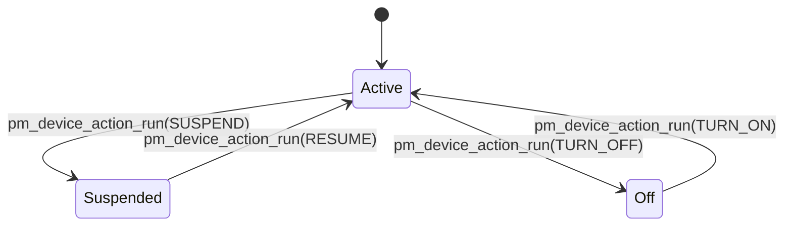

# Device Power Management

Control power states of individual peripherals and devices.

## Device PM States



## Kconfig

```kconfig
CONFIG_PM_DEVICE=y
CONFIG_PM_DEVICE_RUNTIME=y
```

## Controlling Device Power

```c
#include <zephyr/pm/device.h>
#include <zephyr/device.h>

const struct device *i2c = DEVICE_DT_GET(DT_NODELABEL(i2c0));

/* Suspend device */
int suspend_device(void)
{
    return pm_device_action_run(i2c, PM_DEVICE_ACTION_SUSPEND);
}

/* Resume device */
int resume_device(void)
{
    return pm_device_action_run(i2c, PM_DEVICE_ACTION_RESUME);
}

/* Turn off device */
int turn_off_device(void)
{
    return pm_device_action_run(i2c, PM_DEVICE_ACTION_TURN_OFF);
}

/* Turn on device */
int turn_on_device(void)
{
    return pm_device_action_run(i2c, PM_DEVICE_ACTION_TURN_ON);
}
```

## Checking Device State

```c
enum pm_device_state state;

int err = pm_device_state_get(i2c, &state);
if (err == 0) {
    switch (state) {
    case PM_DEVICE_STATE_ACTIVE:
        printk("Device active\n");
        break;
    case PM_DEVICE_STATE_SUSPENDED:
        printk("Device suspended\n");
        break;
    case PM_DEVICE_STATE_OFF:
        printk("Device off\n");
        break;
    }
}
```

## Runtime PM

Automatic power management based on usage:

```c
#include <zephyr/pm/device_runtime.h>

const struct device *sensor = DEVICE_DT_GET(DT_NODELABEL(sensor0));

void init_runtime_pm(void)
{
    /* Enable runtime PM for device */
    pm_device_runtime_enable(sensor);
}

int read_sensor_with_pm(void)
{
    int ret;

    /* Request device - automatically resumes if suspended */
    ret = pm_device_runtime_get(sensor);
    if (ret < 0) {
        return ret;
    }

    /* Use device */
    int value = sensor_read(sensor);

    /* Release device - may suspend if no other users */
    pm_device_runtime_put(sensor);

    return value;
}

/* Async version */
int read_sensor_async(void)
{
    pm_device_runtime_get(sensor);

    /* Device guaranteed active now */
    int value = sensor_read(sensor);

    /* Release asynchronously (don't wait for suspend) */
    pm_device_runtime_put_async(sensor, K_MSEC(100));

    return value;
}
```

## Implementing Device PM in a Driver

```c
#include <zephyr/pm/device.h>

struct my_driver_data {
    bool powered;
};

static int my_driver_pm_action(const struct device *dev,
                               enum pm_device_action action)
{
    struct my_driver_data *data = dev->data;

    switch (action) {
    case PM_DEVICE_ACTION_SUSPEND:
        /* Save state and power down */
        disable_hardware(dev);
        data->powered = false;
        break;

    case PM_DEVICE_ACTION_RESUME:
        /* Restore state and power up */
        enable_hardware(dev);
        data->powered = true;
        break;

    case PM_DEVICE_ACTION_TURN_OFF:
        /* Complete power off */
        power_off_hardware(dev);
        data->powered = false;
        break;

    case PM_DEVICE_ACTION_TURN_ON:
        /* Power on from off state */
        power_on_hardware(dev);
        init_hardware(dev);
        data->powered = true;
        break;

    default:
        return -ENOTSUP;
    }

    return 0;
}

/* Device definition with PM */
PM_DEVICE_DT_DEFINE(DT_NODELABEL(my_device), my_driver_pm_action);

DEVICE_DT_DEFINE(DT_NODELABEL(my_device),
                 my_driver_init,
                 PM_DEVICE_DT_GET(DT_NODELABEL(my_device)),
                 &my_data, &my_config,
                 POST_KERNEL, 90, &my_api);
```

## System-Wide Device PM

```c
/* Suspend all devices before system sleep */
void prepare_for_sleep(void)
{
    const struct device *dev;

    /* Iterate and suspend devices */
    for (dev = __device_start; dev < __device_end; dev++) {
        if (pm_device_is_busy(dev)) {
            continue;  /* Skip busy devices */
        }
        pm_device_action_run(dev, PM_DEVICE_ACTION_SUSPEND);
    }
}

/* Resume all devices after wake */
void resume_from_sleep(void)
{
    const struct device *dev;

    for (dev = __device_start; dev < __device_end; dev++) {
        pm_device_action_run(dev, PM_DEVICE_ACTION_RESUME);
    }
}
```

## Busy Status

```c
/* Mark device as busy (prevents suspension) */
pm_device_busy_set(dev);

/* Clear busy status */
pm_device_busy_clear(dev);

/* Check if device is busy */
if (pm_device_is_busy(dev)) {
    printk("Device is busy\n");
}
```

## Example: Power-Efficient Sensor

```c
#include <zephyr/kernel.h>
#include <zephyr/pm/device_runtime.h>

const struct device *accel = DEVICE_DT_GET(DT_NODELABEL(accel0));
const struct device *i2c = DEVICE_DT_GET(DT_NODELABEL(i2c0));

void init(void)
{
    pm_device_runtime_enable(accel);
    pm_device_runtime_enable(i2c);
}

int read_acceleration(int16_t *x, int16_t *y, int16_t *z)
{
    int ret;

    /* I2C will auto-resume when accel requests it */
    ret = pm_device_runtime_get(accel);
    if (ret < 0) {
        return ret;
    }

    /* Read accelerometer data */
    uint8_t data[6];
    ret = sensor_read_regs(accel, 0x28, data, 6);

    *x = (data[1] << 8) | data[0];
    *y = (data[3] << 8) | data[2];
    *z = (data[5] << 8) | data[4];

    /* Release - will suspend after idle timeout */
    pm_device_runtime_put_async(accel, K_MSEC(500));

    return ret;
}
```

## Best Practices

1. **Use runtime PM** - Automatic management is simpler
2. **Handle state correctly** - Save/restore registers on suspend/resume
3. **Consider dependencies** - Parent devices must be active for children
4. **Test power states** - Verify device works after resume
5. **Use async put** - Avoid unnecessary suspend/resume cycles

## Next Steps

Learn about [Debugging]() for troubleshooting techniques.
