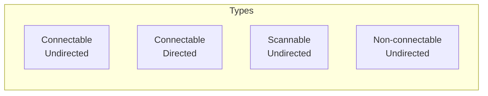

# BLE Advertising

Advertising allows BLE devices to broadcast their presence and data.

## Advertising Types



| Type | Connectable | Scannable | Use Case |
|------|-------------|-----------|----------|
| ADV_IND | Yes | Yes | General peripheral |
| ADV_DIRECT_IND | Yes (specific) | No | Fast reconnect |
| ADV_SCAN_IND | No | Yes | More data in scan response |
| ADV_NONCONN_IND | No | No | Beacon |

## Basic Advertising

```c
#include <zephyr/bluetooth/bluetooth.h>

/* Advertising data */
static const struct bt_data ad[] = {
    BT_DATA_BYTES(BT_DATA_FLAGS, (BT_LE_AD_GENERAL | BT_LE_AD_NO_BREDR)),
    BT_DATA_BYTES(BT_DATA_UUID16_ALL, 0x0d, 0x18),  /* Heart Rate Service */
};

/* Scan response data */
static const struct bt_data sd[] = {
    BT_DATA(BT_DATA_NAME_COMPLETE, "Zephyr HR", 9),
};

int start_advertising(void)
{
    int err;

    err = bt_le_adv_start(BT_LE_ADV_CONN,  /* Connectable */
                          ad, ARRAY_SIZE(ad),
                          sd, ARRAY_SIZE(sd));
    if (err) {
        printk("Advertising failed to start: %d\n", err);
        return err;
    }

    printk("Advertising started\n");
    return 0;
}
```

## Advertising Parameters

```c
/* Custom advertising parameters */
static struct bt_le_adv_param adv_param = {
    .id = BT_ID_DEFAULT,
    .options = BT_LE_ADV_OPT_CONNECTABLE | BT_LE_ADV_OPT_USE_NAME,
    .interval_min = BT_GAP_ADV_FAST_INT_MIN_2,  /* 100ms */
    .interval_max = BT_GAP_ADV_FAST_INT_MAX_2,  /* 150ms */
};

int start_custom_advertising(void)
{
    return bt_le_adv_start(&adv_param, ad, ARRAY_SIZE(ad), sd, ARRAY_SIZE(sd));
}

/* Common parameter presets */
BT_LE_ADV_CONN          /* Connectable, uses default name */
BT_LE_ADV_CONN_NAME     /* Connectable with device name */
BT_LE_ADV_NCONN         /* Non-connectable */
BT_LE_ADV_NCONN_IDENTITY /* Non-connectable with identity address */
```

## Advertising Data Types

```c
/* Flags */
BT_DATA_BYTES(BT_DATA_FLAGS, BT_LE_AD_GENERAL | BT_LE_AD_NO_BREDR)

/* Device name */
BT_DATA(BT_DATA_NAME_COMPLETE, "MyDevice", 8)
BT_DATA(BT_DATA_NAME_SHORTENED, "MyDev", 5)

/* Service UUIDs */
BT_DATA_BYTES(BT_DATA_UUID16_ALL,
    BT_UUID_16_ENCODE(BT_UUID_HRS_VAL),  /* Heart Rate */
    BT_UUID_16_ENCODE(BT_UUID_BAS_VAL))  /* Battery */

BT_DATA_BYTES(BT_DATA_UUID128_ALL,
    0xf0, 0xde, 0xbc, 0x9a, 0x78, 0x56, 0x34, 0x12,
    0x78, 0x56, 0x34, 0x12, 0x78, 0x56, 0x34, 0x12)

/* TX Power */
BT_DATA_BYTES(BT_DATA_TX_POWER, 0)  /* 0 dBm */

/* Manufacturer data */
#define COMPANY_ID 0x1234
static uint8_t mfg_data[] = { 0x34, 0x12, 0x01, 0x02, 0x03 };
BT_DATA(BT_DATA_MANUFACTURER_DATA, mfg_data, sizeof(mfg_data))

/* Service data */
static uint8_t svc_data[] = { 0x0d, 0x18, 0x64 };  /* HR UUID + value */
BT_DATA(BT_DATA_SVC_DATA16, svc_data, sizeof(svc_data))
```

## iBeacon

```c
#define IBEACON_UUID 0x12, 0x34, 0x56, 0x78, \
                     0x12, 0x34, 0x56, 0x78, \
                     0x12, 0x34, 0x56, 0x78, \
                     0x12, 0x34, 0x56, 0x78

static const struct bt_data ibeacon_ad[] = {
    BT_DATA_BYTES(BT_DATA_FLAGS, BT_LE_AD_NO_BREDR),
    BT_DATA_BYTES(BT_DATA_MANUFACTURER_DATA,
        0x4c, 0x00,  /* Apple company ID */
        0x02, 0x15,  /* iBeacon type and length */
        IBEACON_UUID,
        0x00, 0x01,  /* Major */
        0x00, 0x02,  /* Minor */
        0xc5)        /* TX power at 1m */
};

int start_ibeacon(void)
{
    return bt_le_adv_start(BT_LE_ADV_NCONN_IDENTITY,
                           ibeacon_ad, ARRAY_SIZE(ibeacon_ad),
                           NULL, 0);
}
```

## Eddystone URL Beacon

```c
/* Eddystone URL frame */
static uint8_t eddystone_url[] = {
    0xaa, 0xfe,              /* Eddystone UUID */
    0x10,                    /* Frame type: URL */
    0xf8,                    /* TX power */
    0x03,                    /* https:// */
    'e', 'x', 'a', 'm', 'p', 'l', 'e',
    0x07                     /* .com */
};

static const struct bt_data eddystone_ad[] = {
    BT_DATA_BYTES(BT_DATA_FLAGS, BT_LE_AD_NO_BREDR),
    BT_DATA_BYTES(BT_DATA_UUID16_ALL, 0xaa, 0xfe),
    BT_DATA(BT_DATA_SVC_DATA16, eddystone_url, sizeof(eddystone_url)),
};
```

## Dynamic Advertising Data

```c
static struct bt_data ad[] = {
    BT_DATA_BYTES(BT_DATA_FLAGS, BT_LE_AD_GENERAL | BT_LE_AD_NO_BREDR),
    BT_DATA(BT_DATA_MANUFACTURER_DATA, NULL, 0),  /* Placeholder */
};

static uint8_t mfg_data[10];

void update_advertising_data(uint8_t *new_data, size_t len)
{
    /* Stop advertising */
    bt_le_adv_stop();

    /* Update data */
    memcpy(mfg_data, new_data, MIN(len, sizeof(mfg_data)));
    ad[1].data = mfg_data;
    ad[1].data_len = len;

    /* Restart advertising */
    bt_le_adv_start(BT_LE_ADV_CONN, ad, ARRAY_SIZE(ad), NULL, 0);
}
```

## Extended Advertising (BLE 5.0)

```c
#include <zephyr/bluetooth/bluetooth.h>

/* Enable in Kconfig */
/* CONFIG_BT_EXT_ADV=y */

static struct bt_le_ext_adv *adv;

static const struct bt_data ext_ad[] = {
    BT_DATA_BYTES(BT_DATA_FLAGS, BT_LE_AD_GENERAL | BT_LE_AD_NO_BREDR),
    /* Can include up to 251 bytes (vs 31 for legacy) */
};

int start_extended_advertising(void)
{
    int err;

    struct bt_le_adv_param param = {
        .options = BT_LE_ADV_OPT_EXT_ADV | BT_LE_ADV_OPT_CONNECTABLE,
        .interval_min = BT_GAP_ADV_FAST_INT_MIN_2,
        .interval_max = BT_GAP_ADV_FAST_INT_MAX_2,
    };

    err = bt_le_ext_adv_create(&param, NULL, &adv);
    if (err) {
        return err;
    }

    err = bt_le_ext_adv_set_data(adv, ext_ad, ARRAY_SIZE(ext_ad), NULL, 0);
    if (err) {
        return err;
    }

    return bt_le_ext_adv_start(adv, BT_LE_EXT_ADV_START_DEFAULT);
}
```

## Advertising Control

```c
/* Stop advertising */
bt_le_adv_stop();

/* Check if advertising */
bool is_advertising = bt_le_adv_is_active();
```

## Best Practices

1. **Minimize advertising data** - 31 bytes max for legacy
2. **Use scan response** - For additional data
3. **Adjust interval** - Balance discovery speed vs power
4. **Include service UUIDs** - For filtering
5. **Use appropriate type** - Beacon vs connectable

## Next Steps

Learn about [BLE Scanning]() for discovering devices.
