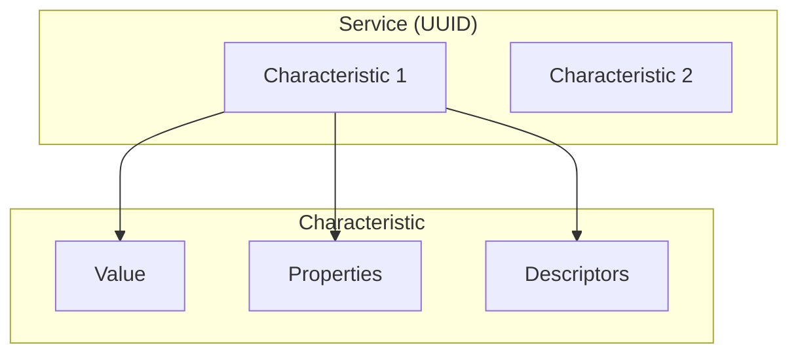

# GATT Server

Create custom BLE services with characteristics for data exchange.

## GATT Structure



## Defining a Custom Service

```c
#include <zephyr/bluetooth/bluetooth.h>
#include <zephyr/bluetooth/gatt.h>
#include <zephyr/bluetooth/uuid.h>

/* Custom Service UUID: 12345678-1234-5678-1234-567812345678 */
#define BT_UUID_CUSTOM_SERVICE \
    BT_UUID_DECLARE_128(BT_UUID_128_ENCODE(0x12345678, 0x1234, 0x5678, 0x1234, 0x567812345678))

/* Custom Characteristic UUID */
#define BT_UUID_CUSTOM_CHAR \
    BT_UUID_DECLARE_128(BT_UUID_128_ENCODE(0x12345678, 0x1234, 0x5678, 0x1234, 0x567812345679))

static uint8_t custom_value[20];
static bool notify_enabled;

/* Read callback */
static ssize_t read_custom(struct bt_conn *conn,
                           const struct bt_gatt_attr *attr,
                           void *buf, uint16_t len, uint16_t offset)
{
    return bt_gatt_attr_read(conn, attr, buf, len, offset,
                             custom_value, sizeof(custom_value));
}

/* Write callback */
static ssize_t write_custom(struct bt_conn *conn,
                            const struct bt_gatt_attr *attr,
                            const void *buf, uint16_t len,
                            uint16_t offset, uint8_t flags)
{
    if (offset + len > sizeof(custom_value)) {
        return BT_GATT_ERR(BT_ATT_ERR_INVALID_OFFSET);
    }

    memcpy(custom_value + offset, buf, len);
    printk("Received %d bytes\n", len);

    return len;
}

/* CCC changed callback */
static void ccc_changed(const struct bt_gatt_attr *attr, uint16_t value)
{
    notify_enabled = (value == BT_GATT_CCC_NOTIFY);
    printk("Notifications %s\n", notify_enabled ? "enabled" : "disabled");
}

/* Service definition */
BT_GATT_SERVICE_DEFINE(custom_svc,
    BT_GATT_PRIMARY_SERVICE(BT_UUID_CUSTOM_SERVICE),

    /* Characteristic with read/write/notify */
    BT_GATT_CHARACTERISTIC(BT_UUID_CUSTOM_CHAR,
        BT_GATT_CHRC_READ | BT_GATT_CHRC_WRITE | BT_GATT_CHRC_NOTIFY,
        BT_GATT_PERM_READ | BT_GATT_PERM_WRITE,
        read_custom, write_custom, custom_value),

    /* Client Characteristic Configuration (for notifications) */
    BT_GATT_CCC(ccc_changed, BT_GATT_PERM_READ | BT_GATT_PERM_WRITE),
);
```

## Sending Notifications

```c
/* Send notification to all connected clients */
void send_notification(uint8_t *data, uint16_t len)
{
    if (!notify_enabled) {
        return;
    }

    /* Get the characteristic attribute */
    const struct bt_gatt_attr *attr = &custom_svc.attrs[2];  /* Characteristic value */

    bt_gatt_notify(NULL, attr, data, len);
}

/* Send to specific connection */
void send_notification_to(struct bt_conn *conn, uint8_t *data, uint16_t len)
{
    const struct bt_gatt_attr *attr = &custom_svc.attrs[2];
    bt_gatt_notify(conn, attr, data, len);
}
```

## Standard Services

### Battery Service

```c
#include <zephyr/bluetooth/services/bas.h>

/* Enable in Kconfig: CONFIG_BT_BAS=y */

void update_battery(void)
{
    uint8_t level = read_battery_percent();
    bt_bas_set_battery_level(level);
}
```

### Heart Rate Service

```c
#include <zephyr/bluetooth/services/hrs.h>

/* Enable in Kconfig: CONFIG_BT_HRS=y */

void send_heart_rate(uint16_t bpm)
{
    bt_hrs_notify(bpm);
}
```

### Device Information Service

```c
#include <zephyr/bluetooth/services/dis.h>

/* Enable and configure in Kconfig */
/* CONFIG_BT_DIS=y */
/* CONFIG_BT_DIS_MANUF="My Company" */
/* CONFIG_BT_DIS_MODEL="Model 1" */
/* CONFIG_BT_DIS_FW_REV_STR="1.0.0" */
```

## Characteristic Properties

```c
/* Properties */
BT_GATT_CHRC_BROADCAST    /* Broadcast permitted */
BT_GATT_CHRC_READ         /* Read permitted */
BT_GATT_CHRC_WRITE_WITHOUT_RESP  /* Write without response */
BT_GATT_CHRC_WRITE        /* Write with response */
BT_GATT_CHRC_NOTIFY       /* Notify permitted */
BT_GATT_CHRC_INDICATE     /* Indicate permitted */
BT_GATT_CHRC_AUTH         /* Authenticated writes */

/* Permissions */
BT_GATT_PERM_READ         /* Read permitted */
BT_GATT_PERM_WRITE        /* Write permitted */
BT_GATT_PERM_READ_ENCRYPT /* Encrypted read */
BT_GATT_PERM_WRITE_ENCRYPT /* Encrypted write */
BT_GATT_PERM_READ_AUTHEN  /* Authenticated read */
BT_GATT_PERM_WRITE_AUTHEN /* Authenticated write */
```

## Indications

```c
/* Indication callback */
static void indicate_cb(struct bt_conn *conn,
                        struct bt_gatt_indicate_params *params,
                        uint8_t err)
{
    printk("Indication %s\n", err ? "failed" : "acknowledged");
}

static struct bt_gatt_indicate_params ind_params;

void send_indication(uint8_t *data, uint16_t len)
{
    ind_params.attr = &custom_svc.attrs[2];
    ind_params.data = data;
    ind_params.len = len;
    ind_params.func = indicate_cb;

    bt_gatt_indicate(NULL, &ind_params);
}
```

## Dynamic Services

```c
/* CONFIG_BT_GATT_DYNAMIC_DB=y */

static struct bt_gatt_attr dynamic_attrs[] = {
    BT_GATT_PRIMARY_SERVICE(BT_UUID_CUSTOM_SERVICE),
    BT_GATT_CHARACTERISTIC(BT_UUID_CUSTOM_CHAR,
        BT_GATT_CHRC_READ, BT_GATT_PERM_READ,
        read_custom, NULL, NULL),
};

static struct bt_gatt_service dynamic_svc = {
    .attrs = dynamic_attrs,
    .attr_count = ARRAY_SIZE(dynamic_attrs),
};

int register_service(void)
{
    return bt_gatt_service_register(&dynamic_svc);
}

int unregister_service(void)
{
    return bt_gatt_service_unregister(&dynamic_svc);
}
```

## Complete Example

```c
#include <zephyr/kernel.h>
#include <zephyr/bluetooth/bluetooth.h>
#include <zephyr/bluetooth/gatt.h>

static uint8_t sensor_value;
static struct bt_conn *current_conn;

static ssize_t read_sensor(struct bt_conn *conn,
                           const struct bt_gatt_attr *attr,
                           void *buf, uint16_t len, uint16_t offset)
{
    sensor_value = read_sensor_hardware();
    return bt_gatt_attr_read(conn, attr, buf, len, offset,
                             &sensor_value, sizeof(sensor_value));
}

static void ccc_changed(const struct bt_gatt_attr *attr, uint16_t value)
{
    ARG_UNUSED(attr);
}

BT_GATT_SERVICE_DEFINE(sensor_svc,
    BT_GATT_PRIMARY_SERVICE(BT_UUID_CUSTOM_SERVICE),
    BT_GATT_CHARACTERISTIC(BT_UUID_CUSTOM_CHAR,
        BT_GATT_CHRC_READ | BT_GATT_CHRC_NOTIFY,
        BT_GATT_PERM_READ, read_sensor, NULL, &sensor_value),
    BT_GATT_CCC(ccc_changed, BT_GATT_PERM_READ | BT_GATT_PERM_WRITE),
);

void sensor_notify_thread(void)
{
    while (1) {
        k_sleep(K_SECONDS(1));

        sensor_value = read_sensor_hardware();

        bt_gatt_notify(NULL, &sensor_svc.attrs[1], &sensor_value, 1);
    }
}

K_THREAD_DEFINE(sensor_thread, 1024, sensor_notify_thread, NULL, NULL, NULL, 7, 0, 0);
```

## Best Practices

1. **Use standard services** - When applicable (BAS, HRS, DIS)
2. **Handle errors** - Check return values in callbacks
3. **Validate input** - Check offset and length in write callbacks
4. **Use appropriate permissions** - Based on data sensitivity
5. **Limit notification rate** - Avoid flooding the connection

## Example Code

See the complete [BLE Peripheral Example]() demonstrating a GATT server with custom services.

## Next Steps

Learn about [GATT Client]() for reading remote services.
