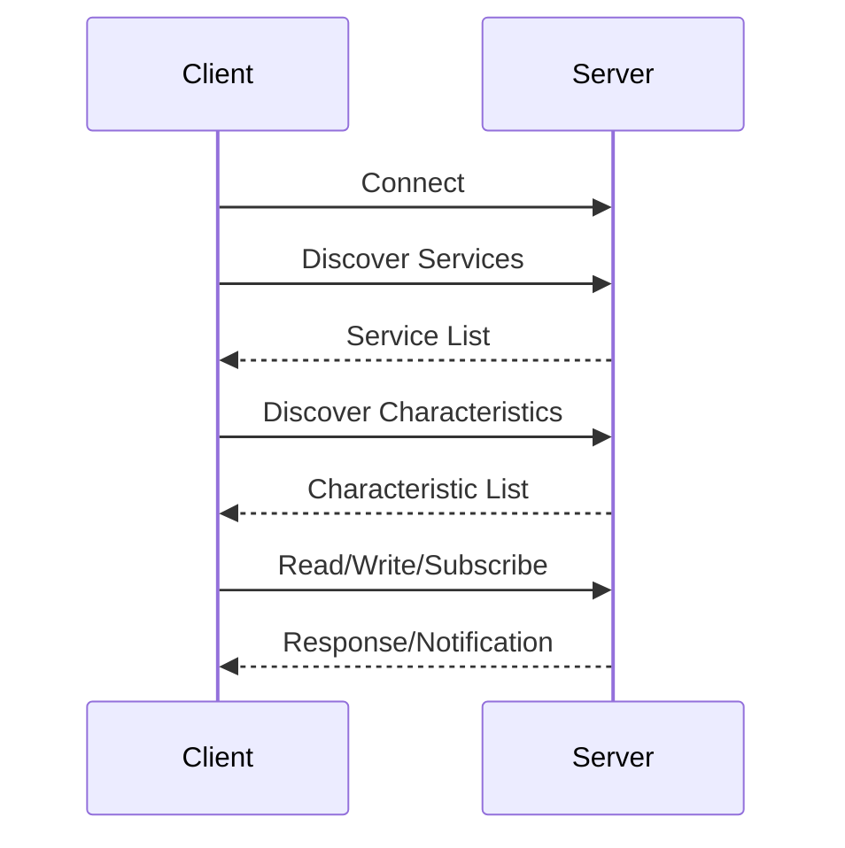

# GATT Client

Discover and interact with remote BLE services and characteristics.

## GATT Discovery Flow



## Service Discovery

```c
#include <zephyr/bluetooth/gatt.h>

static struct bt_gatt_discover_params discover_params;
static struct bt_gatt_subscribe_params subscribe_params;

/* Characteristic handles (found during discovery) */
static uint16_t hr_handle;
static uint16_t hr_ccc_handle;

static uint8_t discover_func(struct bt_conn *conn,
                             const struct bt_gatt_attr *attr,
                             struct bt_gatt_discover_params *params)
{
    if (!attr) {
        printk("Discovery complete\n");
        return BT_GATT_ITER_STOP;
    }

    printk("Handle 0x%04x, UUID ", attr->handle);

    if (params->type == BT_GATT_DISCOVER_PRIMARY) {
        struct bt_gatt_service_val *svc = attr->user_data;
        printk("Service: ");
        /* Check if this is the service we want */
    } else if (params->type == BT_GATT_DISCOVER_CHARACTERISTIC) {
        struct bt_gatt_chrc *chrc = attr->user_data;
        hr_handle = chrc->value_handle;
        printk("Characteristic: value handle 0x%04x\n", hr_handle);
    } else if (params->type == BT_GATT_DISCOVER_DESCRIPTOR) {
        hr_ccc_handle = attr->handle;
        printk("CCC Descriptor\n");
    }

    return BT_GATT_ITER_CONTINUE;
}

int discover_services(struct bt_conn *conn)
{
    discover_params.uuid = BT_UUID_HRS;  /* Heart Rate Service */
    discover_params.func = discover_func;
    discover_params.start_handle = BT_ATT_FIRST_ATTRIBUTE_HANDLE;
    discover_params.end_handle = BT_ATT_LAST_ATTRIBUTE_HANDLE;
    discover_params.type = BT_GATT_DISCOVER_PRIMARY;

    return bt_gatt_discover(conn, &discover_params);
}
```

## Reading Characteristics

```c
static uint8_t read_func(struct bt_conn *conn, uint8_t err,
                         struct bt_gatt_read_params *params,
                         const void *data, uint16_t length)
{
    if (err) {
        printk("Read failed: %d\n", err);
        return BT_GATT_ITER_STOP;
    }

    if (!data) {
        printk("Read complete\n");
        return BT_GATT_ITER_STOP;
    }

    printk("Read %d bytes: ", length);
    for (int i = 0; i < length; i++) {
        printk("%02x ", ((uint8_t *)data)[i]);
    }
    printk("\n");

    return BT_GATT_ITER_CONTINUE;
}

static struct bt_gatt_read_params read_params;

int read_characteristic(struct bt_conn *conn, uint16_t handle)
{
    read_params.func = read_func;
    read_params.handle_count = 1;
    read_params.single.handle = handle;
    read_params.single.offset = 0;

    return bt_gatt_read(conn, &read_params);
}
```

## Writing Characteristics

```c
static void write_func(struct bt_conn *conn, uint8_t err,
                       struct bt_gatt_write_params *params)
{
    if (err) {
        printk("Write failed: %d\n", err);
        return;
    }

    printk("Write complete\n");
}

static struct bt_gatt_write_params write_params;

int write_characteristic(struct bt_conn *conn, uint16_t handle,
                         const uint8_t *data, uint16_t len)
{
    write_params.func = write_func;
    write_params.handle = handle;
    write_params.offset = 0;
    write_params.data = data;
    write_params.length = len;

    return bt_gatt_write(conn, &write_params);
}

/* Write without response */
int write_without_response(struct bt_conn *conn, uint16_t handle,
                          const uint8_t *data, uint16_t len)
{
    return bt_gatt_write_without_response(conn, handle, data, len, false);
}
```

## Subscribing to Notifications

```c
static uint8_t notify_func(struct bt_conn *conn,
                           struct bt_gatt_subscribe_params *params,
                           const void *data, uint16_t length)
{
    if (!data) {
        printk("Unsubscribed\n");
        params->value_handle = 0;
        return BT_GATT_ITER_STOP;
    }

    printk("Notification: ");
    for (int i = 0; i < length; i++) {
        printk("%02x ", ((uint8_t *)data)[i]);
    }
    printk("\n");

    return BT_GATT_ITER_CONTINUE;
}

static struct bt_gatt_subscribe_params subscribe_params;

int subscribe_to_notifications(struct bt_conn *conn,
                               uint16_t value_handle,
                               uint16_t ccc_handle)
{
    subscribe_params.notify = notify_func;
    subscribe_params.value_handle = value_handle;
    subscribe_params.ccc_handle = ccc_handle;
    subscribe_params.value = BT_GATT_CCC_NOTIFY;

    return bt_gatt_subscribe(conn, &subscribe_params);
}

int unsubscribe(struct bt_conn *conn)
{
    return bt_gatt_unsubscribe(conn, &subscribe_params);
}
```

## Complete Example: Heart Rate Client

```c
#include <zephyr/bluetooth/bluetooth.h>
#include <zephyr/bluetooth/gatt.h>
#include <zephyr/bluetooth/uuid.h>

static struct bt_conn *default_conn;
static struct bt_gatt_discover_params discover_params;
static struct bt_gatt_subscribe_params subscribe_params;
static uint16_t hr_value_handle;

static uint8_t notify_func(struct bt_conn *conn,
                           struct bt_gatt_subscribe_params *params,
                           const void *data, uint16_t length)
{
    if (!data) {
        return BT_GATT_ITER_STOP;
    }

    /* Parse heart rate measurement */
    uint8_t flags = ((uint8_t *)data)[0];
    uint16_t hr;

    if (flags & 0x01) {
        hr = ((uint8_t *)data)[1] | (((uint8_t *)data)[2] << 8);
    } else {
        hr = ((uint8_t *)data)[1];
    }

    printk("Heart Rate: %d bpm\n", hr);
    return BT_GATT_ITER_CONTINUE;
}

static uint8_t discover_func(struct bt_conn *conn,
                             const struct bt_gatt_attr *attr,
                             struct bt_gatt_discover_params *params)
{
    if (!attr) {
        /* Discovery complete - subscribe to notifications */
        subscribe_params.notify = notify_func;
        subscribe_params.value_handle = hr_value_handle;
        subscribe_params.ccc_handle = 0;  /* Auto-discover */
        subscribe_params.value = BT_GATT_CCC_NOTIFY;
        bt_gatt_subscribe(conn, &subscribe_params);
        return BT_GATT_ITER_STOP;
    }

    if (params->type == BT_GATT_DISCOVER_PRIMARY) {
        /* Found service, discover characteristics */
        discover_params.type = BT_GATT_DISCOVER_CHARACTERISTIC;
        discover_params.uuid = BT_UUID_HRS_MEASUREMENT;
        discover_params.start_handle = attr->handle + 1;
        bt_gatt_discover(conn, &discover_params);
    } else if (params->type == BT_GATT_DISCOVER_CHARACTERISTIC) {
        struct bt_gatt_chrc *chrc = attr->user_data;
        hr_value_handle = chrc->value_handle;
    }

    return BT_GATT_ITER_CONTINUE;
}

static void connected(struct bt_conn *conn, uint8_t err)
{
    if (err) {
        return;
    }

    default_conn = bt_conn_ref(conn);

    /* Start service discovery */
    discover_params.uuid = BT_UUID_HRS;
    discover_params.func = discover_func;
    discover_params.type = BT_GATT_DISCOVER_PRIMARY;
    discover_params.start_handle = BT_ATT_FIRST_ATTRIBUTE_HANDLE;
    discover_params.end_handle = BT_ATT_LAST_ATTRIBUTE_HANDLE;

    bt_gatt_discover(conn, &discover_params);
}

BT_CONN_CB_DEFINE(conn_callbacks) = {
    .connected = connected,
};
```

## Best Practices

1. **Handle discovery completion** - Check for NULL attr
2. **Store handles** - Cache discovered handles for later use
3. **Unsubscribe on disconnect** - Clean up subscriptions
4. **Handle errors** - Check return values and error callbacks
5. **Use appropriate MTU** - Request larger MTU for efficiency

## Next Steps

Learn about [BLE Mesh]() for mesh networking.
