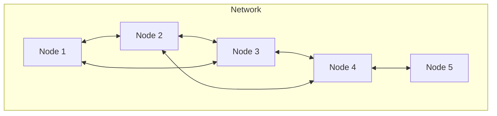

# Bluetooth Mesh

Bluetooth Mesh enables many-to-many communication for large-scale device networks.

## Mesh Architecture



## Kconfig

```kconfig
CONFIG_BT=y
CONFIG_BT_MESH=y
CONFIG_BT_MESH_RELAY=y        # Relay messages
CONFIG_BT_MESH_PB_GATT=y      # GATT provisioning
CONFIG_BT_MESH_PB_ADV=y       # Advertising provisioning
CONFIG_BT_MESH_GATT_PROXY=y   # GATT proxy

# Settings for persistence
CONFIG_BT_SETTINGS=y
CONFIG_SETTINGS=y
CONFIG_FLASH=y
CONFIG_NVS=y
```

## Basic Mesh Setup

```c
#include <zephyr/bluetooth/bluetooth.h>
#include <zephyr/bluetooth/mesh.h>

/* Device UUID */
static uint8_t dev_uuid[16] = { 0x00, 0x01, 0x02, 0x03, 0x04, 0x05, 0x06, 0x07,
                                0x08, 0x09, 0x0a, 0x0b, 0x0c, 0x0d, 0x0e, 0x0f };

/* Provisioning */
static void prov_complete(uint16_t net_idx, uint16_t addr)
{
    printk("Provisioned: net_idx 0x%04x, addr 0x%04x\n", net_idx, addr);
}

static void prov_reset(void)
{
    bt_mesh_prov_enable(BT_MESH_PROV_ADV | BT_MESH_PROV_GATT);
}

static const struct bt_mesh_prov prov = {
    .uuid = dev_uuid,
    .complete = prov_complete,
    .reset = prov_reset,
};

/* Models */
static struct bt_mesh_cfg_cli cfg_cli;

static const struct bt_mesh_model root_models[] = {
    BT_MESH_MODEL_CFG_SRV,
    BT_MESH_MODEL_CFG_CLI(&cfg_cli),
    BT_MESH_MODEL_HEALTH_SRV(&health_srv, &health_pub),
};

static struct bt_mesh_elem elements[] = {
    BT_MESH_ELEM(0, root_models, BT_MESH_MODEL_NONE),
};

static const struct bt_mesh_comp comp = {
    .cid = 0xFFFF,  /* Company ID */
    .elem = elements,
    .elem_count = ARRAY_SIZE(elements),
};

int mesh_init(void)
{
    int err;

    err = bt_mesh_init(&prov, &comp);
    if (err) {
        printk("Mesh init failed: %d\n", err);
        return err;
    }

    /* Enable provisioning */
    bt_mesh_prov_enable(BT_MESH_PROV_ADV | BT_MESH_PROV_GATT);

    return 0;
}
```

## Custom Model

```c
/* Model opcodes */
#define OP_ONOFF_GET    BT_MESH_MODEL_OP_2(0x82, 0x01)
#define OP_ONOFF_SET    BT_MESH_MODEL_OP_2(0x82, 0x02)
#define OP_ONOFF_STATUS BT_MESH_MODEL_OP_2(0x82, 0x04)

static uint8_t onoff_state;

/* Handle GET */
static int onoff_get(struct bt_mesh_model *model,
                     struct bt_mesh_msg_ctx *ctx,
                     struct net_buf_simple *buf)
{
    BT_MESH_MODEL_BUF_DEFINE(msg, OP_ONOFF_STATUS, 1);

    bt_mesh_model_msg_init(&msg, OP_ONOFF_STATUS);
    net_buf_simple_add_u8(&msg, onoff_state);

    bt_mesh_model_send(model, ctx, &msg, NULL, NULL);
    return 0;
}

/* Handle SET */
static int onoff_set(struct bt_mesh_model *model,
                     struct bt_mesh_msg_ctx *ctx,
                     struct net_buf_simple *buf)
{
    onoff_state = net_buf_simple_pull_u8(buf);
    printk("Set OnOff: %d\n", onoff_state);

    /* Control hardware */
    gpio_pin_set_dt(&led, onoff_state);

    /* Send status response */
    return onoff_get(model, ctx, buf);
}

static const struct bt_mesh_model_op onoff_ops[] = {
    { OP_ONOFF_GET, 0, onoff_get },
    { OP_ONOFF_SET, 1, onoff_set },
    BT_MESH_MODEL_OP_END,
};

/* Vendor model */
#define VENDOR_ID 0x1234
#define MOD_ID    0x0001

static struct bt_mesh_model vendor_models[] = {
    BT_MESH_MODEL_VND(VENDOR_ID, MOD_ID, onoff_ops, NULL, NULL),
};
```

## Publishing Messages

```c
BT_MESH_MODEL_PUB_DEFINE(onoff_pub, NULL, 2);

/* Publish status */
void publish_onoff_status(void)
{
    struct bt_mesh_model *model = &root_models[3];  /* Our OnOff model */

    if (model->pub->addr == BT_MESH_ADDR_UNASSIGNED) {
        return;  /* Not configured for publishing */
    }

    BT_MESH_MODEL_BUF_DEFINE(msg, OP_ONOFF_STATUS, 1);

    bt_mesh_model_msg_init(&msg, OP_ONOFF_STATUS);
    net_buf_simple_add_u8(&msg, onoff_state);

    bt_mesh_model_publish(model);
}
```

## Health Server

```c
#include <zephyr/bluetooth/mesh/health_srv.h>

static uint8_t cur_faults[8];
static uint8_t reg_faults[8];

static int fault_get_cur(struct bt_mesh_model *model, uint8_t *test_id,
                         uint16_t *company_id, uint8_t *faults,
                         uint8_t *fault_count)
{
    *test_id = 0;
    *company_id = 0xFFFF;
    memcpy(faults, cur_faults, sizeof(cur_faults));
    *fault_count = sizeof(cur_faults);
    return 0;
}

static const struct bt_mesh_health_srv_cb health_cb = {
    .fault_get_cur = fault_get_cur,
};

static struct bt_mesh_health_srv health_srv = {
    .cb = &health_cb,
};

BT_MESH_HEALTH_PUB_DEFINE(health_pub, 8);
```

## Provisioning

### Self-Provisioning (for development)

```c
static uint8_t net_key[16] = { /* Network key */ };
static uint8_t app_key[16] = { /* Application key */ };

int self_provision(void)
{
    int err;

    err = bt_mesh_provision(net_key, 0, 0, 0, 0x0001, app_key);
    if (err) {
        printk("Provisioning failed: %d\n", err);
        return err;
    }

    printk("Self-provisioned\n");
    return 0;
}
```

### Reset Provisioning

```c
void mesh_reset(void)
{
    bt_mesh_reset();
    bt_mesh_prov_enable(BT_MESH_PROV_ADV | BT_MESH_PROV_GATT);
}
```

## Shell Commands

```kconfig
CONFIG_BT_MESH_SHELL=y
```

```
uart:~$ mesh init
uart:~$ mesh prov-adv on
uart:~$ mesh reset
```

## Best Practices

1. **Use relay for larger networks** - Enable message forwarding
2. **Implement health server** - For diagnostics
3. **Store provisioning data** - Use settings for persistence
4. **Handle network resets** - Re-enable provisioning
5. **Test with provisioner app** - Use nRF Mesh app

## Next Steps

Learn about [Power Management]() for low-power operation.
