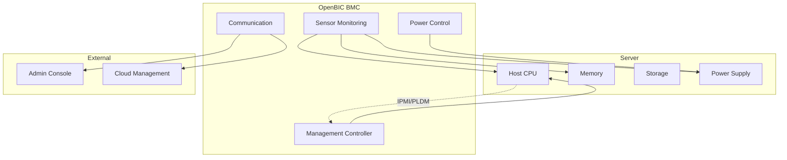
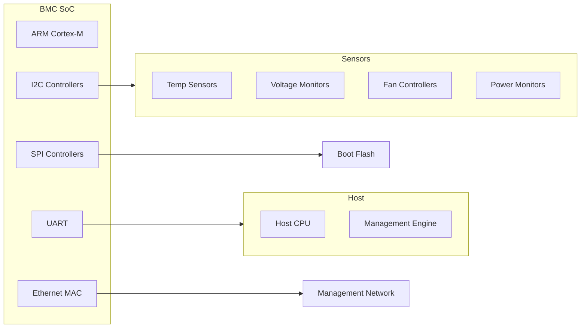

# OpenBIC Overview

OpenBIC is an open-source Baseboard Management Controller (BMC) firmware built on Zephyr RTOS, demonstrating enterprise-grade embedded system design.

## What is OpenBIC?

OpenBIC provides out-of-band management capabilities for server platforms:



## Key Features

| Feature | Description |
|---------|-------------|
| Sensor Monitoring | Temperature, voltage, power sensors |
| Power Management | Host power control, sequencing |
| Event Logging | SEL (System Event Log) |
| Remote Management | IPMI, PLDM protocols |
| Firmware Update | In-band and out-of-band updates |

## Project Structure

```
openbic/
├── common/                 # Shared code across platforms
│   ├── dev/               # Device drivers
│   ├── lib/               # Common libraries
│   ├── service/           # Services (IPMI, PLDM, etc.)
│   └── shell/             # Shell commands
├── meta-facebook/         # Platform-specific configs
│   └── boards/            # Board configurations
├── fix_patch/             # Zephyr patches
└── scripts/               # Build and utility scripts
```

## Why Zephyr?

OpenBIC chose Zephyr for several reasons:

1. **Real-time Capabilities** - Predictable response times for hardware monitoring
2. **Small Footprint** - Fits in constrained BMC hardware
3. **Rich Driver Support** - I2C, SPI, GPIO for sensor access
4. **Active Community** - Continuous improvements and security updates
5. **Vendor Neutral** - No licensing restrictions

## Hardware Platform

Typical OpenBIC deployment:



## Getting Started

### Prerequisites

```bash
# Install Zephyr SDK
# Install west

# Clone repository
git clone https://github.com/facebook/openbic.git
cd openbic
```

### Build

```bash
# Initialize west workspace
west init -l .
west update

# Build for specific platform
west build -b ast1030_evb meta-facebook/yv35-cl/
```

### Flash

```bash
west flash
```

## Configuration System

OpenBIC uses Kconfig extensively:

```kconfig
# Platform selection
CONFIG_META_FACEBOOK=y
CONFIG_PLAT_CC=y

# Features
CONFIG_IPMI=y
CONFIG_PLDM=y
CONFIG_SENSOR_MONITOR=y

# Hardware
CONFIG_I2C=y
CONFIG_GPIO=y
CONFIG_SPI=y
```

## Development Workflow


## Learning Outcomes

From studying OpenBIC, you'll learn:

- **Modular Architecture** - How to structure large Zephyr projects
- **Protocol Implementation** - IPMI/PLDM message handling
- **Sensor Framework** - Scalable sensor management
- **Platform Abstraction** - Supporting multiple hardware variants
- **Production Practices** - CI/CD, testing, release management

## Next Steps

Dive into the [OpenBIC Architecture]() to understand its internal design.
