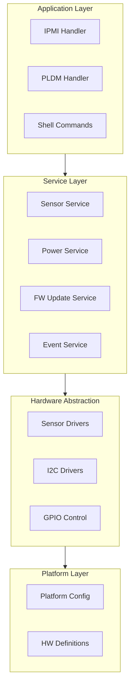
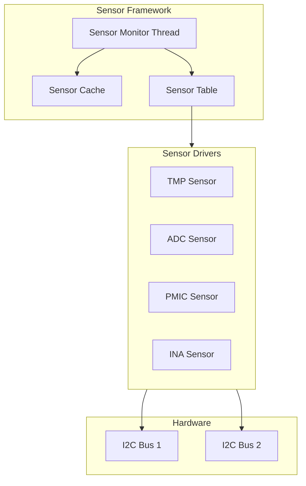
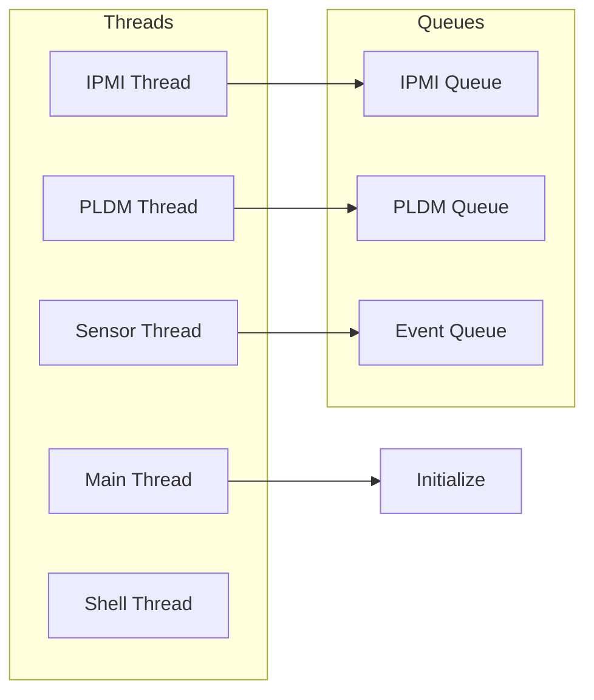

# OpenBIC Architecture

Understanding OpenBIC's modular architecture reveals patterns applicable to any large Zephyr project.

## Layer Architecture



## Module Organization

### Common Code

```
common/
├── dev/                    # Device drivers
│   ├── sensor/            # Sensor driver implementations
│   ├── i2c/               # I2C device drivers
│   └── gpio/              # GPIO utilities
├── lib/                    # Libraries
│   ├── ipmi/              # IPMI protocol
│   ├── pldm/              # PLDM protocol
│   └── util/              # Utilities
└── service/               # System services
    ├── sensor/            # Sensor monitoring
    ├── power/             # Power management
    └── fw_update/         # Firmware updates
```

### Platform-Specific Code

```
meta-facebook/
├── common/                 # FB common code
├── yv35-cl/               # Platform: Yosemite V3.5 CL
│   ├── boards/
│   ├── src/
│   │   ├── platform.c     # Platform init
│   │   ├── sensor_table.c # Sensor definitions
│   │   └── fru.c          # FRU data
│   ├── prj.conf
│   └── CMakeLists.txt
└── gt-cc/                 # Platform: Grand Teton CC
    └── ...
```

## Sensor Architecture



### Sensor Table Pattern

```c
/* sensor_table.c */
struct sensor_cfg sensor_config[] = {
    /* idx, type, port, addr, offset, read_func, ... */
    { SENSOR_NUM_TEMP_CPU, SENSOR_TYPE_TEMP, I2C_BUS1, 0x48,
      sensor_read_tmp75, NULL },
    { SENSOR_NUM_VOLT_P12V, SENSOR_TYPE_VOLT, I2C_BUS2, 0x40,
      sensor_read_ina230, NULL },
    /* ... more sensors ... */
};

const uint8_t sensor_config_size = ARRAY_SIZE(sensor_config);
```

## Threading Model



### Thread Definition Example

```c
/* Sensor monitoring thread */
#define SENSOR_THREAD_STACK_SIZE 2048
#define SENSOR_THREAD_PRIORITY 7

K_THREAD_STACK_DEFINE(sensor_stack, SENSOR_THREAD_STACK_SIZE);
static struct k_thread sensor_thread_data;

void sensor_thread_init(void)
{
    k_thread_create(&sensor_thread_data, sensor_stack,
                    SENSOR_THREAD_STACK_SIZE,
                    sensor_thread_entry,
                    NULL, NULL, NULL,
                    SENSOR_THREAD_PRIORITY, 0, K_NO_WAIT);
    k_thread_name_set(&sensor_thread_data, "sensor");
}
```

## Message Passing

### IPMI Message Queue

```c
/* Message structure */
struct ipmi_msg {
    uint8_t netfn;
    uint8_t cmd;
    uint8_t data_len;
    uint8_t data[IPMI_MAX_DATA_LEN];
    void (*callback)(struct ipmi_msg *);
};

K_MSGQ_DEFINE(ipmi_msgq, sizeof(struct ipmi_msg), 16, 4);

/* Send IPMI request */
int ipmi_send(struct ipmi_msg *msg)
{
    return k_msgq_put(&ipmi_msgq, msg, K_NO_WAIT);
}

/* IPMI handler thread */
void ipmi_thread_entry(void)
{
    struct ipmi_msg msg;

    while (1) {
        k_msgq_get(&ipmi_msgq, &msg, K_FOREVER);
        ipmi_process_msg(&msg);
    }
}
```

## Configuration Patterns

### Kconfig Organization

```kconfig
# Platform Kconfig
menuconfig PLAT_YOSEMITE_V35
    bool "Yosemite V3.5 Platform"
    select I2C
    select SENSOR
    help
      Enable Yosemite V3.5 platform support.

if PLAT_YOSEMITE_V35

config PLAT_SLOT_COUNT
    int "Number of server slots"
    default 4

config PLAT_HAS_EXPANSION
    bool "Has expansion cards"
    default y

endif # PLAT_YOSEMITE_V35
```

### Devicetree Overlays

```dts
/* Platform overlay */
/ {
    chosen {
        zephyr,console = &uart0;
    };
};

&i2c0 {
    status = "okay";
    clock-frequency = <I2C_BITRATE_FAST>;

    tmp75_cpu: tmp75@48 {
        compatible = "ti,tmp75";
        reg = <0x48>;
    };
};
```

## Error Handling

```c
/* Error codes */
enum bic_error {
    BIC_SUCCESS = 0,
    BIC_ERR_INVALID_PARAM = -1,
    BIC_ERR_TIMEOUT = -2,
    BIC_ERR_COMM = -3,
    BIC_ERR_NOT_READY = -4,
};

/* Error handling pattern */
int sensor_read(uint8_t sensor_num, int *value)
{
    if (sensor_num >= sensor_config_size) {
        return BIC_ERR_INVALID_PARAM;
    }

    struct sensor_cfg *cfg = &sensor_config[sensor_num];

    if (!cfg->read_func) {
        return BIC_ERR_NOT_READY;
    }

    int ret = cfg->read_func(cfg, value);
    if (ret != 0) {
        LOG_WRN("Sensor %d read failed: %d", sensor_num, ret);
        return BIC_ERR_COMM;
    }

    return BIC_SUCCESS;
}
```

## Key Patterns

1. **Table-Driven Configuration** - Sensor tables, FRU tables
2. **Message Queues** - Decouple request handling
3. **Service Layer** - Abstract hardware from protocols
4. **Platform Abstraction** - Same code, different hardware
5. **Kconfig for Features** - Compile-time configuration

## Next Steps

Learn about [OpenBIC Protocols]() for IPMI and PLDM implementation.
