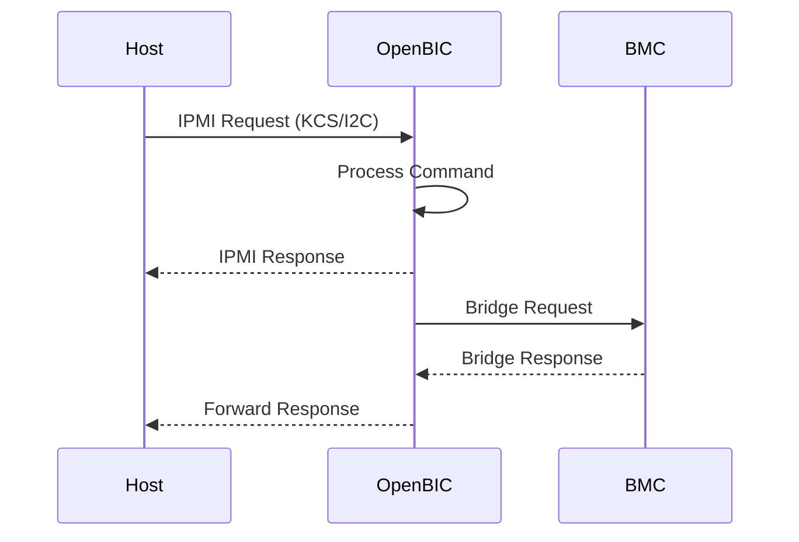
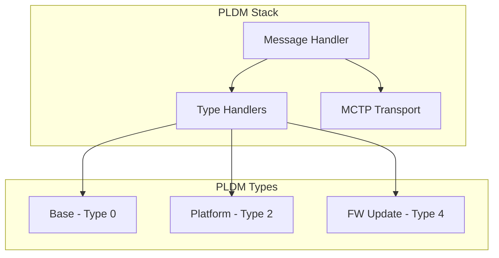

# OpenBIC Protocol Implementation

OpenBIC implements IPMI and PLDM protocols for BMC communication.

## IPMI Overview



## IPMI Message Structure

```c
/* IPMI message format */
struct ipmi_msg {
    struct {
        uint8_t netfn;      /* Network function */
        uint8_t seq;        /* Sequence number */
        uint8_t cmd;        /* Command */
    } header;

    uint8_t data_len;       /* Data length */
    uint8_t data[256];      /* Request/Response data */
    uint8_t completion_code; /* Response completion code */
};
```

## Command Handler Registration

```c
/* Handler function type */
typedef void (*ipmi_handler_fn)(struct ipmi_msg *msg);

/* Command handler entry */
struct ipmi_cmd_handler {
    uint8_t netfn;
    uint8_t cmd;
    ipmi_handler_fn handler;
};

/* Handler table */
static const struct ipmi_cmd_handler handlers[] = {
    { NETFN_CHASSIS, CMD_GET_CHASSIS_STATUS, cmd_chassis_status },
    { NETFN_SENSOR, CMD_GET_SENSOR_READING, cmd_sensor_reading },
    { NETFN_APP, CMD_GET_DEVICE_ID, cmd_device_id },
    { NETFN_OEM, CMD_OEM_GET_BIC_STATUS, cmd_bic_status },
    /* ... more handlers ... */
};

/* Dispatch function */
void ipmi_dispatch(struct ipmi_msg *msg)
{
    for (int i = 0; i < ARRAY_SIZE(handlers); i++) {
        if (handlers[i].netfn == msg->header.netfn &&
            handlers[i].cmd == msg->header.cmd) {
            handlers[i].handler(msg);
            return;
        }
    }

    /* Unknown command */
    msg->completion_code = CC_INVALID_CMD;
    msg->data_len = 0;
}
```

## Example IPMI Handlers

### Get Sensor Reading

```c
void cmd_sensor_reading(struct ipmi_msg *msg)
{
    if (msg->data_len < 1) {
        msg->completion_code = CC_REQ_DATA_LEN_INVALID;
        return;
    }

    uint8_t sensor_num = msg->data[0];
    int reading;

    int ret = sensor_read(sensor_num, &reading);
    if (ret != 0) {
        msg->completion_code = CC_SENSOR_NOT_PRESENT;
        return;
    }

    msg->data[0] = reading & 0xFF;           /* Reading */
    msg->data[1] = 0xC0;                     /* Scanning enabled */
    msg->data[2] = get_sensor_threshold_status(sensor_num);
    msg->data_len = 3;
    msg->completion_code = CC_SUCCESS;
}
```

### Set Power State

```c
void cmd_chassis_control(struct ipmi_msg *msg)
{
    if (msg->data_len < 1) {
        msg->completion_code = CC_REQ_DATA_LEN_INVALID;
        return;
    }

    uint8_t action = msg->data[0] & 0x0F;

    switch (action) {
    case CHASSIS_PWR_OFF:
        power_off_host();
        break;
    case CHASSIS_PWR_ON:
        power_on_host();
        break;
    case CHASSIS_PWR_CYCLE:
        power_cycle_host();
        break;
    case CHASSIS_HARD_RESET:
        reset_host();
        break;
    default:
        msg->completion_code = CC_PARAM_OUT_OF_RANGE;
        return;
    }

    msg->data_len = 0;
    msg->completion_code = CC_SUCCESS;
}
```

## PLDM Implementation



### PLDM Message Structure

```c
struct pldm_msg {
    struct pldm_header {
        uint8_t instance_id;
        uint8_t type;
        uint8_t command;
    } hdr;

    uint8_t payload[PLDM_MAX_PAYLOAD];
    uint16_t payload_len;
};
```

### PLDM Handler Pattern

```c
/* PLDM type handler */
struct pldm_type_handler {
    uint8_t type;
    int (*handler)(struct pldm_msg *req, struct pldm_msg *resp);
};

static const struct pldm_type_handler pldm_handlers[] = {
    { PLDM_TYPE_BASE, pldm_base_handler },
    { PLDM_TYPE_PLATFORM, pldm_platform_handler },
    { PLDM_TYPE_FW_UPDATE, pldm_fwup_handler },
};

/* Base type commands */
int pldm_base_handler(struct pldm_msg *req, struct pldm_msg *resp)
{
    switch (req->hdr.command) {
    case PLDM_GET_TID:
        return pldm_get_tid(req, resp);
    case PLDM_GET_PLDM_VERSION:
        return pldm_get_version(req, resp);
    case PLDM_GET_PLDM_TYPES:
        return pldm_get_types(req, resp);
    default:
        return PLDM_ERROR_UNSUPPORTED_CMD;
    }
}
```

## MCTP Transport

```c
/* MCTP header */
struct mctp_header {
    uint8_t ver;           /* Version */
    uint8_t dest_eid;      /* Destination endpoint ID */
    uint8_t src_eid;       /* Source endpoint ID */
    uint8_t tag;           /* Message tag */
};

/* Send PLDM over MCTP */
int mctp_send_pldm(uint8_t dest_eid, struct pldm_msg *msg)
{
    struct mctp_header hdr = {
        .ver = MCTP_VERSION,
        .dest_eid = dest_eid,
        .src_eid = my_eid,
        .tag = allocate_tag(),
    };

    /* Encapsulate and send */
    return mctp_send(&hdr, msg, sizeof(msg->hdr) + msg->payload_len);
}
```

## Protocol Threading

```c
/* IPMI thread */
K_MSGQ_DEFINE(ipmi_rx_queue, sizeof(struct ipmi_msg), 8, 4);

void ipmi_thread(void)
{
    struct ipmi_msg msg;

    while (1) {
        k_msgq_get(&ipmi_rx_queue, &msg, K_FOREVER);
        ipmi_dispatch(&msg);
        ipmi_send_response(&msg);
    }
}

/* PLDM thread */
K_MSGQ_DEFINE(pldm_rx_queue, sizeof(struct pldm_msg), 8, 4);

void pldm_thread(void)
{
    struct pldm_msg req, resp;

    while (1) {
        k_msgq_get(&pldm_rx_queue, &req, K_FOREVER);

        for (int i = 0; i < ARRAY_SIZE(pldm_handlers); i++) {
            if (pldm_handlers[i].type == req.hdr.type) {
                pldm_handlers[i].handler(&req, &resp);
                pldm_send_response(&resp);
                break;
            }
        }
    }
}
```

## Key Patterns

1. **Table-Driven Dispatch** - Handler lookup tables
2. **Message Queues** - Decouple receive from processing
3. **Layered Protocols** - PLDM over MCTP
4. **Completion Codes** - Standardized error reporting
5. **Thread per Protocol** - Isolation and prioritization

## Next Steps

Learn about the [OpenBIC Sensor Framework]().
