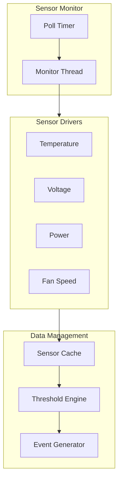

# OpenBIC Sensor Framework

The sensor framework demonstrates scalable device monitoring patterns.

## Sensor Architecture



## Sensor Configuration

### Sensor Table Definition

```c
/* Sensor configuration structure */
struct sensor_cfg {
    uint8_t num;              /* Sensor number */
    uint8_t type;             /* Temperature, voltage, etc. */
    uint8_t port;             /* I2C/SPI port */
    uint8_t addr;             /* Device address */
    uint8_t offset;           /* Register offset */

    /* Function pointers */
    int (*read)(struct sensor_cfg *, int *);
    int (*init)(struct sensor_cfg *);

    /* Thresholds */
    int16_t ucr;              /* Upper critical */
    int16_t unc;              /* Upper non-critical */
    int16_t lnc;              /* Lower non-critical */
    int16_t lcr;              /* Lower critical */

    /* Polling */
    uint16_t poll_interval_ms;
    uint8_t retry_count;
};

/* Platform sensor table */
struct sensor_cfg sensor_config[] = {
    {
        .num = SENSOR_CPU_TEMP,
        .type = SENSOR_TYPE_TEMP,
        .port = I2C_BUS_1,
        .addr = 0x48,
        .read = sensor_read_tmp75,
        .init = sensor_init_tmp75,
        .ucr = 95,
        .unc = 85,
        .lnc = 10,
        .lcr = 5,
        .poll_interval_ms = 1000,
    },
    {
        .num = SENSOR_P12V_MAIN,
        .type = SENSOR_TYPE_VOLT,
        .port = I2C_BUS_2,
        .addr = 0x40,
        .read = sensor_read_ina230,
        .init = sensor_init_ina230,
        .ucr = 13200,  /* mV */
        .unc = 12600,
        .lnc = 11400,
        .lcr = 10800,
        .poll_interval_ms = 500,
    },
    /* ... more sensors ... */
};
```

## Sensor Drivers

### Temperature Sensor (TMP75)

```c
int sensor_init_tmp75(struct sensor_cfg *cfg)
{
    const struct device *i2c = get_i2c_device(cfg->port);
    uint8_t config = TMP75_CONFIG_12BIT;

    return i2c_reg_write_byte(i2c, cfg->addr, TMP75_REG_CONFIG, config);
}

int sensor_read_tmp75(struct sensor_cfg *cfg, int *value)
{
    const struct device *i2c = get_i2c_device(cfg->port);
    uint8_t data[2];
    int ret;

    ret = i2c_burst_read(i2c, cfg->addr, TMP75_REG_TEMP, data, 2);
    if (ret != 0) {
        return ret;
    }

    /* Convert to millidegrees Celsius */
    int16_t raw = (data[0] << 8) | data[1];
    *value = (raw >> 4) * 625 / 10;  /* 0.0625°C per LSB */

    return 0;
}
```

### Power Monitor (INA230)

```c
int sensor_read_ina230(struct sensor_cfg *cfg, int *value)
{
    const struct device *i2c = get_i2c_device(cfg->port);
    uint8_t data[2];
    int ret;

    ret = i2c_burst_read(i2c, cfg->addr, INA230_REG_BUS_VOLT, data, 2);
    if (ret != 0) {
        return ret;
    }

    /* Convert to millivolts: 1.25mV per LSB */
    uint16_t raw = (data[0] << 8) | data[1];
    *value = (raw >> 3) * 125 / 100;

    return 0;
}
```

## Sensor Monitor Thread

```c
#define SENSOR_POLL_INTERVAL_MS 100

static int sensor_cache[MAX_SENSORS];
static uint8_t sensor_status[MAX_SENSORS];

void sensor_monitor_thread(void)
{
    int64_t last_poll[MAX_SENSORS] = { 0 };

    while (1) {
        int64_t now = k_uptime_get();

        for (int i = 0; i < sensor_config_size; i++) {
            struct sensor_cfg *cfg = &sensor_config[i];

            /* Check if it's time to poll */
            if ((now - last_poll[i]) < cfg->poll_interval_ms) {
                continue;
            }

            last_poll[i] = now;

            /* Read sensor */
            int value;
            int ret = cfg->read(cfg, &value);

            if (ret == 0) {
                sensor_cache[cfg->num] = value;
                sensor_status[cfg->num] = SENSOR_STATUS_OK;

                /* Check thresholds */
                check_thresholds(cfg, value);
            } else {
                sensor_status[cfg->num] = SENSOR_STATUS_ERROR;
                LOG_WRN("Sensor %d read failed: %d", cfg->num, ret);
            }
        }

        k_msleep(SENSOR_POLL_INTERVAL_MS);
    }
}
```

## Threshold Monitoring

```c
void check_thresholds(struct sensor_cfg *cfg, int value)
{
    uint8_t old_status = threshold_status[cfg->num];
    uint8_t new_status = 0;

    if (value >= cfg->ucr) {
        new_status = THRESH_UPPER_CRIT;
    } else if (value >= cfg->unc) {
        new_status = THRESH_UPPER_NONCRIT;
    } else if (value <= cfg->lcr) {
        new_status = THRESH_LOWER_CRIT;
    } else if (value <= cfg->lnc) {
        new_status = THRESH_LOWER_NONCRIT;
    }

    if (new_status != old_status) {
        threshold_status[cfg->num] = new_status;

        /* Generate event */
        struct sensor_event evt = {
            .sensor_num = cfg->num,
            .type = cfg->type,
            .value = value,
            .threshold = new_status,
            .timestamp = k_uptime_get(),
        };

        generate_sensor_event(&evt);
    }
}
```

## Sensor Event Generation

```c
K_MSGQ_DEFINE(event_queue, sizeof(struct sensor_event), 32, 4);

void generate_sensor_event(struct sensor_event *evt)
{
    if (k_msgq_put(&event_queue, evt, K_NO_WAIT) != 0) {
        LOG_WRN("Event queue full, dropping event");
    }
}

/* Event processing thread */
void event_thread(void)
{
    struct sensor_event evt;

    while (1) {
        k_msgq_get(&event_queue, &evt, K_FOREVER);

        /* Log to SEL */
        sel_add_entry(&evt);

        /* Send IPMI event */
        ipmi_send_event_msg(&evt);

        /* Trigger actions */
        if (evt.threshold == THRESH_UPPER_CRIT) {
            handle_critical_threshold(&evt);
        }
    }
}
```

## Sensor API

```c
/* Get cached sensor value */
int sensor_get_reading(uint8_t sensor_num, int *value)
{
    if (sensor_num >= MAX_SENSORS) {
        return -EINVAL;
    }

    if (sensor_status[sensor_num] != SENSOR_STATUS_OK) {
        return -EIO;
    }

    *value = sensor_cache[sensor_num];
    return 0;
}

/* Get sensor status */
uint8_t sensor_get_status(uint8_t sensor_num)
{
    if (sensor_num >= MAX_SENSORS) {
        return SENSOR_STATUS_NOT_PRESENT;
    }

    return sensor_status[sensor_num];
}
```

## Key Patterns

1. **Table-Driven Sensors** - Easy to add/modify sensors
2. **Function Pointers** - Pluggable driver implementations
3. **Cached Readings** - Fast access without I/O
4. **Threshold Engine** - Automatic event generation
5. **Event Queue** - Decouple detection from handling

## Next Steps

Learn about [OpenBIC Lessons]() for design patterns.
