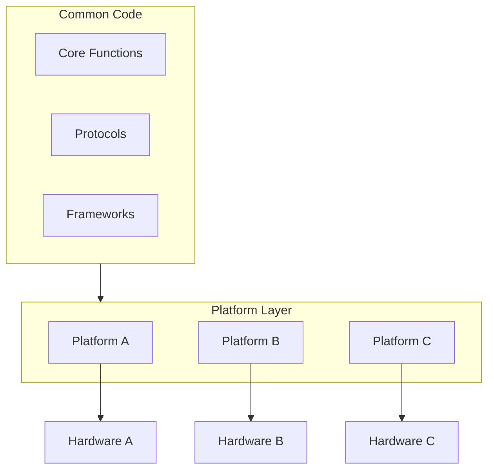
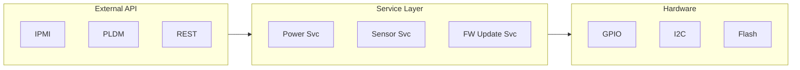

# Lessons from OpenBIC

Key design patterns and best practices learned from OpenBIC development.

## Architecture Patterns

### 1. Platform Abstraction



**Implementation:**

```c
/* Common interface */
int platform_get_sensor_count(void);
struct sensor_cfg *platform_get_sensor_table(void);

/* Platform-specific implementation */
/* meta-facebook/yv35-cl/src/platform.c */
struct sensor_cfg sensor_config[] = { /* ... */ };

int platform_get_sensor_count(void)
{
    return ARRAY_SIZE(sensor_config);
}

struct sensor_cfg *platform_get_sensor_table(void)
{
    return sensor_config;
}
```

### 2. Table-Driven Design

**Benefits:**
- Easy to modify without code changes
- Clear data/logic separation
- Self-documenting configuration

```c
/* GPIO pin table */
const struct gpio_cfg gpio_config[] = {
    { "FM_BMC_READY", GPIO_PORT_A, 5, GPIO_OUTPUT, GPIO_ACTIVE_HIGH },
    { "RST_RSMRST", GPIO_PORT_B, 2, GPIO_OUTPUT, GPIO_ACTIVE_LOW },
    { "PWRGD_CPU", GPIO_PORT_C, 7, GPIO_INPUT, GPIO_ACTIVE_HIGH },
    /* ... */
};

/* FRU information table */
const struct fru_cfg fru_config[] = {
    { FRU_BMC, "BMC", fru_read_eeprom, 0x50 },
    { FRU_SYSTEM, "System", fru_read_eeprom, 0x51 },
    { FRU_CPU, "CPU", fru_read_smbios, 0 },
    /* ... */
};
```

### 3. Service Layer Pattern



**Benefits:**
- Protocol independence
- Testability
- Reusability

## Configuration Patterns

### Kconfig Hierarchy

```kconfig
# Top-level feature config
config SENSOR_MONITOR
    bool "Enable sensor monitoring"
    default y
    depends on I2C

if SENSOR_MONITOR

config SENSOR_POLL_INTERVAL_MS
    int "Sensor poll interval (ms)"
    default 1000

config SENSOR_THRESHOLD_CHECK
    bool "Enable threshold checking"
    default y

config SENSOR_EVENT_LOG
    bool "Log sensor events"
    depends on SENSOR_THRESHOLD_CHECK
    default y

endif # SENSOR_MONITOR
```

### Conditional Compilation

```c
/* Feature-gated code */
#ifdef CONFIG_SENSOR_THRESHOLD_CHECK
    check_thresholds(cfg, value);
#endif

#ifdef CONFIG_SENSOR_EVENT_LOG
    log_sensor_event(&event);
#endif
```

## Threading Patterns

### Thread Priorities

| Thread | Priority | Purpose |
|--------|----------|---------|
| ISR | - | Hardware interrupts |
| Watchdog | 1 | System health |
| Power Control | 3 | Critical operations |
| IPMI Handler | 5 | Protocol handling |
| Sensor Monitor | 7 | Background monitoring |
| Shell | 10 | Debug interface |

### Work Queue Usage

```c
/* Deferred work for non-critical tasks */
K_WORK_DEFINE(log_work, log_work_handler);

void isr_handler(void)
{
    /* Quick ISR handling */
    capture_data();

    /* Defer heavy processing */
    k_work_submit(&log_work);
}

void log_work_handler(struct k_work *work)
{
    /* Safe to do blocking operations */
    write_to_flash();
    send_event_notification();
}
```

## Error Handling Patterns

### Return Code Convention

```c
/* Consistent error codes */
enum bic_status {
    BIC_OK = 0,
    BIC_ERR_INVALID_PARAM = -1,
    BIC_ERR_TIMEOUT = -2,
    BIC_ERR_BUSY = -3,
    BIC_ERR_NOT_FOUND = -4,
    BIC_ERR_IO = -5,
    BIC_ERR_NO_MEM = -6,
};

/* Error propagation */
int higher_level_func(void)
{
    int ret = lower_level_func();
    if (ret != BIC_OK) {
        LOG_ERR("Lower level failed: %d", ret);
        return ret;  /* Propagate error */
    }

    return BIC_OK;
}
```

### Retry Pattern

```c
int reliable_read(struct sensor_cfg *cfg, int *value)
{
    int retry = 3;
    int ret;

    while (retry-- > 0) {
        ret = cfg->read(cfg, value);
        if (ret == BIC_OK) {
            return BIC_OK;
        }

        LOG_WRN("Read failed, retrying (%d left)", retry);
        k_msleep(10);
    }

    LOG_ERR("Read failed after retries");
    return BIC_ERR_IO;
}
```

## Testing Patterns

### Unit Testable Design

```c
/* Dependency injection for testing */
struct sensor_ops {
    int (*read)(uint8_t addr, uint8_t reg, uint8_t *data);
    int (*write)(uint8_t addr, uint8_t reg, uint8_t data);
};

/* Production implementation */
static const struct sensor_ops hw_ops = {
    .read = i2c_read_byte,
    .write = i2c_write_byte,
};

/* Test mock */
static const struct sensor_ops mock_ops = {
    .read = mock_read,
    .write = mock_write,
};

int sensor_init(const struct sensor_ops *ops);
```

## Best Practices Summary

1. **Separate Common and Platform Code** - Maximize reuse
2. **Use Tables for Configuration** - Data-driven design
3. **Layer Your Architecture** - Clear responsibilities
4. **Consistent Error Handling** - Propagate and log errors
5. **Design for Testability** - Dependency injection
6. **Document with Kconfig** - Self-describing features
7. **Use Appropriate Thread Priorities** - Balance responsiveness
8. **Defer Non-Critical Work** - Keep ISRs fast

## Next Steps

Learn about [ASPEED RoT]() for security patterns.
