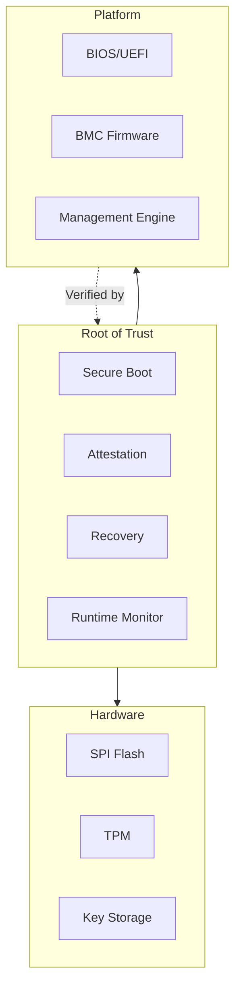
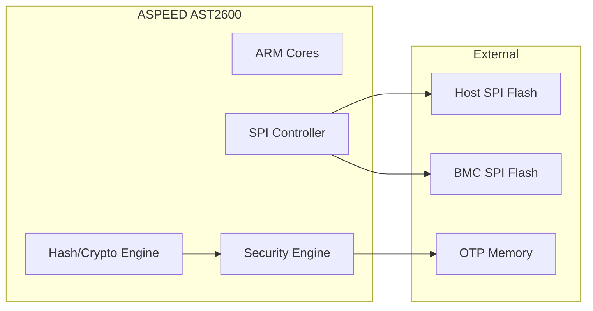
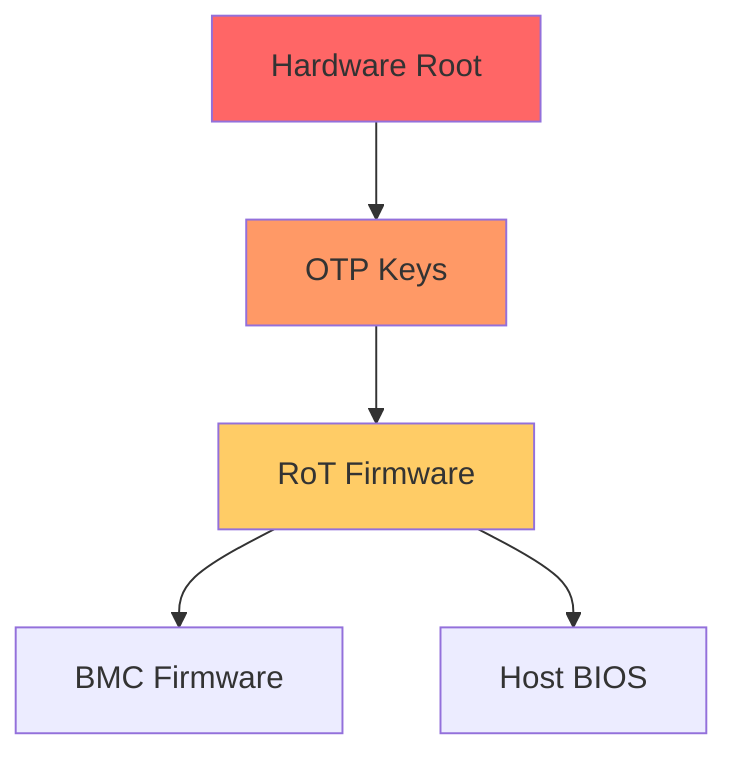

# ASPEED Root of Trust Overview

ASPEED's Root of Trust (RoT) implementation showcases security-focused Zephyr development for platform firmware protection.

## What is Root of Trust?



## RoT Responsibilities

| Function | Description |
|----------|-------------|
| Secure Boot | Verify firmware before execution |
| Attestation | Prove platform state to verifiers |
| Recovery | Restore firmware from known-good state |
| Update | Secure firmware update process |
| Monitoring | Detect runtime tampering |

## ASPEED RoT Architecture



## Zephyr Configuration

```kconfig
# Security features
CONFIG_SECURE_BOOT=y
CONFIG_FLASH_ENCRYPTION=y

# Cryptographic support
CONFIG_MBEDTLS=y
CONFIG_MBEDTLS_BUILTIN=y
CONFIG_MBEDTLS_ECDSA_C=y
CONFIG_MBEDTLS_SHA256_C=y
CONFIG_MBEDTLS_SHA512_C=y

# Hardware acceleration
CONFIG_CRYPTO=y
CONFIG_CRYPTO_ASPEED=y

# Flash access
CONFIG_FLASH=y
CONFIG_SPI_NOR=y
CONFIG_SPI_NOR_MULTI_DEV=y
```

## Security Model

### Trust Hierarchy



### Key Management

```c
/* Key storage locations */
enum key_slot {
    KEY_SLOT_ROOT,      /* OTP - immutable */
    KEY_SLOT_PLATFORM,  /* Secure storage */
    KEY_SLOT_ROLLBACK,  /* Anti-rollback counter */
};

/* Key operations */
int rot_get_public_key(enum key_slot slot, uint8_t *key, size_t *len);
int rot_verify_signature(enum key_slot slot, const uint8_t *data,
                         size_t data_len, const uint8_t *sig, size_t sig_len);
```

## Core Components

### Secure Boot Engine

```c
struct boot_policy {
    uint32_t flags;
    uint8_t key_index;
    uint8_t hash_algo;
    uint16_t reserved;
};

int secure_boot_verify(struct boot_policy *policy,
                       const uint8_t *firmware,
                       size_t fw_size);
```

### Attestation Service

```c
struct attestation_request {
    uint8_t nonce[32];
    uint16_t pcr_selection;
};

struct attestation_response {
    uint8_t quote[512];
    uint16_t quote_len;
    uint8_t signature[64];
};

int attestation_generate_quote(struct attestation_request *req,
                               struct attestation_response *resp);
```

### Recovery Manager

```c
enum recovery_reason {
    RECOVERY_CORRUPTION,
    RECOVERY_AUTH_FAIL,
    RECOVERY_USER_REQUEST,
};

int recovery_restore_firmware(enum recovery_reason reason);
int recovery_check_image(const uint8_t *image, size_t size);
```

## Hardware Security Features

| Feature | Purpose |
|---------|---------|
| OTP Memory | Immutable key storage |
| HACE Engine | Hardware crypto acceleration |
| Secure Boot ROM | Verified first-stage boot |
| Debug Lock | Disable JTAG in production |
| Memory Protection | Isolate RoT from other code |

## Standards Compliance

- **NIST SP 800-193** - Platform Firmware Resiliency
- **DICE** - Device Identifier Composition Engine
- **SPDM** - Security Protocol and Data Model
- **TCG** - Trusted Computing Group standards

## Next Steps

Learn about [Secure Boot]() implementation.
