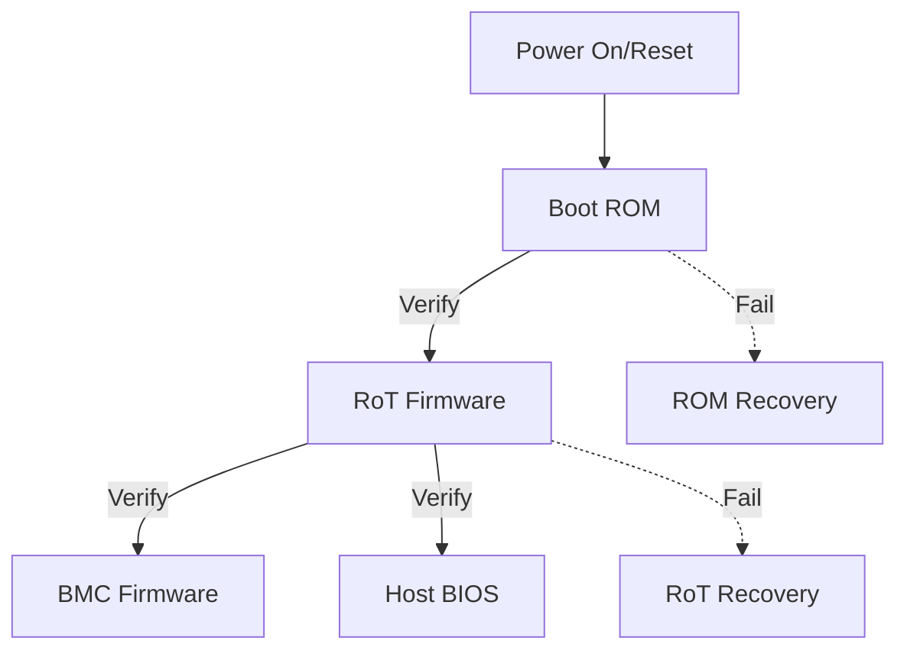

# Secure Boot Implementation

Secure boot ensures only authenticated firmware executes on the platform.

## Boot Flow



## Firmware Image Format

```c
/* Signed firmware header */
struct fw_header {
    uint32_t magic;           /* "AROT" */
    uint32_t version;         /* Image version */
    uint32_t size;            /* Image size */
    uint32_t entry_point;     /* Execution entry */
    uint8_t  hash[32];        /* SHA-256 of payload */
    uint8_t  signature[64];   /* ECDSA signature */
    uint8_t  key_id;          /* Signing key index */
    uint8_t  flags;           /* Image flags */
    uint16_t reserved;
};

#define FW_MAGIC 0x544F5241  /* "AROT" */
#define FW_FLAG_COMPRESSED  BIT(0)
#define FW_FLAG_ENCRYPTED   BIT(1)
```

## Verification Process

```c
#include <zephyr/crypto/crypto.h>

int verify_firmware(const struct fw_header *hdr, const uint8_t *payload)
{
    int ret;

    /* 1. Validate header magic */
    if (hdr->magic != FW_MAGIC) {
        LOG_ERR("Invalid magic");
        return -EINVAL;
    }

    /* 2. Check version (anti-rollback) */
    uint32_t min_version = otp_get_min_version();
    if (hdr->version < min_version) {
        LOG_ERR("Rollback attempted");
        return -EPERM;
    }

    /* 3. Compute hash of payload */
    uint8_t computed_hash[32];
    ret = compute_sha256(payload, hdr->size, computed_hash);
    if (ret != 0) {
        return ret;
    }

    /* 4. Verify hash matches header */
    if (memcmp(computed_hash, hdr->hash, 32) != 0) {
        LOG_ERR("Hash mismatch");
        return -EBADMSG;
    }

    /* 5. Verify signature */
    ret = verify_ecdsa_signature(hdr->key_id,
                                 hdr->hash, sizeof(hdr->hash),
                                 hdr->signature);
    if (ret != 0) {
        LOG_ERR("Signature verification failed");
        return -EACCES;
    }

    LOG_INF("Firmware verified successfully");
    return 0;
}
```

## Hash Computation

```c
int compute_sha256(const uint8_t *data, size_t len, uint8_t *hash)
{
    const struct device *crypto = DEVICE_DT_GET(DT_NODELABEL(hace));

    if (!device_is_ready(crypto)) {
        return -ENODEV;
    }

    struct hash_ctx ctx;
    struct hash_pkt pkt = {
        .in_buf = data,
        .in_len = len,
        .out_buf = hash,
    };

    hash_begin_session(crypto, &ctx, CRYPTO_HASH_ALGO_SHA256);
    hash_compute(&ctx, &pkt);
    hash_free_session(crypto, &ctx);

    return 0;
}
```

## Signature Verification

```c
int verify_ecdsa_signature(uint8_t key_id,
                           const uint8_t *hash, size_t hash_len,
                           const uint8_t *signature)
{
    /* Get public key from OTP or secure storage */
    uint8_t pubkey[64];
    size_t pubkey_len;

    int ret = get_public_key(key_id, pubkey, &pubkey_len);
    if (ret != 0) {
        return ret;
    }

    /* Verify using mbedTLS or hardware crypto */
    mbedtls_ecdsa_context ecdsa;
    mbedtls_ecdsa_init(&ecdsa);

    ret = mbedtls_ecp_group_load(&ecdsa.grp, MBEDTLS_ECP_DP_SECP256R1);
    if (ret != 0) {
        goto cleanup;
    }

    ret = mbedtls_ecp_point_read_binary(&ecdsa.grp, &ecdsa.Q,
                                        pubkey, pubkey_len);
    if (ret != 0) {
        goto cleanup;
    }

    ret = mbedtls_ecdsa_read_signature(&ecdsa, hash, hash_len,
                                       signature, 64);

cleanup:
    mbedtls_ecdsa_free(&ecdsa);
    return ret;
}
```

## Anti-Rollback Protection

```c
/* OTP-based version tracking */
#define OTP_VERSION_OFFSET 0x100
#define OTP_VERSION_BITS   32

uint32_t otp_get_min_version(void)
{
    uint32_t otp_value = otp_read(OTP_VERSION_OFFSET);

    /* Count set bits = minimum version */
    return __builtin_popcount(otp_value);
}

int otp_increment_version(uint32_t new_version)
{
    uint32_t current = otp_get_min_version();

    if (new_version <= current) {
        return -EINVAL;  /* Can't go backwards */
    }

    /* Burn additional bits */
    uint32_t bits_to_burn = (1 << new_version) - 1;
    return otp_write(OTP_VERSION_OFFSET, bits_to_burn);
}
```

## Boot Chain

```c
void secure_boot_chain(void)
{
    const uint8_t *bmc_flash = (const uint8_t *)BMC_FLASH_BASE;
    const uint8_t *host_flash = (const uint8_t *)HOST_FLASH_BASE;

    /* Verify and boot BMC */
    struct fw_header *bmc_hdr = (struct fw_header *)bmc_flash;
    if (verify_firmware(bmc_hdr, bmc_flash + sizeof(*bmc_hdr)) == 0) {
        /* Allow BMC to run */
        release_bmc_reset();
    } else {
        /* Trigger BMC recovery */
        initiate_recovery(RECOVERY_TARGET_BMC);
    }

    /* Verify host BIOS */
    struct fw_header *host_hdr = (struct fw_header *)host_flash;
    if (verify_firmware(host_hdr, host_flash + sizeof(*host_hdr)) == 0) {
        /* Allow host to boot */
        release_host_reset();
    } else {
        /* Trigger host recovery */
        initiate_recovery(RECOVERY_TARGET_HOST);
    }
}
```

## Key Management

```c
/* Key storage structure */
struct key_entry {
    uint8_t id;
    uint8_t algo;
    uint8_t usage;
    uint8_t flags;
    uint8_t key_data[64];
};

/* Key usages */
enum key_usage {
    KEY_USAGE_SIGN_VERIFY,
    KEY_USAGE_ENCRYPT_DECRYPT,
    KEY_USAGE_KEY_DERIVE,
};

/* Secure key loading */
int load_signing_key(uint8_t key_id, struct key_entry *key)
{
    /* Read from OTP or secure storage */
    if (key_id == 0) {
        return otp_read_key(OTP_ROOT_KEY_OFFSET, key);
    }

    return secure_storage_read_key(key_id, key);
}
```

## Best Practices

1. **Immutable Root Key** - Store in OTP, never in flash
2. **Anti-Rollback** - Enforce minimum version
3. **Hash Before Sign** - Verify integrity before signature
4. **Fail Secure** - Recovery on any failure
5. **Chain of Trust** - Each stage verifies the next

## Next Steps

Learn about [Attestation]() for platform verification.
