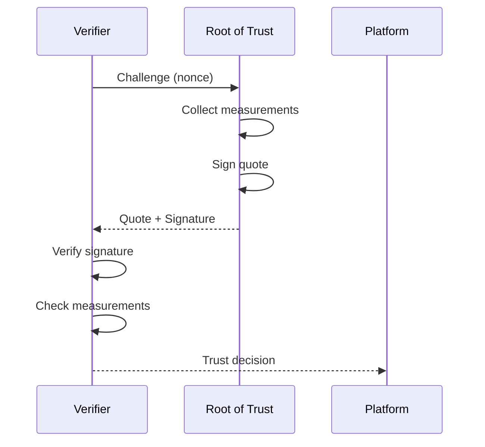
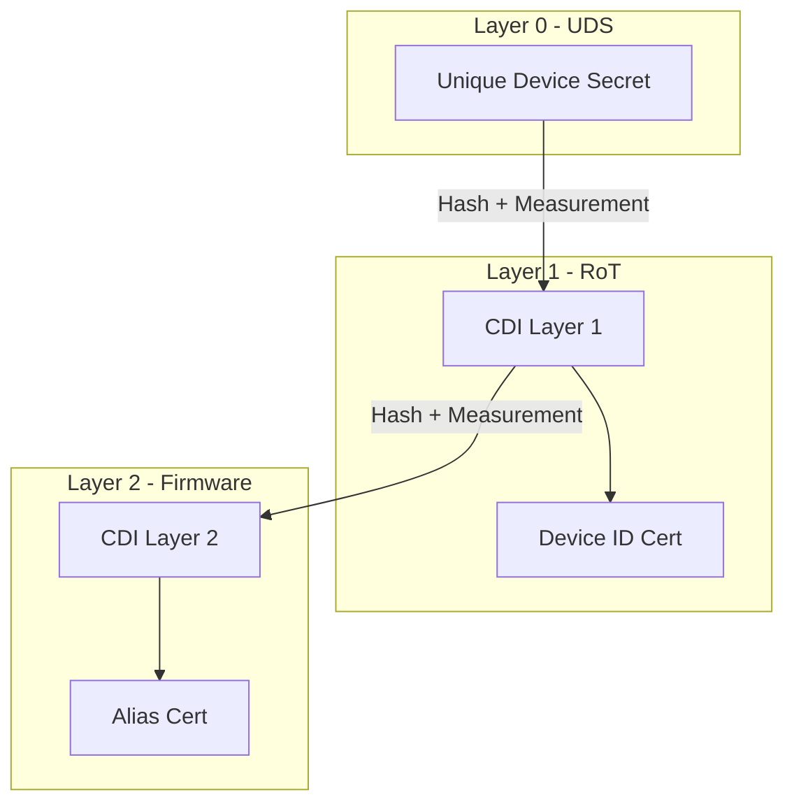
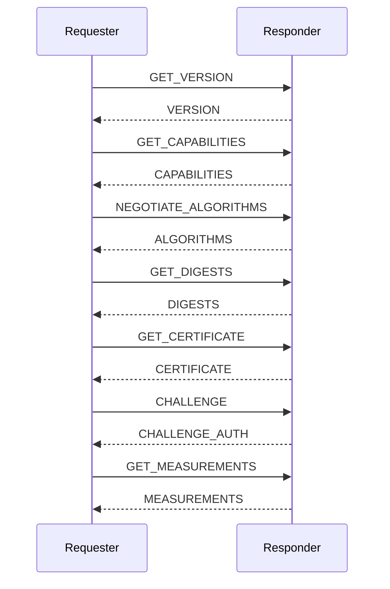

# Attestation and Identity

Attestation allows a platform to prove its state and identity to remote verifiers.

## Attestation Overview



## DICE (Device Identifier Composition Engine)

### DICE Architecture



### DICE Implementation

```c
#include <zephyr/crypto/crypto.h>

/* Compound Device Identifier derivation */
struct dice_cdi {
    uint8_t cdi[32];      /* CDI value */
    uint8_t cert[512];    /* Certificate */
    uint16_t cert_len;
};

int dice_derive_cdi(const uint8_t *uds, size_t uds_len,
                    const uint8_t *measurement, size_t meas_len,
                    struct dice_cdi *cdi)
{
    /* CDI = KDF(UDS, H(code)) */
    uint8_t code_hash[32];

    /* Hash the measurement */
    compute_sha256(measurement, meas_len, code_hash);

    /* Derive CDI using HKDF */
    return hkdf_sha256(uds, uds_len,
                       code_hash, sizeof(code_hash),
                       "DICE CDI", 8,
                       cdi->cdi, sizeof(cdi->cdi));
}

/* Generate Device ID key pair from CDI */
int dice_generate_device_id(const struct dice_cdi *cdi,
                            uint8_t *pubkey, size_t *pubkey_len,
                            uint8_t *privkey, size_t *privkey_len)
{
    /* Deterministic key generation from CDI */
    mbedtls_ctr_drbg_context drbg;
    mbedtls_ecp_keypair keypair;

    mbedtls_ctr_drbg_init(&drbg);
    mbedtls_ecp_keypair_init(&keypair);

    /* Seed DRBG with CDI */
    mbedtls_ctr_drbg_seed(&drbg, entropy_from_cdi, (void *)cdi->cdi,
                          NULL, 0);

    /* Generate key pair */
    mbedtls_ecp_gen_key(MBEDTLS_ECP_DP_SECP256R1, &keypair,
                        mbedtls_ctr_drbg_random, &drbg);

    /* Export keys */
    /* ... */

    return 0;
}
```

## SPDM (Security Protocol and Data Model)

### SPDM Message Flow



### SPDM Handler

```c
/* SPDM message types */
enum spdm_request_code {
    SPDM_GET_VERSION = 0x84,
    SPDM_GET_CAPABILITIES = 0xE1,
    SPDM_NEGOTIATE_ALGORITHMS = 0xE3,
    SPDM_GET_DIGESTS = 0x81,
    SPDM_GET_CERTIFICATE = 0x82,
    SPDM_CHALLENGE = 0x83,
    SPDM_GET_MEASUREMENTS = 0xE0,
};

/* SPDM context */
struct spdm_context {
    uint8_t version;
    uint32_t capabilities;
    uint8_t base_hash_algo;
    uint8_t base_asym_algo;
    uint8_t connection_state;
};

int spdm_handle_request(struct spdm_context *ctx,
                        const uint8_t *request, size_t req_len,
                        uint8_t *response, size_t *resp_len)
{
    uint8_t code = request[1];

    switch (code) {
    case SPDM_GET_VERSION:
        return spdm_get_version(ctx, request, req_len,
                               response, resp_len);

    case SPDM_GET_CAPABILITIES:
        return spdm_get_capabilities(ctx, request, req_len,
                                     response, resp_len);

    case SPDM_CHALLENGE:
        return spdm_challenge(ctx, request, req_len,
                             response, resp_len);

    case SPDM_GET_MEASUREMENTS:
        return spdm_get_measurements(ctx, request, req_len,
                                     response, resp_len);

    default:
        return spdm_error_response(response, resp_len,
                                   SPDM_ERROR_UNSUPPORTED_REQUEST);
    }
}
```

### Measurements

```c
/* Measurement structure */
struct measurement {
    uint8_t index;
    uint8_t type;
    uint8_t hash[32];
};

#define MAX_MEASUREMENTS 16
static struct measurement measurements[MAX_MEASUREMENTS];
static uint8_t measurement_count;

/* Record measurement */
int record_measurement(uint8_t index, uint8_t type,
                       const uint8_t *data, size_t len)
{
    if (index >= MAX_MEASUREMENTS) {
        return -EINVAL;
    }

    measurements[index].index = index;
    measurements[index].type = type;
    compute_sha256(data, len, measurements[index].hash);

    if (index >= measurement_count) {
        measurement_count = index + 1;
    }

    return 0;
}

/* SPDM GET_MEASUREMENTS response */
int spdm_get_measurements(struct spdm_context *ctx,
                          const uint8_t *req, size_t req_len,
                          uint8_t *resp, size_t *resp_len)
{
    uint8_t operation = req[2];
    uint8_t index = req[3];
    uint8_t *nonce = (operation & 0x01) ? &req[4] : NULL;

    /* Build response */
    struct spdm_measurements_response *r = (void *)resp;
    r->header.version = ctx->version;
    r->header.request_response_code = SPDM_MEASUREMENTS;
    r->number_of_blocks = measurement_count;

    size_t offset = sizeof(*r);

    /* Add measurement blocks */
    for (int i = 0; i < measurement_count; i++) {
        if (index != 0xFF && index != i) {
            continue;
        }

        struct measurement_block *blk = (void *)(resp + offset);
        blk->index = measurements[i].index;
        blk->measurement_specification = 1;  /* DMTF */
        blk->measurement_size = sizeof(measurements[i].hash);
        memcpy(blk->measurement, measurements[i].hash,
               sizeof(measurements[i].hash));

        offset += sizeof(*blk);
    }

    /* Sign if nonce provided */
    if (nonce) {
        sign_measurements(resp, offset, nonce, resp + offset);
        offset += 64;  /* Signature size */
    }

    *resp_len = offset;
    return 0;
}
```

## Certificate Chain

```c
/* Certificate slots */
struct cert_slot {
    uint8_t cert[2048];
    uint16_t cert_len;
    bool valid;
};

static struct cert_slot cert_chain[4];

int spdm_get_certificate(struct spdm_context *ctx,
                         const uint8_t *req, size_t req_len,
                         uint8_t *resp, size_t *resp_len)
{
    uint8_t slot = req[2];
    uint16_t offset = (req[3] << 8) | req[4];
    uint16_t length = (req[5] << 8) | req[6];

    if (slot >= ARRAY_SIZE(cert_chain) || !cert_chain[slot].valid) {
        return spdm_error_response(resp, resp_len,
                                   SPDM_ERROR_INVALID_REQUEST);
    }

    struct cert_slot *s = &cert_chain[slot];

    /* Build response */
    struct spdm_certificate_response *r = (void *)resp;
    r->header.version = ctx->version;
    r->header.request_response_code = SPDM_CERTIFICATE;
    r->slot_id = slot;

    uint16_t remaining = s->cert_len - offset;
    uint16_t portion = MIN(length, remaining);

    r->portion_length = portion;
    r->remainder_length = remaining - portion;
    memcpy(r->cert_chain, s->cert + offset, portion);

    *resp_len = sizeof(*r) + portion;
    return 0;
}
```

## Challenge-Response

```c
int spdm_challenge(struct spdm_context *ctx,
                   const uint8_t *req, size_t req_len,
                   uint8_t *resp, size_t *resp_len)
{
    uint8_t slot = req[2];
    uint8_t measurement_summary = req[3];
    uint8_t *nonce = &req[4];

    /* Build challenge auth response */
    struct spdm_challenge_auth_response *r = (void *)resp;
    r->header.version = ctx->version;
    r->header.request_response_code = SPDM_CHALLENGE_AUTH;
    r->slot_id = slot;

    /* Generate responder nonce */
    generate_random(r->responder_nonce, 32);

    /* Hash certificate chain */
    compute_sha256(cert_chain[slot].cert, cert_chain[slot].cert_len,
                   r->cert_chain_hash);

    /* Add measurement summary if requested */
    if (measurement_summary) {
        compute_measurement_hash(r->measurement_summary_hash);
    }

    /* Sign the response */
    size_t data_len = sizeof(*r) - 64;  /* Exclude signature */
    sign_data(resp, data_len, nonce, r->signature);

    *resp_len = sizeof(*r);
    return 0;
}
```

## Best Practices

1. **Protect secrets** - UDS and CDI must be inaccessible
2. **Chain measurements** - Each layer measures the next
3. **Fresh nonces** - Prevent replay attacks
4. **Validate certificates** - Check chain and revocation
5. **Audit measurements** - Log all attestation requests

## Next Steps

Learn about [Platform Firmware Resilience]().
